# Fishing Info Index -- Snoqualmie Region

Generated 2026-07-06 01:06. Scanned 43 hikes' WTA trip reports for fishing-related text and photo captions.

**674 trip report(s)** across the region mention fishing; **22 photo(s)** have fishing-related captions; **1509 photo(s)** downloaded for visual review; **17 additional fishing photo(s)** found by automated vision review (missed by text/caption matching).

Every fishing photo found (caption-matched or vision-confirmed) is embedded inline under its hike in the Details section below.

## Summary

| Hike | Matching Reports | Photo Matches | Photos Downloaded | Contact Sheets | Vision Findings |
|---|---|---|---|---|---|
| [Annette Lake](#annette-lake) | 105 | 4 | 221 | 12 | 5 |
| [Waptus Lake via Waptus River](#waptus-lake-via-waptus-river) | 47 | 1 | 111 | 6 | 1 |
| [Melakwa Lake](#melakwa-lake) | 41 | 1 | 109 | 6 | 0 |
| [Pete Lake](#pete-lake) | 38 | 3 | 68 | 4 | 1 |
| [Rampart Ridge - Rampart Lakes](#rampart-ridge---rampart-lakes) | 35 | 1 | 90 | 5 | 3 |
| [Taylor River - Otter Falls](#taylor-river---otter-falls) | 35 | 0 | 73 | 4 | 1 |
| [PCT Section J - Snoqualmie Pass to Stevens Pass](#pct-section-j---snoqualmie-pass-to-stevens-pass) | 29 | 2 | 90 | 5 | 0 |
| [Snoqualmie Lake](#snoqualmie-lake) | 28 | 0 | 64 | 4 | 0 |
| [Spade Lake](#spade-lake) | 28 | 1 | 78 | 4 | 1 |
| [Dingford Creek-Hester Lake](#dingford-creek-hester-lake) | 24 | 1 | 32 | 2 | 0 |
| [Spectacle Lake](#spectacle-lake) | 23 | 0 | 45 | 3 | 0 |
| [Gold Creek Trail to Alaska Lake](#gold-creek-trail-to-alaska-lake) | 22 | 0 | 33 | 2 | 0 |
| [Marten Lake](#marten-lake) | 21 | 3 | 45 | 3 | 0 |
| [Dingford Creek-Myrtle Lake](#dingford-creek-myrtle-lake) | 20 | 1 | 37 | 2 | 0 |
| [Hyas Lake](#hyas-lake) | 18 | 1 | 26 | 2 | 0 |
| [Nordrum Lake](#nordrum-lake) | 18 | 1 | 36 | 2 | 1 |
| [Cooper River](#cooper-river) | 17 | 2 | 32 | 2 | 0 |
| [Lower Tuscohatchie Lake](#lower-tuscohatchie-lake) | 16 | 0 | 40 | 2 | 0 |
| [Alta Mountain](#alta-mountain) | 15 | 0 | 48 | 3 | 0 |
| [Marmot Lake](#marmot-lake) | 15 | 0 | 33 | 2 | 0 |
| [Dutch Miller Gap](#dutch-miller-gap) | 9 | 0 | 14 | 1 | 0 |
| [Sunday Lake](#sunday-lake) | 8 | 0 | 9 | 1 | 1 |
| [Kaleetan Lake](#kaleetan-lake) | 8 | 0 | 20 | 1 | 0 |
| [Lila Lake](#lila-lake) | 7 | 0 | 25 | 2 | 1 |
| [Lake Laura Backdoor](#lake-laura-backdoor) | 7 | 0 | 17 | 1 | 0 |
| [Thompson Lake via Granite Creek Trail](#thompson-lake-via-granite-creek-trail) | 6 | 0 | 21 | 2 | 0 |
| [Ivanhoe Lake](#ivanhoe-lake) | 6 | 0 | 12 | 1 | 0 |
| [Kendall Peak Lakes](#kendall-peak-lakes) | 5 | 0 | 9 | 1 | 1 |
| [Rock Creek](#rock-creek) | 5 | 0 | 20 | 1 | 1 |
| [Oxbow Loop Trail](#oxbow-loop-trail) | 4 | 0 | 14 | 1 | 0 |
| [Source Lake](#source-lake) | 4 | 0 | 15 | 1 | 0 |
| [Trail Creek](#trail-creek) | 4 | 0 | 12 | 1 | 0 |
| [Loch Katrine](#loch-katrine) | 3 | 0 | 2 | 1 | 0 |
| [Nordic Pass - Hyak](#nordic-pass---hyak) | 1 | 0 | 0 | 0 | 0 |
| [PCT - Stampede Pass to Windy Pass](#pct---stampede-pass-to-windy-pass) | 1 | 0 | 4 | 1 | 0 |
| [Alaska Lake Snowshoe](#alaska-lake-snowshoe) | 1 | 0 | 4 | 1 | 0 |
| [Easton Ridge](#easton-ridge) | 0 | 0 | 0 | 0 | 0 |
| [Rock Creek - Red Pass Loop](#rock-creek---red-pass-loop) | 0 | 0 | 0 | 0 | 0 |
| [Lower Tuscohatchie Lake via Denny Creek Trail](#lower-tuscohatchie-lake-via-denny-creek-trail) | 0 | 0 | 0 | 0 | 0 |
| [Sorcery Mountain](#sorcery-mountain) | 0 | 0 | 0 | 0 | 0 |
| [Quick Creek Camp](#quick-creek-camp) | 0 | 0 | 0 | 0 | 0 |
| [Rye Creek to Camp Lake Snowshoe](#rye-creek-to-camp-lake-snowshoe) | 0 | 0 | 0 | 0 | 0 |
| [Jack Creek Snowshoe](#jack-creek-snowshoe) | 0 | 0 | 0 | 0 | 0 |

## Details

### Annette Lake

https://www.wta.org/go-hiking/hikes/annette-lake

_221 photo(s) downloaded for visual review, 12 contact sheet(s) generated._

**Fishing photos (9):**

 <em>Saturday, Jun. 29, 2019 -- Waterfall from packraft [caption match]</em> -- <a href="https://www.wta.org/go-hiking/trip-reports/trip_report.2019-07-01.2971306884">https://www.wta.org/go-hiking/trip-reports/trip_report.2019-07-01.2971306884</a>

 <em>Thursday, Jun. 18, 2015 -- My girlfriend fishing on a foggy morning [caption match]</em> -- <a href="https://www.wta.org/go-hiking/trip-reports/trip_report.2015-06-21.2697726063">https://www.wta.org/go-hiking/trip-reports/trip_report.2015-06-21.2697726063</a>

 <em>Saturday, Jun. 29, 2013 -- Fish Spotting. photo by j brink [caption match]</em> -- <a href="https://www.wta.org/go-hiking/trip-reports/trip_report.2013-06-30.4418364932">https://www.wta.org/go-hiking/trip-reports/trip_report.2013-06-30.4418364932</a>

 <em>Friday, Jun. 23, 2006 -- Fish in Lake Annette [caption match]</em> -- <a href="https://www.wta.org/go-hiking/trip-reports/tripreport-2006062431">https://www.wta.org/go-hiking/trip-reports/tripreport-2006062431</a>

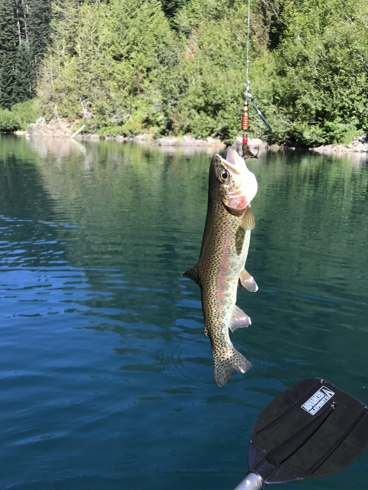 <em>Friday, Aug. 30, 2024 -- Rainbow trout on a lure, caught from a kayak [manual review]</em> -- <a href="https://www.wta.org/go-hiking/trip-reports/trip_report-2024-08-31.082839769056">https://www.wta.org/go-hiking/trip-reports/trip_report-2024-08-31.082839769056</a>

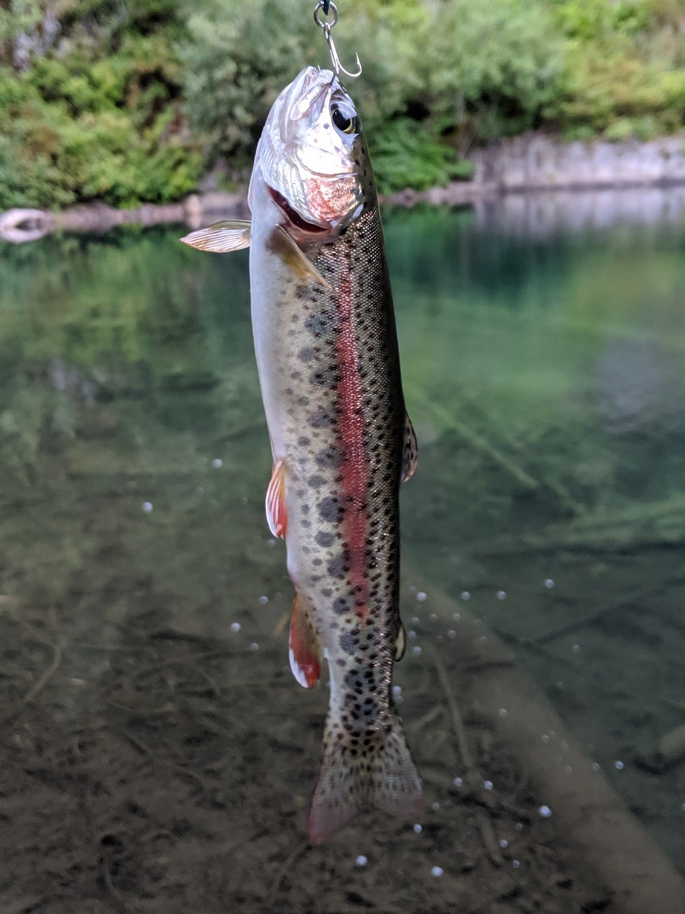 <em>Saturday, Aug. 24, 2019 -- Rainbow trout on a hook [manual review]</em> -- <a href="https://www.wta.org/go-hiking/trip-reports/trip_report.2019-08-26.2986195346">https://www.wta.org/go-hiking/trip-reports/trip_report.2019-08-26.2986195346</a>

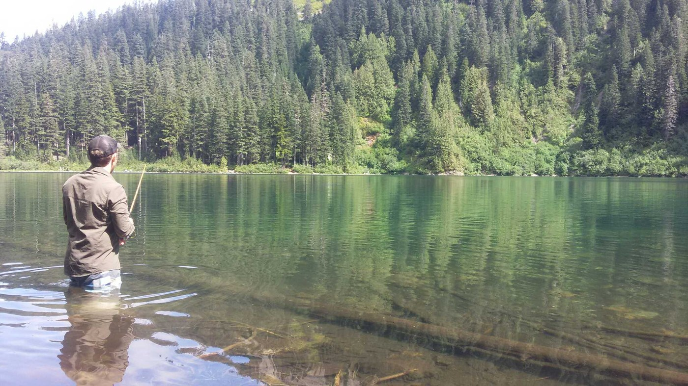 <em>Saturday, Aug. 19, 2017 -- Fly fisherman standing waist-deep in the lake [manual review]</em> -- <a href="https://www.wta.org/go-hiking/trip-reports/trip_report.2017-08-20.9973951123">https://www.wta.org/go-hiking/trip-reports/trip_report.2017-08-20.9973951123</a>

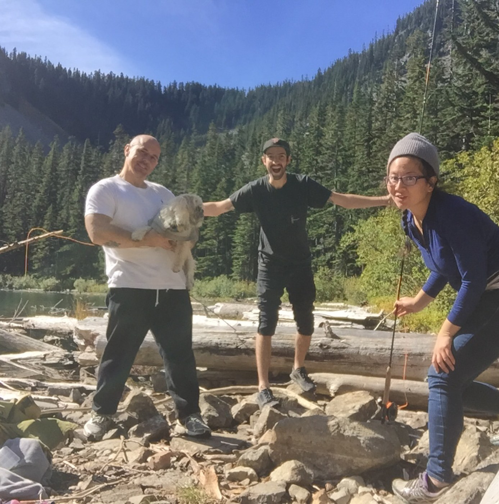 <em>Wednesday, Sep. 23, 2015 -- Group photo, one person holding a fishing rod [manual review]</em> -- <a href="https://www.wta.org/go-hiking/trip-reports/trip_report.2015-09-28.5725731032">https://www.wta.org/go-hiking/trip-reports/trip_report.2015-09-28.5725731032</a>

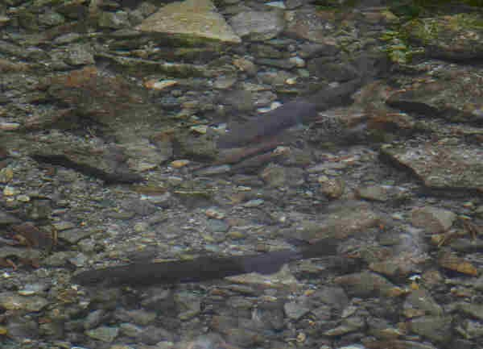 <em>Thursday, Jul. 17, 2008 -- Multiple fish visible in shallow water [manual review]</em> -- <a href="https://www.wta.org/go-hiking/trip-reports/tripreport-2008071801">https://www.wta.org/go-hiking/trip-reports/tripreport-2008071801</a>

**Text mentions:**

- **Thursday, Jun. 18, 2026** -- https://www.wta.org/go-hiking/trip-reports/trip_report-2026-06-20.093420040615
    - text ("fishing"): "..., saw three campsites with tents, saw one person in a little raft, saw a couple other men fishing, I saw some trout in the lake, I almost took a swim as I do in most lakes when I hike, bu..."
    - text ("trout"): "...s with tents, saw one person in a little raft, saw a couple other men fishing, I saw some trout in the lake, I almost took a swim as I do in most lakes when I hike, but decided not to t..."
- **Saturday, Jun. 13, 2026** -- https://www.wta.org/go-hiking/trip-reports/trip_report-2026-06-13.230546989068
    - text ("fish"): "...o the water, she had to concede, "OK this is pretty fun." I'll take it. Watched lots of fish jumping and flipping out of the waters to nab some low-flying bugs. Could be a great spot..."
- **Monday, Jun. 1, 2026** -- https://www.wta.org/go-hiking/trip-reports/trip_report-2026-06-02.213837310761
    - text ("trout"): "...le. Bugs were non-existent on the trail and not that bothersome at the lake. Many small trout were surfacing the late to eat the hatch in the evening...."
- **Sunday, May. 3, 2026** -- https://www.wta.org/go-hiking/trip-reports/trip_report-2026-05-05.002008911223
    - text ("fishing"): "...saw that the lake was totally free of snow and ice. There were even a couple of youngans fishing out on the lake in rafts. I set up camp on the north side of the lake. All of the camps..."
- **Saturday, Aug. 23, 2025** -- https://www.wta.org/go-hiking/trip-reports/trip_report-2025-08-23.185528559265
    - text ("fishing"): "...o don't expect to be away from people at any point either hiking or camping. There were fishing jumping and it is a decent swimming lake too. Very rewarding for an easy hike...."
- **Monday, Jul. 28, 2025** -- https://www.wta.org/go-hiking/trip-reports/trip_report-2025-07-28.214618632301
    - text ("fishing"): "...ace, I made it up in about 90mins. Spent some time floating on the lake while others were fishing. There are great campsites and plenty of lake access. A note at the trailhead mentioned t..."
- **Sunday, Jul. 27, 2025** -- https://www.wta.org/go-hiking/trip-reports/trip_report-2025-07-27.164415249295
    - text ("fish"): "...lake with only a few brief sections of full sun. The lake itself is beautiful. Lots of fish hopping out of the water which provided some entertainment. I shared the lake with severa..."
- **Tuesday, Jul. 8, 2025** -- https://www.wta.org/go-hiking/trip-reports/trip_report-2025-07-09.071053224369
    - text ("fish"): "...The lake was beautiful and not too frigid. I swam for awhile and enjoyed watching the fish jump around me trying to catch the bugs. All in all, it was a lovely hike without any..."
- **Sunday, Jun. 1, 2025** -- https://www.wta.org/go-hiking/trip-reports/trip_report-2025-06-02.082612002108
    - text ("fisherman"): "...thinking about it and it seemed like they were going to just sink into the lake. Saw a fisherman in the lake, and there were lots of folks hanging out at the lake, though we found a spot..."
- **Friday, Aug. 30, 2024** -- https://www.wta.org/go-hiking/trip-reports/trip_report-2024-08-31.082839769056
    - text ("packraft"): "...the pass was supposed to be less hot than most of the state this weekend. I lugged up my packraft which was not easy as this trail is almost all uphill. There is a big tree across the tra..."
    - text ("fish"): "...real easy to cross, other than that the trail is in pretty good shape. I caught several fish but they are mainly focused on eating insects right now. The water is pretty cold, maybe..."
- **Thursday, Aug. 1, 2024** -- https://www.wta.org/go-hiking/trip-reports/trip_report-2024-08-02.083617662513
    - text ("fish"): "...is hike and there have been many trail improvements, Thank You! The lake was beautiful, fish jumping, beautiful mountain reflections onto the water. Some flies and mosquitos, but n..."
- **Saturday, Jun. 22, 2024** -- https://www.wta.org/go-hiking/trip-reports/trip_report-2024-06-22.165324672963
    - text ("trout"): ".... Also quite beautiful with waterfalls, views, and Annette Lake as a great payoff. We saw trout swimming about. Be warned, the gravel road is awful. Parking situation is still bad, pa..."
- **Wednesday, Jun. 12, 2024** -- https://www.wta.org/go-hiking/trip-reports/trip_report-2024-06-12.150605531715
    - text ("fish"): "...he logjam on the way back (if you take a right at the lake you'll see it, along with some fish). He slipped on one of the floating logs that took a spin. Worried that he might get pinn..."
- **Tuesday, Jun. 27, 2023** -- https://www.wta.org/go-hiking/trip-reports/trip_report.2023-06-27.1959953744
    - text ("fish"): "...round. NOOOOO. The old log bridge was cool and the lake was pretty. Surprisingly no bugs, fish were jumping and there were a few wildflowers, queens cup, false solomons seal, violets,..."
- **Thursday, Jun. 22, 2023** -- https://www.wta.org/go-hiking/trip-reports/trip_report.2023-06-22.6132108493
    - text ("fish"): "...uch better served as a day hike location. Beautiful lake, was very clear and saw lots of fish jumping. Had a snack and headed back down. Very nice trail. I will say that I-90 is a me..."
- **Monday, Jun. 19, 2023** -- https://www.wta.org/go-hiking/trip-reports/trip_report.2023-10-02.2557803710
    - text ("fish"): "...run the risk of getting your shoes wet. The lake was crystal clear and filled with small fish. It rained very every other 20 minutes while we were there and the night was very cold. A..."
- **Sunday, Jun. 11, 2023** -- https://www.wta.org/go-hiking/trip-reports/trip_report.2023-06-12.1622263876
    - text ("fish"): "...very nice. Going left around the lake is better than the right - more places to sit. Big fish in the lake too!..."
- **Thursday, Jun. 8, 2023** -- https://www.wta.org/go-hiking/trip-reports/trip_report.2023-06-08.2081434643
    - text ("trout"): "...at Lake to swim when it gets a little warmer, do a family camping night out, and try some trout fishing. Lots of little blue butterflies that seemed curious to be around us, and severa..."
- **Saturday, Jun. 3, 2023** -- https://www.wta.org/go-hiking/trip-reports/trip_report.2023-06-05.0815622573
    - text ("trout"): "...reful not to fall through the snow in the lake! It's still a little cold, plenty of small trout and a few people using inflatable rafts. Long version: started kind of late with full p..."
- **Sunday, Nov. 21, 2021** -- https://www.wta.org/go-hiking/trip-reports/trip_report-2021-11-21-5274652063
    - text ("pack-rafting"): "...r an otherwordly day. What a change in character from the more familiar summer months. No pack-rafting on the lake today (although I had considered bringing my boat) :) Stats Distance: 1..."
- **Monday, Aug. 9, 2021** -- https://www.wta.org/go-hiking/trip-reports/trip_report-2021-08-09-3247011671
    - text ("fishing"): "...fallen trees across the path, but otherwise it’s a clear hike up to the lake. We weren’t fishing, but fish seemed to be biting hard on a carpet of bugs on the lake; no mosquitoes or pesk..."
- **Sunday, Jul. 11, 2021** -- https://www.wta.org/go-hiking/trip-reports/trip_report-2021-07-11-7303020787
    - text ("fish"): "...slip or fall here may lead to injury. Under these logs you can catch glimpses of darting fish, very cool! Across this stream are quite a few established campsites and relative solitud..."
- **Saturday, Jul. 3, 2021** -- https://www.wta.org/go-hiking/trip-reports/trip_report-2021-07-03-0503530087
    - text ("fish"): "...ided against it. Great views across the lake, and some people rafting. We saw some small fish visible in the clear shallow water at the edge of the lake. Overall, a great hike on a n..."
- **Friday, Jul. 2, 2021** -- https://www.wta.org/go-hiking/trip-reports/trip_report-2021-07-02-9132859862
    - text ("fish"): "...a hike! Weather was low 70s and cloudy. The lake is beautiful and very clear with lots of fish jumping. Our hike was pleasant but the trail was pretty busy, we counted 65 people going..."
- **Friday, Jun. 4, 2021** -- https://www.wta.org/go-hiking/trip-reports/trip_report-2021-06-07-1313950296
    - text ("fish"): "...Sorry for the delayed report but wanted to share that there is about an acre of water to fish right in front of the outlet but didn't get any takers. I saw one fish wisely lounging un..."
    - text ("fish"): "...n acre of water to fish right in front of the outlet but didn't get any takers. I saw one fish wisely lounging underneath the log jam but my theory that the rest of his friends would b..."
- **Monday, Sep. 7, 2020** -- https://www.wta.org/go-hiking/trip-reports/trip_report-2020-09-09-8511484135
    - text ("fishing"): "...nice campsites that I have to come back for in the future. Friend and I tried our hand at fishing, but we knew we came at the complete wrong time of day and had no luck. Saw some pretty r..."
    - text ("trout"): "...e knew we came at the complete wrong time of day and had no luck. Saw some pretty redband trout swimming around the shore (taunting us…) and enjoyed the sun. Lots of chipmunks too, so I..."
- **Wednesday, Aug. 26, 2020** -- https://www.wta.org/go-hiking/trip-reports/trip_report-2020-08-26-4831684503
    - text ("fishing"): "...ir way down. We got to the lake about two hours after starting and saw a father and son fishing (they had also spent the night up there) and we chatted with the dad for a while about th..."
- **Saturday, Aug. 22, 2020** -- https://www.wta.org/go-hiking/trip-reports/trip_report-2020-08-23-1773871365
    - text ("fish"): "...trol at all times, even at the top. Lots of wildlife in the area (saw a snake, chipmunks, fish) -pack it in, pack it out. Take your garbage with you. Overall a great hike, just sligh..."
- **Monday, Aug. 10, 2020** -- https://www.wta.org/go-hiking/trip-reports/trip_report-2020-08-11-5627520750
    - text ("fish"): "...ed 3 groups on the way up and easily found a spot by the lake to hang out and saw lots of fish eating insects. On the way down I passed at least 5 groups, so I recommend getting there..."
- **Friday, Aug. 7, 2020** -- https://www.wta.org/go-hiking/trip-reports/trip_report-2020-08-08-3300401897
    - text ("fish"): "...to pick and there are still some tree huckleberry and salmonberries! The lake was full of fish jumping and we even found tadpoles! We got to the lake around 11am on a Friday and there..."
- **Wednesday, Aug. 5, 2020** -- https://www.wta.org/go-hiking/trip-reports/trip_report-2020-08-05-4813924174
    - text ("fish"): "...right sides, but we had no problem getting a nice rest / snack spot on the lake. Lots of fish jumping and dragonflies flying around! Hiking down, there were a lot more parties--we..."
- **Saturday, Aug. 1, 2020** -- https://www.wta.org/go-hiking/trip-reports/trip_report-2020-08-04-6946712196
    - text ("fly fishing"): "...ill smoldering. I finally made it to a spot - not secluded, but the lone camper there was fly fishing and there was a long log right at the edge of the water and he was very welcoming in shar..."
    - text ("fishing"): "...re were people indulging in various activities. Some were doing yoga, some swimming, some fishing etc. After brunch, I decided to walk into the lake about knee high - the water was delici..."
- **Monday, Jul. 20, 2020** -- https://www.wta.org/go-hiking/trip-reports/trip_report-2020-07-20-0692511084
    - text ("fish"): "...big rocks under water and you can just jump in and swim in it. The water is so clear and fish is visible underneath. we saw snake too in the area where we had our lunch. It was clo..."
- **Wednesday, Jul. 15, 2020** -- https://www.wta.org/go-hiking/trip-reports/trip_report-2020-07-16-1790019136
    - text ("fishing"): "...dflowers are starting to bloom in the sunnier spots. The lake is perfect for swimming and fishing right now. The bugs are definitely out. They weren’t bad while I was hiking, but if you’r..."
- **Monday, Jun. 29, 2020** -- https://www.wta.org/go-hiking/trip-reports/trip_report-2020-06-29-9095029875
    - text ("trout"): "...nitely bring bug spray! The lake is a phenomenal blue/green and so clear we could see the trout swimming in it. The sun burned off most of the clouds by the time we reached the top whic..."
- **Monday, Jun. 29, 2020** -- https://www.wta.org/go-hiking/trip-reports/trip_report-2020-06-30-1231968430
    - text ("fishing"): ".... This is Seattle's stomping ground. I recommend this trail for those with dogs and/or fishing poles. I saw the biggest Garter snake of my life at the lake, about 4.5'. Fishing was nic..."
    - text ("Fishing"): "...and/or fishing poles. I saw the biggest Garter snake of my life at the lake, about 4.5'. Fishing was nice, but two people walked right in front of us and starting swimming where were fis..."
    - text ("fishing"): "...ing was nice, but two people walked right in front of us and starting swimming where were fishing so we had to leave that spot. There's an awesome fire pit in one of the campsites if y..."
- **Sunday, Nov. 24, 2019** -- https://www.wta.org/go-hiking/trip-reports/trip_report-2020-01-28-5677070832
    - text ("fishing"): "...ople on the trail. It was very wet and cold. The lake was nice and I wish I had bought my fishing pole and tackle. It was very fun!..."
- **Friday, Sep. 6, 2019** -- https://www.wta.org/go-hiking/trip-reports/trip_report.2019-09-11.5490210891
    - text ("trout"): "...nd the mountain to the west. Water: The lake is beautiful and clear. In the evenings, trout appeared to be feeding (definitely bringing fishing tackle next time). The lake outlet is..."
    - text ("fishing"): "...s beautiful and clear. In the evenings, trout appeared to be feeding (definitely bringing fishing tackle next time). The lake outlet is mostly dry, but if you climb down the log jam, you’..."
- **Saturday, Aug. 24, 2019** -- https://www.wta.org/go-hiking/trip-reports/trip_report.2019-08-26.2986195346
    - text ("fishing"): "...ut there's more along the west side of the lake with awesome fire pits. If you plan on fishing, definitely bring your fly rod! I brought my spinning gear and managed to pull in one bea..."
    - text ("fly rod"): "...side of the lake with awesome fire pits. If you plan on fishing, definitely bring your fly rod! I brought my spinning gear and managed to pull in one beautiful little rainbow, though I..."
- **Tuesday, Aug. 6, 2019** -- https://www.wta.org/go-hiking/trip-reports/trip_report.2019-08-07.3855486789
    - text ("trout"): "...e shade and not be exposed. The lake was beautiful and warm enough for a swim. A few lake trout were jumping to catch the plentiful bugs buzzing around. Bugs were not a problem until I..."
- **Sunday, Jul. 28, 2019** -- https://www.wta.org/go-hiking/trip-reports/trip_report.2019-07-29.3265436415
    - text ("Fish"): "...y hike close to home. Some wild flowers and berries along the way plus beautiful weather. Fish were jumping and the fishing was fine. Some folks even brought up inflatables to float ar..."
    - text ("fishing"): "...wild flowers and berries along the way plus beautiful weather. Fish were jumping and the fishing was fine. Some folks even brought up inflatables to float around on. I wish I would of th..."
- **Saturday, Jul. 6, 2019** -- https://www.wta.org/go-hiking/trip-reports/trip_report.2019-07-07.7014031648
    - text ("fish"): "...it were raining, few mosquito bites from by the lake edge Highlight: BF caught a small fish in the lake! Difficulty: the elevation gain section definitely had me catching my breat..."
- **Saturday, Jun. 29, 2019** -- https://www.wta.org/go-hiking/trip-reports/trip_report.2019-07-01.2971306884
    - text ("packraft"): "...p set up camp at the large group site near the lake. I got a chance to borrow a friend's packraft to check out a cool waterfall on the other side of the lake. The group had smores over t..."
- **Friday, Jun. 21, 2019** -- https://www.wta.org/go-hiking/trip-reports/trip_report.2019-06-22.9128436095
    - text ("fishing"): "...er leaves. If you look delicately underneath, you see the ginger flower. Two osprey were fishing at the lake...."
- **Saturday, Jun. 8, 2019** -- https://www.wta.org/go-hiking/trip-reports/trip_report.2019-06-08.8366420040
    - text ("fishing"): "...p, but it was much busier going down. The lake is beautiful and clear and has pretty good fishing. There were tons of dogs on the trail and around the lake, about half of which were off-l..."
- **Tuesday, Aug. 14, 2018** -- https://www.wta.org/go-hiking/trip-reports/trip_report.2018-08-14.4143570311
    - text ("trout"): "...g very clear I wish we would have brought some snorkeling gear. There was a lot of small trout jumping all over the lake. It took us about 2hrs to get to the lake even with having to m..."
- **Sunday, Aug. 5, 2018** -- https://www.wta.org/go-hiking/trip-reports/trip_report.2018-08-05.8651576345
    - text ("fishing"): "...uminating the crystalline lake water was serene and rather other-worldly. Two people were fishing, and a few others were sitting on logs around the lake. We explored the path around the l..."
- **Saturday, Jul. 28, 2018** -- https://www.wta.org/go-hiking/trip-reports/trip_report.2018-08-02.2765353743
    - text ("fishing"): "...t to the lake by 8:30. The lake was peaceful and quiet - there were just a couple people fishing and another hiking group relaxing. I think the lake would've been prettier if the sun ha..."
- **Wednesday, Jul. 18, 2018** -- https://www.wta.org/go-hiking/trip-reports/trip_report.2018-07-22.6909657612
    - text ("fish"): "...ardless, it is a lovely hike and a good workout. The lake is beautiful and clear. Lots of fish jumping out of the water to catch bugs. #HikingtheState..."
- **Thursday, Jul. 12, 2018** -- https://www.wta.org/go-hiking/trip-reports/trip_report.2018-07-12.1138391942
    - text ("fishing"): "...w often does that happen?? There were only 3 others at the lake when I got there - a guy fishing and a couple just hiking out. I did pass quite a few people on my way out, so early is d..."
- **Wednesday, Jun. 27, 2018** -- https://www.wta.org/go-hiking/trip-reports/trip_report.2018-06-27.7979075450
    - text ("fish"): "...Had the lake to ourselves for a bit, viewed the waterfalls across the way and watched the fish jump, then headed back down trail. Several groups were hiking up on our return, and the p..."
- **Friday, Jun. 15, 2018** -- https://www.wta.org/go-hiking/trip-reports/trip_report.2018-06-18.3611657375
    - text ("fish"): "...unleveled ground and rocks. There's a cool hawk that fishes in the lake. We also saw fish jumping in the lake every few minutes. The high waterfall to the right is gorgeous and i..."
- **Sunday, Sep. 17, 2017** -- https://www.wta.org/go-hiking/trip-reports/trip_report.2017-10-06.6334011328
    - text ("Fish"): "...3 full at 11am and I only saw 25 people the entire time. Pikas were peeking and peeping. Fish were jumping. Rambunctious boy scout campers were having a rollicking good time at the la..."
- **Saturday, Aug. 19, 2017** -- https://www.wta.org/go-hiking/trip-reports/trip_report.2017-08-20.9973951123
    - text ("fishing"): "...Yesterday's hike to Annette Lake was the perfect way to spend the day hiking and fishing with some good friends and their sweet (on leash) dog. I was impressed at how many of ou..."
- **Monday, Aug. 7, 2017** -- https://www.wta.org/go-hiking/trip-reports/trip_report.2017-08-08.4988376654
    - text ("fish"): "...cks come to an end, you are almost there. The Lake is beautiful and clear. You can see fish swimming around. Its a great place to have lunch and relax. Plenty of places for everyone..."
- **Saturday, Jul. 22, 2017** -- https://www.wta.org/go-hiking/trip-reports/trip_report.2017-07-23.1685435976
    - text ("fish"): "...e gone. Minus the flies it would make for an amazing backpacking spot, and we saw lots of fish jumping!..."
- **Wednesday, Jun. 28, 2017** -- https://www.wta.org/go-hiking/trip-reports/trip_report.2017-06-28.8286589168
    - text ("trout"): "...trailhead (with plenty of parking spots) at 11AM this morning and made it to the rainbow trout-filled lake around 12:45PM for lunch while listening to the rushing waterfall across from..."
- **Sunday, Jun. 4, 2017** -- https://www.wta.org/go-hiking/trip-reports/trip_report.2017-06-05.5928048720
    - text ("fish"): "...still mostly frozen, but that did not stop a few people from casting lines in hopes of a fish story to tell...."
- **Monday, Aug. 22, 2016** -- https://www.wta.org/go-hiking/trip-reports/trip_report.2016-08-23.6606648394
    - text ("fish"): "...Trail was in good shape. No obstacles. The lake was gorgeous and I even saw a energetic fish jump out of the water. The bugs weren't bad at all, but I can't comment on evening mosqui..."
- **Sunday, Jul. 10, 2016** -- https://www.wta.org/go-hiking/trip-reports/trip_report.2016-07-10.7171515360
    - text ("fishing"): "...therwise in great shape. Several people carrying poles on the way down mentioned that the fishing was lousy...."
- **Wednesday, Jun. 15, 2016** -- https://www.wta.org/go-hiking/trip-reports/trip_report.2016-06-23.5634803853
    - text ("fish"): "...ck and root and mud. You will need hiking boots. The lake was stunning blue/green and the fish were starting to jump a little, well worth the trek. We found a spot along the water and..."
- **Sunday, Jun. 5, 2016** -- https://www.wta.org/go-hiking/trip-reports/trip_report.2016-06-05.4391417545
    - text ("fishing"): "...othing difficult to get over. The lake is beautiful, we saw a few people heading up with fishing poles. It took us about 2 hours to get there. Some muddy spots but nothing terrible. We w..."
- **Friday, Jun. 3, 2016** -- https://www.wta.org/go-hiking/trip-reports/trip_report.2016-06-11.8346992330
    - text ("fish"): "...e were limited for space while having our lunch, but the view was gorgeous as always. The fish in the lake were very active, in case that's of any interest to anyone...."
- **Sunday, Oct. 4, 2015** -- https://www.wta.org/go-hiking/trip-reports/trip_report.2016-04-03.2949712380
    - text ("fishing"): "...Day hike for a little fishing. WTA trail party working on some portions. Thank you for that. Overall trail in good shap..."
- **Wednesday, Sep. 23, 2015** -- https://www.wta.org/go-hiking/trip-reports/trip_report.2015-09-28.5725731032
    - text ("fish"): "...s in good shape, and was busy for a midweek. Sunny, crisp, fall foliage. Didn't catch any fish, but had a fun hike...."
- **Friday, Sep. 11, 2015** -- https://www.wta.org/go-hiking/trip-reports/trip_report.2015-09-12.9734433574
    - text ("fishing"): "...line area (thank you!!). The lake itself was beautiful. Some folks were hiking up with fishing poles to fish for trout. The Asahel Curtis Nature Trail starts and ends just to the left..."
    - text ("trout"): "...The lake itself was beautiful. Some folks were hiking up with fishing poles to fish for trout. The Asahel Curtis Nature Trail starts and ends just to the left of the Annette Lake tra..."
- **Wednesday, Sep. 9, 2015** -- https://www.wta.org/go-hiking/trip-reports/trip_report.2015-09-10.9521700394
    - text ("fish"): "...who enjoyed the warm sun and great views east to Silver Peak and west to Humpback Mtn. No fish jumping and no naked swimmers so we packed down early after lunch to socialize with the c..."
- **Tuesday, Aug. 25, 2015** -- https://www.wta.org/go-hiking/trip-reports/trip_report.2015-08-27.6162886144
    - text ("fly rod"): "...Took a reflective day off from work. Caught a sweet little rainbow on my Tenkara fly rod (tenkararodco.com). Had lunch. Left happy :)..."
- **Thursday, Aug. 20, 2015** -- https://www.wta.org/go-hiking/trip-reports/trip_report.2015-08-21.9855248527
    - text ("fish"): "...g to the lake. The trail was extremely peaceful. The lake was pretty. Birds all around, fish jumping in the lake, chipmunks coming and sitting right by us. Fog was rolling in and out..."
- **Friday, Jul. 31, 2015** -- https://www.wta.org/go-hiking/trip-reports/trip_report.2015-08-03.6822707950
    - text ("trout"): "...rnight groups (us - a couple, one family, and another couple). There seem to be a lot of trout in the lake. We hiked out at 10:30 a.m. on Saturday morning and were amazed at the hundr..."
- **Saturday, Jun. 27, 2015** -- https://www.wta.org/go-hiking/trip-reports/trip_report.2015-06-29.8984030381
    - text ("trout"): "...uch a hot day and the water was not as cold as expected. It was so clear we even saw some trout swimming near our lunch spot. There was a small waterfall on the opposite end of the lake..."
- **Thursday, Jun. 18, 2015** -- https://www.wta.org/go-hiking/trip-reports/trip_report.2015-06-21.2697726063
    - text ("fishing"): "...le before making a fire that night. We hung our hammocks, relaxed, and I tried my hand at fishing for a while. Tons of cutthroat trout were jumping and feasting on the flies that were hat..."
    - text ("trout"): "...hung our hammocks, relaxed, and I tried my hand at fishing for a while. Tons of cutthroat trout were jumping and feasting on the flies that were hatching that afternoon. I only had worm..."
    - text ("fish"): "...that were hatching that afternoon. I only had worm and got one nibble. I watched maybe 10 fish swim up to my worm, look at it, and swim off. They simply weren't interested. Frustrating..."
- **Thursday, Jun. 11, 2015** -- https://www.wta.org/go-hiking/trip-reports/trip_report.2015-06-12.2363547134
    - text ("fly fishing"): "...he trees sounded like they would fall at any moment in the wind. The lake looks great for fly fishing, i saw lots of fish jumping. The walk back down was hard because i was sore from the pri..."
    - text ("fish"): "...would fall at any moment in the wind. The lake looks great for fly fishing, i saw lots of fish jumping. The walk back down was hard because i was sore from the prior day. It was a gr..."
- **Wednesday, May. 20, 2015** -- https://www.wta.org/go-hiking/trip-reports/trip_report.2015-05-21.8032625662
    - text ("trout"): "...Just a little mud on the trail. Lots of trout swimming in the outlet (to the north of the log crossing). Shoreline at the lake is pret..."
- **Tuesday, May. 19, 2015** -- https://www.wta.org/go-hiking/trip-reports/trip_report.2015-05-20.8069746667
    - text ("trout"): "...the lake. The lake itself is incredible, and worth the burn to get up there. There were trout swimming around everywhere, especially in the cool little makeshift bridge where you see..."
    - text ("trout"): "...everywhere, especially in the cool little makeshift bridge where you see at least 30 plus trout swimming around. There was a kid doing some fly fishing and he was doing great, probably..."
    - text ("fly fishing"): "...bridge where you see at least 30 plus trout swimming around. There was a kid doing some fly fishing and he was doing great, probably caught and released at least 20 trout. I did notice aft..."
- **Friday, Apr. 3, 2015** -- https://www.wta.org/go-hiking/trip-reports/trip_report.2015-04-04.7451362138
    - text ("fishing"): "...First time on this trail, Our intentions were to try fishing at the lake. Closer to the top there is several inches of snow, the trail was well used s..."
- **Saturday, Jul. 12, 2014** -- https://www.wta.org/go-hiking/trip-reports/trip_report.2014-07-12.7673272037
    - text ("fish"): "...with plenty of shade from the forest canopy. No bugs. Ran in to some folks planning to fish the lake. A very pretty lake with several ways to access the lake shore. A WTA work par..."
- **Friday, Jul. 4, 2014** -- https://www.wta.org/go-hiking/trip-reports/trip_report.2014-07-08.8677649463
    - text ("fish"): "...s along the shore where you can easily get to the water. We watched an osprey hunting for fish in the early evening. The large waterfall that drops into the lake on the southeast side..."
- **Sunday, Aug. 25, 2013** -- https://www.wta.org/go-hiking/trip-reports/trip_report.2013-08-25.4539949636
    - text ("fisherman"): "...Fewer than expected bugs. For all the fisherman, the fish were jumping and we saw a couple of people casting their lines in. Trail is in..."
- **Sunday, Jul. 7, 2013** -- https://www.wta.org/go-hiking/trip-reports/trip_report.2013-07-08.5670354880
    - text ("trout"): "...any part of the trail. Enjoyed a nice lunch by the lake sitting on a rock watching lake trout swim past us before heading down. Past a lot of folks headed up. Was just past noon and..."
- **Saturday, Jun. 29, 2013** -- https://www.wta.org/go-hiking/trip-reports/trip_report.2013-06-30.4418364932
- **Monday, Jun. 17, 2013** -- https://www.wta.org/go-hiking/trip-reports/trip_report.2013-06-18.1361809543
    - text ("trout"): "...n the far side. Nice spots to have some lunch. Crossing the logs, I stopped to watch some trout swimming below. Saw a couple of families on their way up as I headed down, and the lot wa..."
- **Sunday, Jul. 29, 2012** -- https://www.wta.org/go-hiking/trip-reports/trip_report.2012-07-29.8740229285
    - text ("fishing"): "...ent condition. Many folks today and on most days when the sun shines I suspect. I found a fishing rod. If it's yours please contact me......."
- **Friday, Jul. 6, 2012** -- https://www.wta.org/go-hiking/trip-reports/trip_report.2012-07-06.6066497272
    - text ("trout"): "...he lake. Lots of nice campsites at Lake Annette. The lake is ice free and the cutthroat trout are plain to see at the spillway - about 8" long with bright red bellies. Some really ni..."
- **Friday, Jul. 22, 2011** -- https://www.wta.org/go-hiking/trip-reports/trip_report.2011-07-22.3584910966
    - text ("fish"): ".... The log crossing that goes to the right of the lake was scary and there were a bunch of fish in the water there...."
- **Monday, Jul. 19, 2010** -- https://www.wta.org/go-hiking/trip-reports/trip_report.2010-07-20.1719980782
    - text ("trout"): "...and crystal clear skys. Fished for several hours with flys and caught 8 or 10 very small trout (5 to 7 inches, which were all released. Lake is shallow all the way around and probaby s..."
    - text ("fish"): "...h were all released. Lake is shallow all the way around and probaby should have a tube to fish it correctly. Not many bugs and they were not a problem. Counted 19 people at the lake wi..."
- **Wednesday, Jun. 30, 2010** -- https://www.wta.org/go-hiking/trip-reports/trip_report.2010-07-01.2160164918
    - text ("trout"): "...the joys of hiking. Trillium was evident on most of the trail but I missed seeing the trout in Lake Annette I spotted during my last visit...."
- **Thursday, Sep. 24, 2009** -- https://www.wta.org/go-hiking/trip-reports/trip_report.2009-09-28.3250575658
    - text ("fisherman"): "...snack break before the final leg of our journey. The lake was quite pleasant, with a lone fisherman trying to free his line from a snag. No bugs, but also no berries. As we hiked down Annet..."
- **Wednesday, Aug. 5, 2009** -- https://www.wta.org/go-hiking/trip-reports/trip_report.2009-08-10.9176254849
    - text ("fish"): "...5p and had it all to ourselves. It was very peaceful as we sat and watched the 'jumping' fish! No problems with bugs on the trail, and only a few at the lake...."
- **Saturday, Jun. 20, 2009** -- https://www.wta.org/go-hiking/trip-reports/trip_report.2009-06-21.8306371978
    - text ("trout"): "...were only two other campers. Some boys and their dad were very excited about a couple of trout they had caught in the morning so that was exciting. Nothing wrong with the trail, but I..."
- **Monday, Jul. 21, 2008** -- https://www.wta.org/go-hiking/trip-reports/tripreport-2008072206
    - text ("fish"): "...e. Its not a problem to cross over and through. The lake is very nice and you can see the fish come up to the surface. I should have brought a pole to catch lunch. There are some bugs..."
- **Thursday, Jul. 17, 2008** -- https://www.wta.org/go-hiking/trip-reports/tripreport-2008071801
    - text ("fish"): "...f blooms... a few Bleeding Hearts still hanging in there and a handful of Bunchberry. The fish, some sporting red racing stripes, proved more colorful than the flora...."
- **Sunday, Sep. 2, 2007** -- https://www.wta.org/go-hiking/trip-reports/tripreport-2007090303
    - text ("Salmon"): "...a very popular trail, it does have its rocky and rooty sections. There were some berries, Salmon and blue and I got ONE thimbleberry. Fireweed and pearly everlasting were generally it f..."
- **Friday, Jun. 23, 2006** -- https://www.wta.org/go-hiking/trip-reports/tripreport-2006062431
    - text ("trout"): "...s of water up to the lake! Have to wish these folks the best. The lake had lots of small trout in the shallows and likely some larger trout in the deeper sections of the lake. It was c..."
    - text ("trout"): "...folks the best. The lake had lots of small trout in the shallows and likely some larger trout in the deeper sections of the lake. It was cool to see all the fish. All in all it was a..."
    - text ("fish"): "...d likely some larger trout in the deeper sections of the lake. It was cool to see all the fish. All in all it was a great day in the mountains. This is not a solitude hike but still o..."
- **Monday, May. 23, 2005** -- https://www.wta.org/go-hiking/trip-reports/tripreport-2005052403
    - text ("fish"): "...w a pair of butterflies, two chipmunks that came right up to me and a number of 6"" or so fish. A pleasure!..."
- **Friday, Jun. 11, 2004** -- https://www.wta.org/go-hiking/trip-reports/tripreport-2004061219
    - text ("fish"): "...There were a couple beavers or something in the lake having fun in the water and catching fish with the hikers avidly looking on from shore. The hike back was pretty smooth. There are..."
- **Friday, Jun. 6, 2003** -- https://www.wta.org/go-hiking/trip-reports/tripreport-2003060720
    - text ("trout"): "...ozen. I'm glad to say that as of June 7th the lake was ice free, cold on the feet and the trout they were a swimmin'. There were some bugs but they weren't too bad, we were able to stay..."
- **Friday, Aug. 16, 2002** -- https://www.wta.org/go-hiking/trip-reports/tripreport-2002081713
    - text ("fishing"): "...he Tree canopy keeps the trail cool until you hit the lake in full sunlight. A Heron was fishing the opposite side of the late and demoed some water landings. Pack it in, pack it out!..."
- **Friday, Aug. 16, 2002** -- https://www.wta.org/go-hiking/trip-reports/tripreport-2002081726
    - text ("fish"): "...a tree that fell down further down the trail-scared us out of a deep sleep!). Caught 10 fish (Browns and Rainbows). 3/10 were keepers but released all for future fisherman. Nice pla..."
    - text ("fisherman"): "...p!). Caught 10 fish (Browns and Rainbows). 3/10 were keepers but released all for future fisherman. Nice place to fish and spend the night. Biting flys can be annoying and nothing seems t..."
    - text ("fish"): "...ns and Rainbows). 3/10 were keepers but released all for future fisherman. Nice place to fish and spend the night. Biting flys can be annoying and nothing seems to work (coils or bug..."
- **Saturday, Jul. 27, 2002** -- https://www.wta.org/go-hiking/trip-reports/tripreport-2002072810
    - text ("fish"): "...out too much trouble. Good family hike for older kids but do it on a sunny day so you can fish or play in the water...."
- **Saturday, Jun. 22, 2002** -- https://www.wta.org/go-hiking/trip-reports/tripreport-2002062309
    - text ("fishing"): "...spots. Snow is 2-3 feet thick around the lake, and very solid. Good for hiking, good for fishing, bad for geocaching. *grin*..."
- **Friday, Jun. 15, 2001** -- https://www.wta.org/go-hiking/trip-reports/tripreport-2001061629
    - text ("fishermen"): "...Trail was in good shape with only one snow patch right as you approach the lake. For you fishermen/women, there were trout (small ones about 6 - 10 inches) rising everywhere and you could..."
    - text ("trout"): "...h only one snow patch right as you approach the lake. For you fishermen/women, there were trout (small ones about 6 - 10 inches) rising everywhere and you could see them battling for fe..."
- **Thursday, May. 31, 2001** -- https://www.wta.org/go-hiking/trip-reports/tripreport-2001060102
    - text ("trout"): "...until just before the lake. The lake still had ice in it, but was mostly thawed out. Some trout surfacing in the outlet. We headed straight up to Silver Peak from about 300 yards befor..."
- **Monday, Jun. 15, 1998** -- https://www.wta.org/go-hiking/trip-reports/tripreport-1998061602
    - text ("trout"): "...lake. Day was hazy, cool, but dry. Saw elk prints on the trail, and numerous fingerling trout in the lake near the outlet. Trilium and ""mock dogwood"" are in bloom. A pleasant work..."
- **Saturday, Feb. 21, 1998** -- https://www.wta.org/go-hiking/trip-reports/tripreport-1998022200
    - text ("fish"): "...completely iced over and owing to the lack of people, was very peaceful and beautiful. No fish were jumping as they would bump their little fishie-heads on the ice. There is 8 to 10 fe..."

### Waptus Lake via Waptus River

https://www.wta.org/go-hiking/hikes/waptus-river

_111 photo(s) downloaded for visual review, 6 contact sheet(s) generated._

**Fishing photos (2):**

 <em>Friday, Sep. 10, 2021 -- Fish with beautiful Spade Lake water color [caption match]</em> -- <a href="https://www.wta.org/go-hiking/trip-reports/trip_report-2021-09-14-9750762762">https://www.wta.org/go-hiking/trip-reports/trip_report-2021-09-14-9750762762</a>

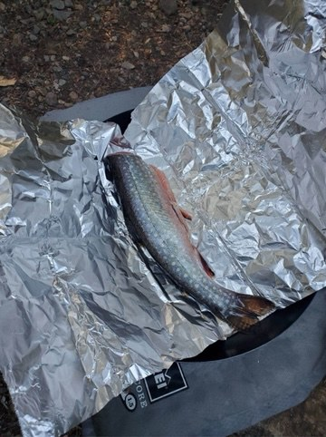 <em>Friday, Jul. 17, 2020 -- Whole trout wrapped in foil, ready to cook [manual review]</em> -- <a href="https://www.wta.org/go-hiking/trip-reports/trip_report-2020-11-02-9420842616">https://www.wta.org/go-hiking/trip-reports/trip_report-2020-11-02-9420842616</a>

**Text mentions:**

- **Friday, Jul. 3, 2026** -- https://www.wta.org/go-hiking/trip-reports/trip_report-2026-07-05.155228418461
    - text ("fish"): "...were the worst for me at Venus - I got swarmed every time I stopped moving. I saw lots of fish in the lake. I also climbed up above the lake using the boot path on the left - definitel..."
- **Friday, Jun. 12, 2026** -- https://www.wta.org/go-hiking/trip-reports/trip_report-2026-06-15.152946727088
    - text ("fishermen"): "...a much sketchier crossing. Waptus is beautiful with tons of camp site options. Lots of fishermen on the trail. The trail around the NE side of Waptus until the junction with the PCT was..."
- **Thursday, Aug. 21, 2025** -- https://www.wta.org/go-hiking/trip-reports/trip_report-2025-10-06.134422051720
    - text ("pack rafts"): "...olor painting which I’ve never done before on a backpacking trip! Next, we both took our pack rafts out onto Spade Lake where we explored floated about for an hour or so before eating lunch..."
- **Friday, Jul. 4, 2025** -- https://www.wta.org/go-hiking/trip-reports/trip_report-2025-07-05.180445322166
    - text ("packraft"): "...Lake, near Quick creek. There were tons of other hikers, plus a fun party that brought a packraft. My partner and I gathered water and started hiking west, up the Waptus Pass Trail, aroun..."
- **Sunday, Sep. 8, 2024** -- https://www.wta.org/go-hiking/trip-reports/trip_report-2024-09-08.162456627601
    - text ("fisherman"): "...rday, we hiked to Spade Lake. This trail was a hard climb for me. It's more a glorified fisherman's trail. It starts by climbing straight up for a long time before traversing, then drops..."
- **Sunday, Sep. 8, 2024** -- https://www.wta.org/go-hiking/trip-reports/trip_report-2024-09-08.190941491715
    - text ("fisherman"): "...l appeared to be far away. After a bit of this traverse, and up around 5700 ft, I found a fisherman's/hunter's trail!! With this trail my pace quickened, and pretty soon I was on the ridge..."
    - text ("fisherman"): ".... The drainage looked promising, so I decided to take it, in the hope that I would find a fisherman's trail. After a good amount of good travel, I came up to a 200ft vertical drop with this..."
- **Friday, Aug. 30, 2024** -- https://www.wta.org/go-hiking/trip-reports/trip_report-2024-09-02.080016538789
    - text ("fishing"): "...3 there were just a few real spots left but many cars seemed to be there for swimming and fishing right at the TH. Got back around noon on Sunday and there were cars everywhere, all down..."
    - text ("fish"): "...swimming and the grounds gets super squishy past the immediate pebbly shore. We saw some fish in the lake. No toilet any more and the one that still existed by the Spade Trail spli..."
    - text ("fish"): "...were painful and we wished we had brought our sandals up from Waptus. We saw decent size fish here too. Spade to Venus: Once we hit the end of the lake there were a lot of little..."
- **Friday, Sep. 2, 2022** -- https://www.wta.org/go-hiking/trip-reports/trip_report.2022-09-05.1076696973
    - text ("trout"): "...not a problem. Plenty of campsites at Waptus and Spade, none at Venus. No snow. Plenty of trout in Waptus and Spade lakes. Permits required: NW Forest Pass, self-issued backcountry perm..."
    - text ("fish"): "...s from seeing into the far distance. The lake itself was turquoise and clear. We saw some fish jumping, and indeed, a nearby camper said he caught some trout. We had dinner on a rocky..."
    - text ("trout"): "...oise and clear. We saw some fish jumping, and indeed, a nearby camper said he caught some trout. We had dinner on a rocky beach and climbed into the tent for the night. Saturday morni..."
- **Wednesday, Aug. 24, 2022** -- https://www.wta.org/go-hiking/trip-reports/trip_report.2022-08-29.3818618027
    - text ("fish"): "...junction and .75 mi before lake. Lake was warm and clear, saw lots of medium-larger sized fish swimming around. Some bugs but not bad. Appears that far edge saw some winter/spring dama..."
    - text ("fishing"): "...tion and at the base of the mountains. There were four or five groups already camping and fishing. Campsites up there are either in the trees or out by the lake. We followed the trail bac..."
- **Friday, Sep. 10, 2021** -- https://www.wta.org/go-hiking/trip-reports/trip_report-2021-09-15-4999451036
    - text ("fisherman"): "...ours. Our water filter broke in the morning and we had to ration water on the way back. A fisherman named Larry overheard us discussing our predicament and he gave us a liter of water to sh..."
    - text ("trout"): "...e saw otters in Waptus lake, and a bunch of deer, some bats, snakes, pika, chipmunks, and trout. Bugs were not so bad. I wore one of those bug bands and I only got bitten twice the whol..."
- **Friday, Sep. 10, 2021** -- https://www.wta.org/go-hiking/trip-reports/trip_report-2021-09-14-9750762762
    - text ("fishing"): "...itely changing as the bushes are all changing colors as you get up from Waptus. Oh ya.. fishing was good ;)..."
- **Monday, Aug. 2, 2021** -- https://www.wta.org/go-hiking/trip-reports/trip_report-2021-08-06-8769682619
    - text ("Salmon"): "...Took a quick overnight trip to Waptus lake via the Waptus river TH at Salmon LeSac. The weather was quite warm and humid making the shaded trail sections, which is a..."
- **Wednesday, Jul. 21, 2021** -- https://www.wta.org/go-hiking/trip-reports/trip_report-2021-07-24-7995004358
    - text ("Fish"): "...ase consider buying their book. Day 1: Arrived at the Tucquala Meadows TH at the end of Fish Lake Rd, aka FS Rd 4430, midmorning on a Wednesday and scored the last spot in the primar..."
- **Wednesday, Jul. 7, 2021** -- https://www.wta.org/go-hiking/trip-reports/trip_report-2021-07-09-6138748892
    - text ("fishing"): "...lf). The Cooper River trail is well-used and delightful, with even a few swimming / fishing / picnicking spots as it approaches the Cooper Lake road. From there follow the road a fe..."
    - text ("fishing"): "...sites toward the lake). There is also a rough, lakeside way trail to informal camping and fishing sites (you can easily bushwack up to the main trail if necessary). I seemed to be t..."
- **Saturday, Oct. 10, 2020** -- https://www.wta.org/go-hiking/trip-reports/trip_report-2020-10-14-3824569896
    - text ("salmon"): ".... There was a lot of Oregon grape along the trail, and some snowberry as well. There were salmon spawning just past the trailhead sign, and I saw a group of four deer on the trail about..."
- **Tuesday, Sep. 22, 2020** -- https://www.wta.org/go-hiking/trip-reports/trip_report-2020-09-22-3653822074
    - text ("salmon"): "...nly did today. Waptus is one of our favorite trails for its variation and quietude. The salmon are spawning right now, and right at the trail's start, just beyond the TH, if you stop a..."
    - text ("salmon"): "...and look down at the Cooper River (which runs sort of parallel to Waptus), you'll see the salmon cycle of life continuing on--despite the idiocy of us humanoids. The trail continues from..."
- **Sunday, Aug. 23, 2020** -- https://www.wta.org/go-hiking/trip-reports/trip_report-2020-08-24-7443229969
    - text ("fisherman"): "...y tired legs in the ice cold water, enjoying the views and had a nice conversation with a fisherman. Early to bed because I had designs on the summit of Mt. Daniel the next morning. Took..."
- **Friday, Jul. 24, 2020** -- https://www.wta.org/go-hiking/trip-reports/trip_report-2020-07-27-2198119127
    - text ("pack rafts"): "...of the lake, although a bit small for our group of three. A quick dip and a float on our pack rafts in the afternoon felt glorious. There was unfortunately no escape from the bugs later tha..."
- **Wednesday, Jul. 22, 2020** -- https://www.wta.org/go-hiking/trip-reports/trip_report-2020-07-22-9214469044
    - text ("salmon"): "...rs of clothes and mosquito netting for head. Lots of wildflowers! Berries were huckle and salmon. Spade Lake trail-- IMO, the whole trail is an obstacle. Steep grade comprised of slip..."
- **Friday, Jul. 17, 2020** -- https://www.wta.org/go-hiking/trip-reports/trip_report-2020-11-02-9420842616
    - text ("fishing"): "...a toilet, trail head to Spade Lake, next to a Creek for water refills and lake access for fishing. The fish were biting and tasted delicious...."
- **Friday, Jul. 17, 2020** -- https://www.wta.org/go-hiking/trip-reports/trip_report-2020-07-19-0473027471
    - text ("fisherman"): "...retty annoying from miles 4-7. recommend light weight long sleeves and bug spray (I like fisherman's friend piccardin) Also, I think it's worth noting the destination is amazing and wort..."
- **Saturday, Jul. 11, 2020** -- https://www.wta.org/go-hiking/trip-reports/trip_report-2020-07-17-7396449333
    - text ("fishing"): "...t windy, and was seemingly unoccupied. I debated making camp and took a few casts with my fishing pole (no bites and no fish observed), but decided to press on to Lake Terence. The trai..."
    - text ("fish"): "...ccupied. I debated making camp and took a few casts with my fishing pole (no bites and no fish observed), but decided to press on to Lake Terence. The trail to Lake Terence was rough..."
    - text ("fish"): "...spot I found was right where the trail meets the lake. I was all alone. There were a few fish rising, but in the middle of the lake, and I got no bites fishing from the shore. I arriv..."
- **Thursday, Jul. 2, 2020** -- https://www.wta.org/go-hiking/trip-reports/trip_report-2020-07-04-1854548561
    - text ("salmon"): "...kend. The last time my husband and I did this, it was October and very chilly, and we saw salmon in the Cooper River! I was nervous about the horse ford. At 5'3, it came up to mid thigh,..."
- **Thursday, Jun. 11, 2020** -- https://www.wta.org/go-hiking/trip-reports/trip_report-2020-06-11-9758828272
    - text ("salmon"): "...hike, as we have always opted for the macho 22-mile trail to Waptus Lake. Cooper River, a salmon spawning ground, is another jade-colored river, wild and gorgeous. The whole area is just..."
- **Saturday, Aug. 31, 2019** -- https://www.wta.org/go-hiking/trip-reports/trip_report.2019-09-06.1711463810
    - text ("fish"): "...s fabulous--chilly but great for swimming in the hot afternoon sun, crystal clear waters, fish flopping. Sunday we headed up to Spade. With our added mile from our campsite to the S..."
- **Sunday, Jul. 21, 2019** -- https://www.wta.org/go-hiking/trip-reports/trip_report.2019-08-03.7386194972
    - text ("fishing"): "...ally wish you had filled the water bottle at the big crossing. Deep lake is really nice, fishing was excellent and we had a side hike to Lake Vincent which was a little difficult. Reall..."
- **Wednesday, Sep. 5, 2018** -- https://www.wta.org/go-hiking/trip-reports/trip_report.2018-09-05.6720850320
    - text ("fish"): "...lake to find a nice slab for lunch and a nap before heading back. There are some sizable fish in the lake, water is so clear I could watch them swimming around...."
- **Friday, Aug. 4, 2017** -- https://www.wta.org/go-hiking/trip-reports/trip_report.2017-08-07.7295551501
    - text ("fish"): "...ing up into Venus just felt like entering a different world. We watched an osprey fly and fish up there for a while which was icing on the cake. We were back at camp around 6:30pm. B..."
- **Friday, Aug. 4, 2017** -- https://www.wta.org/go-hiking/trip-reports/trip_report.2017-08-07.7784163593
    - text ("fishing"): "...room for a few tents (we had three and each had plenty of room). The lake is great for fishing and swimming, and most of the sites have nice little beaches. It'd be fun to bring up an..."
- **Saturday, Jul. 9, 2016** -- https://www.wta.org/go-hiking/trip-reports/trip_report.2016-07-12.8927549053
    - text ("fish"): "...ots back on in between. It was pretty windy in the evening, which impacted my ability to fish so we had a trusty freeze-dried meal. In the morning there was no wind, which impacted my..."
    - text ("fish"): "...trusty freeze-dried meal. In the morning there was no wind, which impacted my ability to fish so we had a trusty freeze-dried meal. I may not be very good at fishing but I sure as hel..."
    - text ("fishing"): "...pacted my ability to fish so we had a trusty freeze-dried meal. I may not be very good at fishing but I sure as hell can boil water! If you want to impress your significant other and/o..."
- **Friday, Jul. 1, 2016** -- https://www.wta.org/go-hiking/trip-reports/trip_report.2016-07-04.6422431000
    - text ("trout"): "...e rocks on the east side of the south-shore peninsula. My partner brought in a cutthroat trout, and we missed several others. The lake was still a bit cold for more than a quick dip a..."
- **Thursday, Jul. 16, 2015** -- https://www.wta.org/go-hiking/trip-reports/trip_report.2015-07-22.0096799091
    - text ("fish"): "...y group would dare get in except for wading up to their knees. In the evening and morning fish were jumping everywhere. We found a nice camp spot on the east side of the lake right nex..."
- **Monday, Jun. 15, 2015** -- https://www.wta.org/go-hiking/trip-reports/trip_report.2015-07-13.7790943540
    - text ("Fish"): "...tus is epic. Giant lake with picturesque mountains and plenty of lake side camping spots. Fish are rampant in the lake. In the morning we started our ascent to deep lake. This day was..."
- **Tuesday, Aug. 11, 2009** -- https://www.wta.org/go-hiking/trip-reports/trip_report.2009-08-15.7527956026
    - text ("fish"): "...en on Wednesday night, it cleared, and we got to see the meteor shower. We caught a few fish there, including one 16" probably 3lb lunker that I thought was going to pull my daughter..."
    - text ("fishing"): "...nker that I thought was going to pull my daughter into the lake from the log that she was fishing on. We left our base camp and hiked up to Spade Lake. This trail is in fair shape, but h..."
    - text ("fish"): "...til the traverse into the upper valley. The lake itself is gorgeous and we caught about 6 fish within 10 minutes of putting our poles in the water. Until the mosquitoes, then the cold..."
- **Friday, Jul. 25, 2008** -- https://www.wta.org/go-hiking/trip-reports/tripreport-2008072631
    - text ("fish"): "...over, camp two. Morning day three is beautiful at Ivanhoe, great views of valley behind, fish jumping at lake ahead, waterfalls cascading at both sides of lake. On to La Bohn, take ea..."
- **Friday, Sep. 21, 2007** -- https://www.wta.org/go-hiking/trip-reports/tripreport-2007092206
    - text ("fishermen"): "...ot necessarily quicker. About halfway down the Spade Lake Trail, I ran into two dayhiking fishermen who had words of praise for my ancient pack, and had recorded a temperature of 35 degrees..."
- **Saturday, Sep. 8, 2007** -- https://www.wta.org/go-hiking/trip-reports/tripreport-2007090915
    - text ("fisherman"): "...we we're feeling fortunate to have had 5 days of such great weather. We headed out on the fisherman's around the far side of the lake. We discoverd a few more camping areas along the first..."
- **Wednesday, Sep. 6, 2006** -- https://www.wta.org/go-hiking/trip-reports/tripreport-2006090703
    - text ("fish"): "...ke to the waterfall and then head up easy, fun slabs to the lake. Both lakes have lots of fish swimming around jumping for bugs. On our second night at Waptus we awoke to thunder storm..."
- **Thursday, Jul. 13, 2006** -- https://www.wta.org/go-hiking/trip-reports/tripreport-2006071406
    - text ("Fishermen"): "...ass trail. There are fire rings at each site and lots of dead downed wood for the taking. Fishermen were having lots of success. We day hiked up the Spinola Creek trail to Deep Lake. The t..."
- **Thursday, May. 27, 2004** -- https://www.wta.org/go-hiking/trip-reports/tripreport-2004052803
    - text ("Fishing"): "...riday and Saturday morning. The parade of newcomers started Saturday afternoon. No bugs! Fishing Conditions: The lake trout are still just waking from winter’s hibernation. A co-hiker ca..."
    - text ("trout"): "...he parade of newcomers started Saturday afternoon. No bugs! Fishing Conditions: The lake trout are still just waking from winter’s hibernation. A co-hiker caught a 12” brook and an 18”..."
- **Saturday, Jul. 26, 2003** -- https://www.wta.org/go-hiking/trip-reports/tripreport-2003072722
    - text ("fish"): "...rushy talus slope. We camped at a small pond near Glacier Lake. Our friends each caught a fish at Glacier. We enjoyed a visit by a curious weasel or marten in the early eveing. Day 2..."
    - text ("fly fishing"): "...iver, and set camp. For much of the day we had the lake to ourselves. Dan and Bruce tried fly fishing but Deep Lake didn't have much to offer. Day 4 - Lake Vincente - Wed 7/30. We took a si..."
    - text ("fishing"): "...at the eastern edge, and a large section had calved into the lake. Dan had great success fishing here, though Bruce was skunked. John explored around the lake and I enjoyed a scramble up..."
- **Sunday, Jun. 22, 2003** -- https://www.wta.org/go-hiking/trip-reports/tripreport-2003062303
    - text ("Fishing"): "...s are in hungry swarms in most places along the trail but not bad at all at Waptus Lake. Fishing was poor, scenery great, not many other folks overnighting at the lake this time. A good..."
- **Friday, Aug. 30, 2002** -- https://www.wta.org/go-hiking/trip-reports/tripreport-2002083108
    - text ("fishing"): "...was unexpected. Sadly, no wildlife in sight and very few birds. The windy conditions made fishing poor - just a few bites after the wind stopped 5 minutes before heading out...."
- **Saturday, Aug. 17, 2002** -- https://www.wta.org/go-hiking/trip-reports/tripreport-2002081809
    - text ("fish"): ".... We were visited by flies and mosquitos at camp. The Waptus river is very pretty and has fish in it. There is a nice falls you can view from the large camp near Hour Creek. Remember..."
- **Thursday, Aug. 1, 2002** -- https://www.wta.org/go-hiking/trip-reports/tripreport-2002080211
    - text ("Fishing"): "...to Ivanhoe. Most snow is gone though there was a nasty traverse along one unmelted slab. Fishing was poor considering 4 poles in the water. One Cutthroat (12 in) and 1 Dolly Varden (16 i..."
- **Thursday, Jul. 4, 2002** -- https://www.wta.org/go-hiking/trip-reports/tripreport-2002070517
    - text ("fish"): "...ampsites around diamond lake are snow free. The lake itself is snow free and we noted the fish in the lake appear to be few and rather small (~7""). Mosquitos are at the lake but were..."
- **Thursday, Aug. 7, 1997** -- https://www.wta.org/go-hiking/trip-reports/tripreport-1997080806
    - text ("fish"): "...start of the trail, few and far between at the lake. Good weather all three days, several fish from 12"" to 18"". Three species of trout in the lake, Brook, Cutthroat and Rainbow...."
    - text ("trout"): "...the lake. Good weather all three days, several fish from 12"" to 18"". Three species of trout in the lake, Brook, Cutthroat and Rainbow...."

### Melakwa Lake

https://www.wta.org/go-hiking/hikes/melakwa-lake

_109 photo(s) downloaded for visual review, 6 contact sheet(s) generated._

**Fishing photos (1):**

 <em>Wednesday, Jul. 15, 2015 -- A little fishing break [caption match]</em> -- <a href="https://www.wta.org/go-hiking/trip-reports/trip_report.2015-07-16.8953129158">https://www.wta.org/go-hiking/trip-reports/trip_report.2015-07-16.8953129158</a>

**Text mentions:**

- **Friday, Jun. 19, 2026** -- https://www.wta.org/go-hiking/trip-reports/trip_report-2026-06-22.090247544815
    - text ("packrafts"): "...rrible yet but I could see this being a pretty problematic season for bugs. We took our packrafts up but didn't use them until the next day. Even though it was quite hot during the day, i..."
    - text ("packraft"): "...r tiny people). Glad I finally made the trek up here, the conditions were amazing and the packraft made it so much more fun!..."
- **Monday, Sep. 9, 2024** -- https://www.wta.org/go-hiking/trip-reports/trip_report-2024-09-10.002048200302
    - text ("fish"): "...now cover. This time I successfully saw both lakes. The water was so clear I saw sizeable fish (trout?) swimming around in the upper lake. The hike right now was a strange mixture of..."
- **Thursday, Jul. 4, 2024** -- https://www.wta.org/go-hiking/trip-reports/trip_report-2024-07-04.184410364172
    - text ("fishing"): "...ple around the lake. That's not counting those on the upper lake. Talked to a guy who was fishing about my desire and his attempt at Kaleetan Peak. Another guy gave up the rock that we sa..."
- **Saturday, Sep. 10, 2022** -- https://www.wta.org/go-hiking/trip-reports/trip_report.2022-09-12.9429999937
    - text ("Trout"): "...uiet, with toilet paper discarded under shrubs and the return of tents dotting the shore. Trout were casually mingling at the surface, nibbling on floating bugs and detritus. Running be..."
- **Sunday, Aug. 7, 2022** -- https://www.wta.org/go-hiking/trip-reports/trip_report.2022-08-11.4781931543
    - text ("Salmon"): "...bloomage at the lake. But the good news is that all of the berry varieties (Blue/Huckle/Salmon/Thimble/etc.) are starting to emerge. The next day, I took a day trip up to Melakwa P..."
- **Tuesday, Jul. 26, 2022** -- https://www.wta.org/go-hiking/trip-reports/trip_report.2022-07-27.2811406275
    - text ("fish"): "...trail is in great shape with very little mud or tricky terrain to navigate. I did not fly fish this time, but saw several fish in the shallow water and a lot more rising to take flies..."
    - text ("fish"): "...y little mud or tricky terrain to navigate. I did not fly fish this time, but saw several fish in the shallow water and a lot more rising to take flies in the middle of the lake. When..."
- **Thursday, Jul. 21, 2022** -- https://www.wta.org/go-hiking/trip-reports/trip_report.2022-07-21.2923103810
    - text ("packraft"): "...Bottom Line: Another great alpine lake for paddling in a packraft with stunningly clear water, underwater cliffs and rock formations, and mesmerizing water..."
    - text ("packraft"): "...n the lake with my admittedly too brightly colored raft) Takeaway: First time taking my packraft here, and while the lake is on the small size, the paddling is outstanding with crystal c..."
    - text ("packraft"): "...leidoscope of color :) I decided to take advantage of the warm day by taking along my packraft and getting on the lake. Like my Lake Serene backraft ( here ), this gives one a whole ne..."
- **Saturday, Jul. 16, 2022** -- https://www.wta.org/go-hiking/trip-reports/trip_report.2022-07-18.5156230407
    - text ("fishing"): "...om all angles and changes moods with the sun, clouds, wind, etc. There were other campers fishing and playing music that afternoon. I think being aware of the people around you and not pl..."
- **Tuesday, Jul. 12, 2022** -- https://www.wta.org/go-hiking/trip-reports/trip_report.2022-07-18.4621007475
    - text ("fishing"): "...red around 60 miles w/10,000ft or so of gain in three days (the fourth was a zero day for fishing). 90% of the entire loop was snow free, with the climb up Mt. Defiance from the NW being..."
    - text ("fishing"): ".... Day 2: Thompson Lake to... Nowhere! I took a zero day at Thompson and spent the day fishing and exploring the lake basin. I moved my camp to a more agreeable spot after another par..."
    - text ("fishing"): "...en scuttled! Very sad day. I also found a Shasta Root Beer can from the 50's when I was fishing. Remember folks, it hasta be Shasta! The trout were jumping all over the lake throughou..."
- **Tuesday, Jun. 7, 2022** -- https://www.wta.org/go-hiking/trip-reports/trip_report-2022-06-09-7639061740
    - text ("fly fishing"): "...trailhead is easy to get to, the hike is challenging, the scenery is spectacular, and the fly fishing is usually good. So I was excited to see if I could make it up to the lake earlier than I..."
- **Monday, Oct. 4, 2021** -- https://www.wta.org/go-hiking/trip-reports/trip_report-2021-10-05-6495306424
    - text ("fisherman"): "...really flowing. A group of 4 passed us about 1/2 mile below Hemlock Pass, a wandering fisherman serenaded a member of our group celebrating a birthday with a piccolo Happy Birthday, 2 m..."
    - text ("trout"): "...ded us with the piccolo Happy Birthday song and then proceeded to catch a 14 “ rainbow trout on the first cast as we enjoyed a leisurely lunch / rest break. The parking lot was and 1..."
- **Saturday, Aug. 28, 2021** -- https://www.wta.org/go-hiking/trip-reports/trip_report-2021-08-29-5887859193
    - text ("fishing"): "...shade of blue. There were several other groups but not that many. There were some people fishing in the lake. Melakwa Lake to Franklin Falls Trailhead: From Melakwa to Slickrock it i..."
- **Saturday, Aug. 14, 2021** -- https://www.wta.org/go-hiking/trip-reports/trip_report-2021-08-15-9589156132
    - text ("trout"): "...aw a lot of Pikas and a few different birds along the way. I even saw a couple of rainbow trout swimming along the shoreline of Lower Melakwa. Bugs... On our way up, the bugs didn't b..."
- **Monday, Aug. 17, 2020** -- https://www.wta.org/go-hiking/trip-reports/trip_report-2020-08-22-5001536529
    - text ("fish"): "...least socially distanced from each other. The lake was beautiful. It was fun to watch the fish trying to catch the bugs floating on the lake surface. Definitely recommend bringing a sw..."
- **Wednesday, Jul. 1, 2020** -- https://www.wta.org/go-hiking/trip-reports/trip_report-2020-07-01-9351350490
    - text ("salmon"): "...seen a dozen different types. See my photo for the types! Also many unripe berry bushes; salmon, huckleberry, and blueberry. People: passed 15 groups in total, only four after Keekwu..."
- **Thursday, Sep. 12, 2019** -- https://www.wta.org/go-hiking/trip-reports/trip_report.2019-09-12.3524844479
    - text ("trout"): "...of places to have a sit and watch the water, which is crystal clear. I even saw a little trout swim by. Even on a weekday there were a few more people than I prefer here.... including..."
- **Saturday, Sep. 7, 2019** -- https://www.wta.org/go-hiking/trip-reports/trip_report.2019-09-08.5930045351
    - text ("fly fishing"): "...the morning. The lake was a beautiful blue and serene as always. There was one person fly fishing, I wonder if this lake was ever stocked...."
- **Thursday, Aug. 1, 2019** -- https://www.wta.org/go-hiking/trip-reports/trip_report.2019-08-01.1334737236
    - text ("fish"): "...lose yet and the thimbleberries are still flowers. The lake was still but for the rising fish and the splashing dogs. Lots of families before the Slippery Slabs, but very few hikers b..."
- **Friday, Sep. 28, 2018** -- https://www.wta.org/go-hiking/trip-reports/trip_report.2018-09-28.1189210832
    - text ("fish"): "...chill and quiet. So if you pertain to that vibe try a Friday afternoon I think. Saw a few fish jump. Returned to DC TH by 5:30. Counted 3 sets of friendly overnight camping duos, 1..."
- **Saturday, Aug. 18, 2018** -- https://www.wta.org/go-hiking/trip-reports/trip_report.2018-08-19.2187127393
    - text ("fish"): "...t people seemed to stay at the water slide and waterfall. Lots of cute dogs, some jumping fish, and a loud blue jay. Trash: we ended up packing out a bag full of garbage left behind..."
- **Friday, Aug. 17, 2018** -- https://www.wta.org/go-hiking/trip-reports/trip_report.2018-08-18.2511162618
    - text ("fish"): "...riend asked if it was cold—he said it was. Bugs were present but not problematic. A few fish found them appetizing. I enjoyed a warm yogurt parfait and headed on my way. I follow..."
- **Tuesday, Aug. 14, 2018** -- https://www.wta.org/go-hiking/trip-reports/trip_report.2018-08-15.5857601066
    - text ("fish"): "...wer than normal for us). The lake and surrounding peaks is beautiful; we saw quite a few fish jumping. One of our group took a swim though it was of course cold. Our descent took 3..."
- **Saturday, Aug. 4, 2018** -- https://www.wta.org/go-hiking/trip-reports/trip_report.2018-08-05.2971860363
    - text ("fish"): "...he lake right upon arrival. The water is incredibly clear with lots of opportunities for fish sightings. We wandered up to Upper Melakwa too and found a peacefull spot to hang out an..."
- **Saturday, Aug. 4, 2018** -- https://www.wta.org/go-hiking/trip-reports/trip_report.2018-08-05.9784700534
    - text ("fishing"): "...e breeze stopped. I left with one bug bite. The trail had other children on it, lots of fishing poles, & night campers. We ended at 11 miles round trip with 2600 gain. Took us about 5..."
- **Monday, Jul. 3, 2017** -- https://www.wta.org/go-hiking/trip-reports/trip_report.2017-07-08.3700817413
    - text ("Fish"): "...definitely out and grabbing. Once there, Whoa. Big ol' water fall dumping into the lake. Fish were jumping. If you like the sound of water rushing down, go down from Melakwa to Lower..."
- **Saturday, Sep. 10, 2016** -- https://www.wta.org/go-hiking/trip-reports/trip_report.2016-09-11.1065707746
    - text ("fish"): "...t around the right side on a bit of a boot path through the rocks to the outflow. Tons of fish jumping in the lake! Here we met a couple who was doing the same loop but the opposite..."
- **Tuesday, Aug. 2, 2016** -- https://www.wta.org/go-hiking/trip-reports/trip_report.2016-08-02.9502523666
    - text ("fish"): "...o the lake at 7 and were able to take a breather. the lake was quiet and pretty, a lot of fish jumping and a whole lot of mosquitos biting but still a beautiful destination. we left ba..."
- **Saturday, Jul. 23, 2016** -- https://www.wta.org/go-hiking/trip-reports/trip_report.2016-07-24.1349256212
    - text ("fisherman"): "...run through the Enchantments. A quality and 'stellar' character. A number of day hikers, fisherman, and a couple of overnight teams were arriving as I departed. From Melakwa, I descended w..."
- **Thursday, Jul. 21, 2016** -- https://www.wta.org/go-hiking/trip-reports/trip_report.2016-07-21.0932147574
    - text ("fishing"): "...s a nice spot to throw the hammock or just rest across the log filled outlet. If you are fishing keep going to the small point where you will see plenty of fish jumping all day. easy ....."
    - text ("fish"): "...ed outlet. If you are fishing keep going to the small point where you will see plenty of fish jumping all day. easy ... no. rewarding... absolutely. HAPPY TRAILS!..."
- **Wednesday, Jul. 15, 2015** -- https://www.wta.org/go-hiking/trip-reports/trip_report.2015-07-16.8953129158
    - text ("fishing"): "...crowded, even for a weekday. The lake itself is gorgeous, and I was able to do a little fishing, and relaxing before heading back. Everyone on the trail was great, and a few people wer..."
- **Thursday, Jun. 11, 2015** -- https://www.wta.org/go-hiking/trip-reports/trip_report.2015-06-15.4480870199
    - text ("fishing"): "...hat previous reports had advised was unexpectedly slippery. We met up with two guys there fishing? Down the stream. We crossed on the rocks a bit upstream from the log without difficulty...."
- **Saturday, Aug. 9, 2014** -- https://www.wta.org/go-hiking/trip-reports/trip_report.2014-08-11.4943719274
    - text ("fishing"): "...ut they aren't so bad in the more rocky parts. Beware of the biting flies. I brought my fishing pole and tried my very best to catch the trout (which I could actually SEE through the cl..."
    - text ("trout"): "...ware of the biting flies. I brought my fishing pole and tried my very best to catch the trout (which I could actually SEE through the clear water) but those 8'' fish weren't biting an..."
    - text ("fish"): "...est to catch the trout (which I could actually SEE through the clear water) but those 8'' fish weren't biting anything I had in my tackle. Fished the upper and lower lakes for about 5..."
- **Saturday, Jul. 19, 2014** -- https://www.wta.org/go-hiking/trip-reports/trip_report.2014-07-20.5047648608
    - text ("salmon"): "...s. This trail clearly receives less use than the one up the Melakwa. There were plenty of salmon and blue berry bushes along the way and some of the berries were quite tasty. We reached..."
- **Thursday, Jul. 4, 2013** -- https://www.wta.org/go-hiking/trip-reports/trip_report.2013-07-05.5534277022
    - text ("fishermen"): "...ravel, but is melting fast. Bugs at Melakwa are getting pretty nasty FYI. Also of note to fishermen, did not see any raises at dusk or dawn and a Melakwa angler also reported no fish activi..."
    - text ("angler"): "...asty FYI. Also of note to fishermen, did not see any raises at dusk or dawn and a Melakwa angler also reported no fish activity. Also thank you to the WTA team working the lower sections..."
    - text ("fish"): "...o fishermen, did not see any raises at dusk or dawn and a Melakwa angler also reported no fish activity. Also thank you to the WTA team working the lower sections of the trail this mor..."
- **Tuesday, Aug. 7, 2012** -- https://www.wta.org/go-hiking/trip-reports/trip_report.2012-08-08.3148269420
    - text ("fishing"): "...rm enough to swim in, also surprisingly empty of people, only a few teenagers camping and fishing. Tuscohatchie on the other hand, although 12 miles in, had a number of people camping, s..."
    - text ("fishing"): "...uscohatchie on the other hand, although 12 miles in, had a number of people camping, some fishing, swimming, washing clothes, floating around in a rubber raft (imagine hauling that up 12..."
- **Saturday, Aug. 28, 2010** -- https://www.wta.org/go-hiking/trip-reports/trip_report.2010-09-08.5958438699
    - text ("fisherman"): "...made quick work of this section and arrived at Tuscohatchie to find one large campsite of fisherman. We said hi and continued on our way to Pratt Lake. At Pratt we overshot the end of the..."
- **Thursday, Sep. 14, 2006** -- https://www.wta.org/go-hiking/trip-reports/tripreport-2006091501
    - text ("fish"): "...e less. At the lake we were pretty much ingulfed in clouds with some lite rain. Are there fish in this lake???? On the way back down we got to really put our rain gear through the test..."
- **Friday, Aug. 19, 2005** -- https://www.wta.org/go-hiking/trip-reports/tripreport-2005082011
    - text ("fish"): "...t no bugs were there to bother us. So we lounged in the sun for a couple of hours and saw fish jumping in the lake. I was surprised to see people walking in with just sandals and skirt..."
- **Friday, Sep. 27, 2002** -- https://www.wta.org/go-hiking/trip-reports/tripreport-2002092809
    - text ("fishing"): "...til 11:00 and figure that my two friends, Mike and Tom, were probably already at the lake fishing or maybe hiking up to the pass or beyond. There car was parked close to the trailhead, an..."
    - text ("fishing"): "...html ). When I reached the north end of the lake I hooked up with my friends who had been fishing for quite awhile and hadn't caught a thing though they could see a few fish swimming arou..."
    - text ("fish"): "...o had been fishing for quite awhile and hadn't caught a thing though they could see a few fish swimming around. Maybe the fish had a hearty meal of mosquitos the night before and weren..."
- **Wednesday, Jul. 24, 2002** -- https://www.wta.org/go-hiking/trip-reports/tripreport-2002072506
    - text ("fishing"): "...hat dive bombed me a couple of times. I finally arrived to find a group of campers. After fishing for a few minutes (same results as last lake) I decided to go swimming. I then headed to..."
- **Sunday, Aug. 13, 2000** -- https://www.wta.org/go-hiking/trip-reports/tripreport-2000081409
    - text ("trout"): "...e bug juice at home. Once we arrived at the lake, we enjoyed an evening meal watching the trout enjoy the abundance of insects on this warm day. Hiking out, we enjoyed a splendid sunse..."

### Pete Lake

https://www.wta.org/go-hiking/hikes/pete-lake

_68 photo(s) downloaded for visual review, 4 contact sheet(s) generated._

**Fishing photos (4):**

 <em>Thursday, Oct. 27, 2022 -- Spawning salmon [caption match]</em> -- <a href="https://www.wta.org/go-hiking/trip-reports/trip_report.2022-10-28.4290333855">https://www.wta.org/go-hiking/trip-reports/trip_report.2022-10-28.4290333855</a>

 <em>Saturday, Jul. 2, 2022 -- Pack raft fly fishing (the fish were biting!) [caption match]</em> -- <a href="https://www.wta.org/go-hiking/trip-reports/trip_report.2022-07-03.1291917192">https://www.wta.org/go-hiking/trip-reports/trip_report.2022-07-03.1291917192</a>

 <em>Friday, Jun. 25, 2010 -- Fishing Pete [caption match]</em> -- <a href="https://www.wta.org/go-hiking/trip-reports/trip_report.2010-06-28.7252044469">https://www.wta.org/go-hiking/trip-reports/trip_report.2010-06-28.7252044469</a>

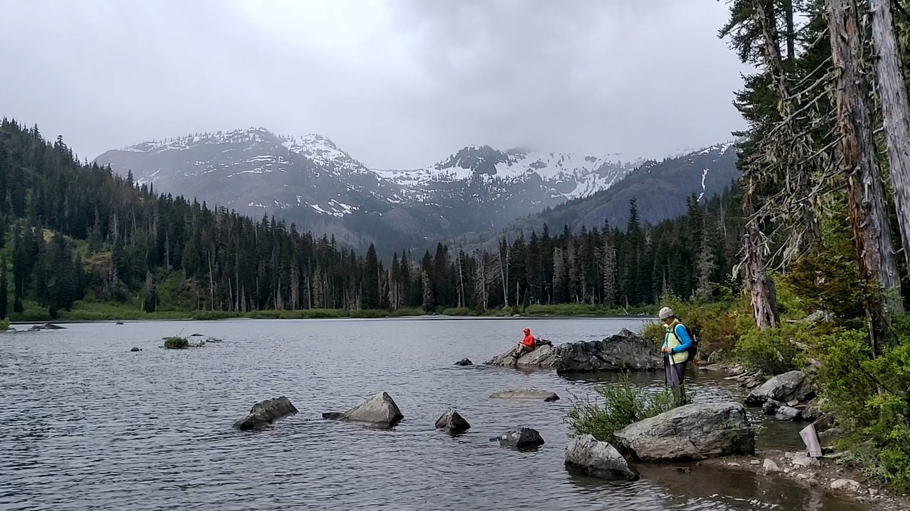 <em>Saturday, Jun. 13, 2020 -- Person fishing from the shoreline, another sitting on a rock further out [manual review]</em> -- <a href="https://www.wta.org/go-hiking/trip-reports/trip_report-2020-06-14-5472590442">https://www.wta.org/go-hiking/trip-reports/trip_report-2020-06-14-5472590442</a>

**Text mentions:**

- **Friday, Jul. 4, 2025** -- https://www.wta.org/go-hiking/trip-reports/trip_report-2025-07-05.180445322166
    - text ("packraft"): "...Lake, near Quick creek. There were tons of other hikers, plus a fun party that brought a packraft. My partner and I gathered water and started hiking west, up the Waptus Pass Trail, aroun..."
- **Saturday, Sep. 7, 2024** -- https://www.wta.org/go-hiking/trip-reports/trip_report-2024-09-07.215620751459
    - text ("fishing"): "...d weather was great. We camped by Lemah creek and it was flowing cool water. No luck with fishing...."
- **Saturday, Aug. 31, 2024** -- https://www.wta.org/go-hiking/trip-reports/trip_report-2024-10-27.213933877176
    - text ("fishing"): "...ere taken, we were able to find a spot right along the water and near the “bathroom”. The fishing wasn’t great, but there were surprisingly fewer bugs than I expected, hardly even needed..."
- **Saturday, Jul. 1, 2023** -- https://www.wta.org/go-hiking/trip-reports/trip_report.2023-07-03.9759961448
    - text ("fish"): "...rom the lake to the waterfall, so we had a built in sound machine to sleep to. There were fish jumping, ducks swimming, and birds diving. I would love to see this place in the fall...."
- **Saturday, Jun. 10, 2023** -- https://www.wta.org/go-hiking/trip-reports/trip_report.2023-06-11.6751969979
    - text ("Fishing"): "...Pete Lake, and we were able to snag a spot at the foot of the lake near the trail fork. Fishing the lake was a bust unfortunately — the accessible areas near the campsites adjoin very s..."
- **Thursday, Oct. 27, 2022** -- https://www.wta.org/go-hiking/trip-reports/trip_report.2022-10-28.4290333855
    - text ("salmon"): "...car at Salmon la Sac trailhead. At the swimming hole at the trailhead we saw 18 spawning salmon. It was outstanding to see them swimming in the shallows. A few were pristine looking whe..."
    - text ("salmon"): "...e really beat up from their long journey. When we returned after our hike we could see no salmon. Maybe they were resting before continuing upstream. This trail is in excellent condition..."
- **Wednesday, Sep. 21, 2022** -- https://www.wta.org/go-hiking/trip-reports/trip_report.2022-09-22.8971137961
    - text ("salmon"): "...excitement until you hit the lake. At this time of year its a good time to see sockeye salmon spawning down at the bridge crossing off of the main highway. Amazing journey these salm..."
    - text ("salmon"): "...lmon spawning down at the bridge crossing off of the main highway. Amazing journey these salmon take worth taking a look and be in awe...."
- **Saturday, Aug. 13, 2022** -- https://www.wta.org/go-hiking/trip-reports/trip_report.2022-08-16.5499745070
    - text ("fish"): "...o break camp. The bugs seemed to stay mostly localized above the lake, and we saw lots of fish jumping out of the water to catch a snack. We left around 11 am and made it back to the s..."
- **Saturday, Jul. 2, 2022** -- https://www.wta.org/go-hiking/trip-reports/trip_report.2022-07-03.1291917192
    - text ("pack-raft"): "...ing (thawed) lake ringed by snowy peaks, and plentiful camping; next time I will bring my pack-raft, as well as camp to venture farther into the Alpine Lakes Wilderness Statistics: Di..."
    - text ("fishermen"): "...e lake of course is spectacular and ringed by (currently snowy) peaks up to ~7K feet; fly fishermen and at least one party with a pretty big catch for the day(!); both a WTA crew and the Na..."
    - text ("fishermen"): "...ly-friendly hike despite the distance; good camping spot for hanging out on the lake (saw fishermen and pack-rafters) or continuing up trail to Lemah Meadow or Spectacle Lake; the lake basi..."
- **Saturday, Oct. 3, 2020** -- https://www.wta.org/go-hiking/trip-reports/trip_report-2020-10-05-0743004332
    - text ("fish"): "...s of fall colors, especially around the lake. No big animals, but lots of chipmunks. Some fish jumping at the lake. Leave no trace: several bits of micro-trash at the campsite that w..."
- **Thursday, Aug. 13, 2020** -- https://www.wta.org/go-hiking/trip-reports/trip_report-2020-08-14-8544696766
    - text ("fish"): "...ke and the trail were fairly empty so the people must have been at Spectacle. We went to fish and got 00000 nibbles but still a nice hike. Be prepared for bugs and water crossings......"
- **Friday, Jul. 24, 2020** -- https://www.wta.org/go-hiking/trip-reports/trip_report-2020-07-26-3146519425
    - text ("fishing"): "...e Lake, they were TERRIBLE at Pete Lake (and normally, bugs do not bother me!) No luck fishing at either lake!..."
- **Saturday, Jul. 11, 2020** -- https://www.wta.org/go-hiking/trip-reports/trip_report-2020-07-12-9996429675
    - text ("salmon"): "...of their droppings, though, they seem to be well-fed! As long as you aren't wearing your salmon-scented deodorant that day, you probably won't be bothered by them! The Tired Creek tra..."
- **Saturday, Jun. 13, 2020** -- https://www.wta.org/go-hiking/trip-reports/trip_report-2020-06-14-5472590442
    - text ("Fishing"): "...for camping that were still free in the afternoon. There is also a toilet at the lake. Fishing seems to be a popular thing at the lake and in streams on the way: lot's of hikers carrie..."
- **Saturday, Jun. 13, 2020** -- https://www.wta.org/go-hiking/trip-reports/trip_report-2020-06-15-7839792852
    - text ("fishing"): "...er! Pete Lake is stunning and a great place to hike around and camp at. There were people fishing (though we didn't see anyone catch anything) and one crazy person went for a very cold sw..."
- **Monday, Sep. 23, 2019** -- https://www.wta.org/go-hiking/trip-reports/trip_report.2019-09-24.4154169452
    - text ("fisherman"): "...you encounter when you first arrive at the lake. The only other person around was a lone fisherman who didn’t stay the night. We were DUMPED on by rain during the night. So much rain th..."
- **Saturday, Jul. 13, 2019** -- https://www.wta.org/go-hiking/trip-reports/trip_report.2019-07-15.3918706224
    - text ("fishing"): "...acle Lake. The water is super cold, but we managed to swim for a few minutes and did some fishing without any luck :) Bugs were pretty bad - I came back with about 20 bites, even thoug..."
- **Saturday, May. 25, 2019** -- https://www.wta.org/go-hiking/trip-reports/trip_report.2019-05-29.0068549620
    - text ("pack raft"): "...Good place to take out a pack raft. Road leading to the trailhead is suitable for all vehicles- including low clearance...."
    - text ("pack raft"): "...ant lake views. No bugs when we were there- the downpour kept them away :) We took the pack raft out when it started pouring rain, one in our party went to the island to scope it out, an..."
- **Friday, Aug. 17, 2018** -- https://www.wta.org/go-hiking/trip-reports/trip_report.2018-08-19.1969487473
    - text ("fish"): "...g lot to reach Pete Lake and we found a lovely spot right on the lake to set up camp. The fish were certainly biting although alas my husband did not catch any fish. The smoke had blow..."
    - text ("fish"): "...to set up camp. The fish were certainly biting although alas my husband did not catch any fish. The smoke had blown out with the wind so we enjoyed a smoke free evening. We had origina..."
- **Saturday, Jul. 21, 2018** -- https://www.wta.org/go-hiking/trip-reports/trip_report.2018-07-29.7265903067
    - text ("fishing"): "...walk to Pete Lake. Lots of people were already camped there and I saw folks floating and fishing. There are lots of social trails at Pete Lake so a couple times I got off the main trail..."
- **Friday, Aug. 18, 2017** -- https://www.wta.org/go-hiking/trip-reports/trip_report.2017-08-20.8200773672
    - text ("fish"): "...ood condition and it was a pleasant hike. The only downside was that there seems to be no fish in the lake or rivers. My assumption is that the water levels are too low. We are now dis..."
- **Saturday, Jul. 15, 2017** -- https://www.wta.org/go-hiking/trip-reports/trip_report.2017-07-16.6698889802
    - text ("fish"): "...econds. We did see one guy get about waist deep though and hang out. We didn't see any fish in the clear lake, but we did see a mama duck and her ducklings swimming about all over t..."
- **Friday, Jun. 23, 2017** -- https://www.wta.org/go-hiking/trip-reports/trip_report.2017-06-24.8988679768
    - text ("fishing"): "...(one did some swimming that night), beavers and mergansers with chicks. My buddies tried fishing with no avail. We hiked out the next morning and met MANY hikers. When we got to the pa..."
- **Sunday, May. 28, 2017** -- https://www.wta.org/go-hiking/trip-reports/trip_report.2017-05-29.0147036315
    - text ("fishing"): "...Our group was looking for a hiking/fishing destination, and Pete Lake was a recommended spot. We ended up getting lost ~10 minutes i..."
    - text ("fish"): "...n the trail. It took us about 3 hours to get to the lake, which we realized had nearly no fish when we got there (we didn't see a fish the entire time). Would not recommend if you want..."
    - text ("fish"): "...get to the lake, which we realized had nearly no fish when we got there (we didn't see a fish the entire time). Would not recommend if you want to actually catch fish...Bring bug spra..."
- **Sunday, Jun. 12, 2016** -- https://www.wta.org/go-hiking/trip-reports/trip_report.2016-06-12.2704205506
    - text ("fish"): "...o reach the lake. Lake was quite, but exciting thing was we saw two snakes fighting for a fish, the big one was about 2 finger thick, the small one was about 1.5 finger thick, the big..."
    - text ("fish"): "...was about 2 finger thick, the small one was about 1.5 finger thick, the big snake got the fish, see photo 3. We put on bug off, it was ok when going in, but on way back, mosquitos were..."
- **Thursday, Aug. 28, 2014** -- https://www.wta.org/go-hiking/trip-reports/trip_report.2014-09-04.4111082234
    - text ("fish"): "...clouds coming over the far peaks. It looked like it might rain so we quickly had our tuna fish sandwiches, chips and water then moved back up to the ridge line. Once we started descen..."
    - text ("fish"): "...t over the valley and just soak in the beauty. Back at camp we got ready for a dinner of fish tacos and Spanish rice by opening up a few ice cold beers from our cache resting in the c..."
- **Saturday, Aug. 24, 2013** -- https://www.wta.org/go-hiking/trip-reports/trip_report.2013-08-26.0763020844
    - text ("fishing"): "...gn pointing to it. I'm very disappointed in my fellow hikers on this one. Also, I tried fishing but didn't even see any fish rising. Other wise, this was a very good trip...."
    - text ("fish"): "...appointed in my fellow hikers on this one. Also, I tried fishing but didn't even see any fish rising. Other wise, this was a very good trip...."
- **Monday, Aug. 6, 2012** -- https://www.wta.org/go-hiking/trip-reports/trip_report.2012-08-21.0321047074
    - text ("trout"): "...site at Spectacle Lake. It was beautiful the whole time we were up there. Lots of smaller trout in the lake. Clear skies both nights we were up there. The next morning we woke up about..."
    - text ("fishing"): "...llow) to Glacier Lake. When we got up there about half the lake was melted off. I found a fishing pole at the southern end of the lake, if you lost if shoot me an email and I'll try and g..."
- **Friday, Jun. 25, 2010** -- https://www.wta.org/go-hiking/trip-reports/trip_report.2010-06-28.7252044469
    - text ("fish"): "...dvantage of the sun and broke out our rafts and rods to see if the lake would give up any fish. Sadly we weren't able to coax any fish into the rafts, but navigating around the lake w..."
    - text ("fish"): "...ts and rods to see if the lake would give up any fish. Sadly we weren't able to coax any fish into the rafts, but navigating around the lake was a blast and yielded much needed vitami..."
- **Saturday, Aug. 29, 2009** -- https://www.wta.org/go-hiking/trip-reports/trip_report.2009-08-30.9382287045
    - text ("fish"): "...friend Lorie Drabant came over from Seattle Friday evening and stayed with us. Much tasty fish and crab was consumed and Saturday morning we woke up and made plans for Matt's first tra..."
- **Saturday, Aug. 9, 2008** -- https://www.wta.org/go-hiking/trip-reports/tripreport-2008081011
    - text ("fishing"): "...Couldn't find anybody to go with me, so I set off with Rugger to explore the fishing at Pete Lake and Spectacle Lake. Left the TH around noon on Friday for a leisurely hike t..."
    - text ("fish"): "...the inlet and thought I'd try drowning some flies in the lake. Although I could see a few fish jumping out in the middle of the lake, none would venture within range of my line. Satur..."
- **Monday, Sep. 3, 2007** -- https://www.wta.org/go-hiking/trip-reports/tripreport-2007090404
    - text ("fishing"): "...out. Everybody swam in Spectacle & a few in Glacier Lake. We were able to watch an osprey fishing in the early mornings. He seemed to have better luck than our own fishermen. The fall col..."
    - text ("fishermen"): "...watch an osprey fishing in the early mornings. He seemed to have better luck than our own fishermen. The fall color is coming on nicely & the blueberries were thick, resulting in not a few..."
- **Friday, Aug. 24, 2007** -- https://www.wta.org/go-hiking/trip-reports/tripreport-2007082406
    - text ("fishermen"): "...south on the often rocky PCT #2000. Along the way we encountered families on horseback, fishermen and a number of long-distance hikers; one group had been hiking since April. We didn’t us..."
    - text ("fishermen"): "...in, reminding us a little of the Enchantments. We camped on the large rock island and the fishermen of our group were glad to see activity rings on the water. Wednesday we day hiked south..."
- **Sunday, Aug. 19, 2007** -- https://www.wta.org/go-hiking/trip-reports/tripreport-2007082003
    - text ("trout"): "...grassy meadow glowing bright green in the waning summer heat. With innumerable acrobatic trout. Magica. Then everyone gets to pay by an infinite climb on a hot muggy day up to Spectac..."
- **Friday, Aug. 18, 2006** -- https://www.wta.org/go-hiking/trip-reports/tripreport-2006081901
    - text ("fishing"): "...323) begins at a nice even level. It skirts the Cooper River, and looks to hold some nice fishing for the anglers out there. The turnoff for the Tired Creek trail (#1317) is a little hidd..."
- **Saturday, Sep. 11, 1999** -- https://www.wta.org/go-hiking/trip-reports/tripreport-1999091206
    - text ("Fish"): "...ake had apparently been drinking and shooting of firearms during the night, prompting the Fish & Wildlife people to come in and investigate. When we passed their campsite, there were l..."
- **Friday, Jul. 10, 1998** -- https://www.wta.org/go-hiking/trip-reports/tripreport-1998071104
    - text ("fish"): "...lake. Very little elevation gain and many a creek holding the wonders of frogs and small fish to keep a little boy walking forward. A big plus when Dad is carrying the megapack and do..."
- **Friday, Aug. 22, 1997** -- https://www.wta.org/go-hiking/trip-reports/tripreport-1997082309
    - text ("fish"): "...excellent shape and dry; although somewhat dusty in places. Beautiful lake with lots of fish rising but not much luck catching them in the middle of the day. Lots of horse traffic..."

### Rampart Ridge - Rampart Lakes

https://www.wta.org/go-hiking/hikes/rampart-ridge-1

_90 photo(s) downloaded for visual review, 5 contact sheet(s) generated._

**Fishing photos (4):**

 <em>Tuesday, Sep. 14, 2010 -- sunbathing trout [caption match]</em> -- <a href="https://www.wta.org/go-hiking/trip-reports/trip_report.2010-09-17.3183729357">https://www.wta.org/go-hiking/trip-reports/trip_report.2010-09-17.3183729357</a>

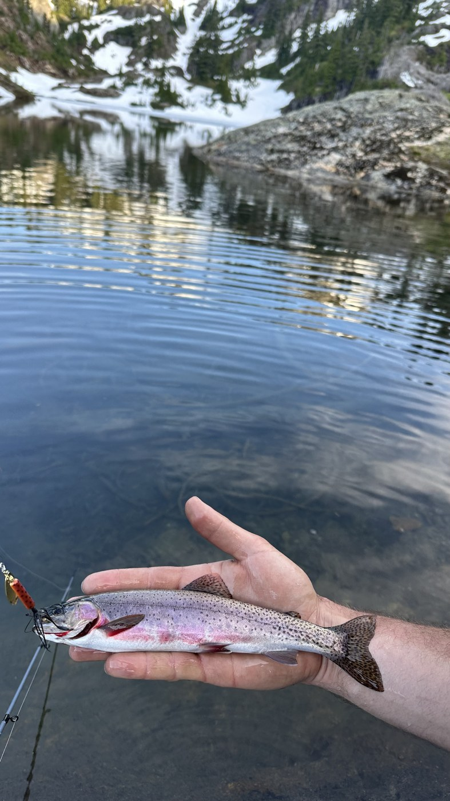 <em>Sunday, Jun. 14, 2026 -- Rainbow trout held in hand, on lure [manual review]</em> -- <a href="https://www.wta.org/go-hiking/trip-reports/trip_report-2026-06-15.072707645417">https://www.wta.org/go-hiking/trip-reports/trip_report-2026-06-15.072707645417</a>

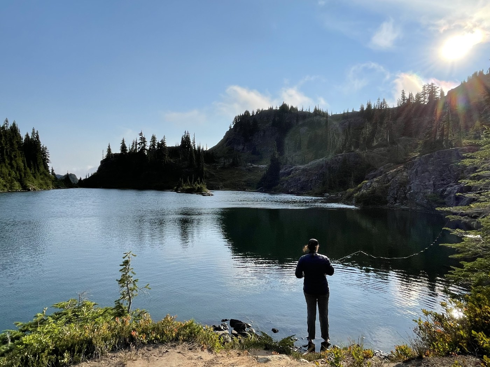 <em>Saturday, Sep. 3, 2022 -- Fly fisherman casting at Lila Lake [manual review]</em> -- <a href="https://www.wta.org/go-hiking/trip-reports/trip_report.2022-09-06.7170241515">https://www.wta.org/go-hiking/trip-reports/trip_report.2022-09-06.7170241515</a>

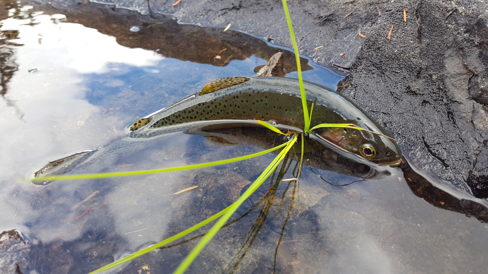 <em>Sunday, Aug. 13, 2017 -- Trout on a fly line [manual review]</em> -- <a href="https://www.wta.org/go-hiking/trip-reports/trip_report.2017-08-14.2360367245">https://www.wta.org/go-hiking/trip-reports/trip_report.2017-08-14.2360367245</a>

**Text mentions:**

- **Sunday, Jun. 14, 2026** -- https://www.wta.org/go-hiking/trip-reports/trip_report-2026-06-15.072707645417
    - text ("trout"): "...ere was enough open water that we were able to catch some of the most beautiful cutthroat trout I’ve ever seen. Lots of fish in Rachel that seem unphased by all the people and dogs swim..."
    - text ("fish"): "...we were able to catch some of the most beautiful cutthroat trout I’ve ever seen. Lots of fish in Rachel that seem unphased by all the people and dogs swimming, but the bite wasn’t gre..."
- **Friday, Aug. 8, 2025** -- https://www.wta.org/go-hiking/trip-reports/trip_report-2025-08-19.221506995251
    - text ("Fishing"): "...was windy there almost all afternoon, dying down in the evenings, nights and mornings. Fishing - my daughter and I each caught a couple Cutthroat Trout in the lakes on dry flies and a..."
    - text ("Trout"): "...enings, nights and mornings. Fishing - my daughter and I each caught a couple Cutthroat Trout in the lakes on dry flies and a casting bubble. They were fairly small at 8 to 10 inches..."
- **Monday, Jul. 7, 2025** -- https://www.wta.org/go-hiking/trip-reports/trip_report-2025-07-08.055336700571
    - text ("fish"): "...think about wearing shorts or a tank top. That being said, the lakes were gorgeous, the fish were biting, and the lakes were just warm enough for a refreshing swim, but I would highl..."
- **Sunday, Jul. 30, 2023** -- https://www.wta.org/go-hiking/trip-reports/trip_report.2023-08-06.8554839404
    - text ("fishing"): "...To Rampart Lakes for a bit of fishing; just a day trip, I didn't camp at the top. Road Conditions: Parked at the trailhead a..."
    - text ("fishing"): "...g the many campsites. It took me about 2 hours 10 mins to reach Rampart Lakes, I did some fishing with dry flies while exploring the lakes. If you can find the right spot, there are some..."
    - text ("Trout"): "...e exploring the lakes. If you can find the right spot, there are some beautiful Cutthroat Trout living here :) Highlights: A refreshing swim in the pristine lakes, and a nap in the s..."
- **Friday, Jul. 7, 2023** -- https://www.wta.org/go-hiking/trip-reports/trip_report.2023-07-12.6848398001
    - text ("trout"): "...to Rampart Lakes. Taking in the scenery, a nice swim and even catching a couple cutthroat trout as the reward for the effort put in to make it to the lakes. A couple very small snow pat..."
- **Sunday, Jul. 2, 2023** -- https://www.wta.org/go-hiking/trip-reports/trip_report.2023-07-03.0991716132
    - text ("fishing"): "...11:15am. At this point, we arrived at the Rampart Lakes! We spent hours swimming, fishing and just hanging out. The weather was great, and there was lots of other campers, but it..."
    - text ("fish"): "...and there was lots of other campers, but it didn’t feel crowded. While we saw a lot of fish (and some good sized ones too), we never were able to catch one. However, someone near us..."
- **Saturday, Jul. 1, 2023** -- https://www.wta.org/go-hiking/trip-reports/trip_report.2023-07-03.3575676049
    - text ("fishing"): "...Rampart Lakes, came home with a number of mosquito bites despite bug spray. Brought a fishing pole but no luck this time! Wildlife: saw one bear, a few marmots and a pika. Lots of..."
- **Saturday, Sep. 3, 2022** -- https://www.wta.org/go-hiking/trip-reports/trip_report.2022-09-06.7170241515
    - text ("trout"): "...with tons of camping spots around the lakes. Fished Rampart Lakes and caught two small trout, but there's definitely bigger fish in there. Also fished Lila lake but had 0 luck, a few..."
    - text ("fish"): "...e lakes. Fished Rampart Lakes and caught two small trout, but there's definitely bigger fish in there. Also fished Lila lake but had 0 luck, a few nibbles but no catches. They're in..."
- **Tuesday, Aug. 10, 2021** -- https://www.wta.org/go-hiking/trip-reports/trip_report-2021-08-12-1939474449
    - text ("fishing"): "...so please contact me if it's yours! In short: Rampart Lakes overnight, bugs were awful, fishing was good, stars were amazing, beware of construction on the road. Day 1: On the way in,..."
    - text ("fishing"): "...around all of the lakes, we made camp by the second largest lake and enjoyed swimming and fishing and hiding in the tent from the bugs. The mosquitoes were relentless within a good mile o..."
- **Saturday, Jul. 3, 2021** -- https://www.wta.org/go-hiking/trip-reports/trip_report-2021-08-01-7574835220
    - text ("fishing"): "...nd and find something else to do. Shame, it was beautiful, despite the bugs! Did a little fishing; didn't catch anything. Saw fish jump, just didn't try very hard or have the right tackle..."
    - text ("fish"): "...ame, it was beautiful, despite the bugs! Did a little fishing; didn't catch anything. Saw fish jump, just didn't try very hard or have the right tackle and bait (I think - I suck at fi..."
    - text ("fishing"): "...sh jump, just didn't try very hard or have the right tackle and bait (I think - I suck at fishing). Second time up to Rampart Lakes and this time my friend and I hiked up to the ridge...."
- **Friday, Sep. 4, 2020** -- https://www.wta.org/go-hiking/trip-reports/trip_report-2020-09-06-0910841235
    - text ("fish"): "...view. The california wildfire smoke had set in, but it didn't block our views. Fun to see fish swimming in the lake below - the water is so clear! We thought about how much fun it woul..."
    - text ("fishing"): "...it would be to bring up an inflatable kayak and check out the whole lake. Saw some folks fishing. The next section of trail has less shade and the switchbacks don't seem to end. That b..."
- **Saturday, Jul. 11, 2020** -- https://www.wta.org/go-hiking/trip-reports/trip_report-2020-07-12-1799752523
    - text ("trout"): "...e black flies were a serious annoyance, but only when we stopped. I saw a couple of small trout feeding in the less icy lakes...."
- **Saturday, Aug. 31, 2019** -- https://www.wta.org/go-hiking/trip-reports/trip_report.2019-09-02.8849133792
    - text ("fishing"): "...ker leaving with his dad right as we arrived. The beautiful emerald pools are perfect for fishing and swimming even with a couple rocks to jump off of. Epic campsites are plentiful. Scra..."
- **Tuesday, Aug. 13, 2019** -- https://www.wta.org/go-hiking/trip-reports/trip_report.2019-08-15.8249897893
    - text ("trout"): "...n us the following morning when we were packing up. We fly fished for some of the stocked trout, which was again successful when you managed to combat the incredibly-strong winds and..."
    - text ("fishing"): "...ombat the incredibly-strong winds and get your fly on the water. I imagine that spin/bait fishing is a much better option. Great hike, good people, friendly community, beautiful vie..."
- **Tuesday, Sep. 25, 2018** -- https://www.wta.org/go-hiking/trip-reports/trip_report.2018-09-27.6373206741
    - text ("fish"): "...got to Rachel Lake; we found a nice camping spot only steps away from the water. Saw many fish jumping. Alta Mountain The trail from Rachel Lake to the junction is relatively shor..."
    - text ("fish"): "...ort and easy. The lakes were much cooler than expected. They're deep and some are full of fish. In my opinion, since this area isn't very long or difficult, I would say it's well worth..."
- **Saturday, Sep. 1, 2018** -- https://www.wta.org/go-hiking/trip-reports/trip_report.2018-09-12.1838557761
    - text ("fishing"): "...lakes. If you look around you will find a lot of hidden tent pads. I don't know how the fishing is here but a lot of people had poles in the water. Lila Lake looked to be less popula..."
- **Thursday, Sep. 28, 2017** -- https://www.wta.org/go-hiking/trip-reports/trip_report.2017-09-29.1091668114
    - text ("fishing"): "...le blow down the entire way. At Rachel Lake there were several people camping and a few fishing. The fall colors are spectacular and there are even a few still ripe blueberries. The tra..."
- **Sunday, Aug. 13, 2017** -- https://www.wta.org/go-hiking/trip-reports/trip_report.2017-08-14.2360367245
    - text ("trout"): "...many lakes as we could, and fished in several of them. We finally caught one decent-sized trout only to find that we'd left the stove at home, so we let him go. At one point, while s..."
    - text ("fish"): "...he stove at home, so we let him go. At one point, while sitting around waiting for the fish to comply, I felt so cold that my hands went numb! I dipped them in the water only to fin..."
- **Saturday, Jul. 22, 2017** -- https://www.wta.org/go-hiking/trip-reports/trip_report.2017-07-24.0691680415
    - text ("fish"): "...morning. Rampart Ridge is beautiful, as are the lakes. There are wildflowers blooming, fish in the lakes, and views galore. Campsites We got to the trailhead at 7:45 to find it..."
- **Saturday, Aug. 20, 2016** -- https://www.wta.org/go-hiking/trip-reports/trip_report.2016-08-21.8129379978
    - text ("fishing"): "...e around 8 gorgeous lakes. The view was awesome, water of lakes was clear and people were fishing and swimming in it. Took me 25 min to hike back to Rachel lake them 1:50 back to parking...."
- **Saturday, Aug. 13, 2016** -- https://www.wta.org/go-hiking/trip-reports/trip_report.2016-08-14.7144198535
    - text ("salmon"): "...on bucket in a short distance if they wanted to take the time to do that. There were also salmon and thimbleberries, though the Vaccinium outnumbered them all the way to the top. I munch..."
- **Saturday, Jun. 6, 2015** -- https://www.wta.org/go-hiking/trip-reports/trip_report.2015-06-08.8138867688
    - text ("trout"): "...to be outdoors on such a beautiful weekend. Wildlife: I saw a garter snake, chipmunks, trout (and lots of flyfishers), kids, dogs, butterflies, bees, and other bugs. The mosquitoes..."
- **Tuesday, Sep. 25, 2012** -- https://www.wta.org/go-hiking/trip-reports/trip_report.2012-09-25.2211376682
    - text ("Fisherman"): "...in Fall. The colors weren't quite ripe but a nice outing it was. I used the Lake Lillian Fisherman's trail found at the big bend of the Rocky Run Road. There were a few cars parked when I..."
- **Tuesday, Sep. 14, 2010** -- https://www.wta.org/go-hiking/trip-reports/trip_report.2010-09-17.3183729357
    - text ("trout"): "...and dead end leads I did. I passed the time camped between three lakes watching the many trout, and a bonus of a mtn. goat family on the cliffs above. Oh yeah, fair number of FM radio..."
- **Monday, Aug. 16, 2010** -- https://www.wta.org/go-hiking/trip-reports/trip_report.2010-08-18.4891156359
    - text ("fish"): "...uddies. We decided it would be a great idea to pack only emergency food, and survive off fish and berries. Turns out, later in the season the fish don't bite. So, we survived off be..."
    - text ("fish"): "...nly emergency food, and survive off fish and berries. Turns out, later in the season the fish don't bite. So, we survived off berries only. This time, I not only wanted to take my w..."
- **Monday, Sep. 17, 2007** -- https://www.wta.org/go-hiking/trip-reports/tripreport-2007091800
    - text ("fisherman"): "...way around the lake and soon was climbing steeply to the ridgeline. I easily followed the fisherman's trail to the uppermost Rampart Lake. The visilbility was next to zero so I continued to..."
- **Saturday, Sep. 8, 2007** -- https://www.wta.org/go-hiking/trip-reports/tripreport-2007090906
    - text ("fisherman"): "...to the west of the Rampart Lakes. As noted in a previous report the road (FS 136) to the fisherman's trail to Lakes Laura and Lillian is on it's last legs. My Forester made it OK but the r..."
- **Friday, Aug. 18, 2006** -- https://www.wta.org/go-hiking/trip-reports/tripreport-2006081905
    - text ("fly fishing"): "...omfortable. Mayflies were hatching in the morning at Rachel, would have been nice for dry fly fishing, but had to get moving...."
- **Saturday, Aug. 13, 2005** -- https://www.wta.org/go-hiking/trip-reports/tripreport-2005081400
    - text ("fish"): "...Rachel seem well used. Lots of random boot track around. Several people swimming. Lots of fish jumping but the only ones near shore look small. Go around the right side of the lake for..."
- **Friday, Jul. 15, 2005** -- https://www.wta.org/go-hiking/trip-reports/tripreport-2005071412
    - text ("fish"): "...s we paused briefly, we were treated to the sight of an osprey, which dove upon a hapless fish then, with a loud ""kreee..."", flew off to a tree to dine. The trail up the next ridge w..."
- **Thursday, May. 26, 2005** -- https://www.wta.org/go-hiking/trip-reports/tripreport-2005052710
    - text ("fisherman"): "...and some snow. Lakes all clear and full. The next phase up to Lillian was snow free, the fisherman is trail up and down!. At Lillan, plenty of snow on the east side trail. South end campsi..."
- **Monday, Sep. 8, 2003** -- https://www.wta.org/go-hiking/trip-reports/tripreport-2003090902
    - text ("fisherman"): "...I had heard that there was a fisherman's trail to Lake Laura and Lake Lillian, and since I only had a half day to devote to hiki..."
    - text ("fisherman"): "...rking. Just follow the old logging road until it turns into a very steep and very defined fisherman's trail. The trail splits with the left branch going to Lake Laura and the right continue..."
    - text ("fishing"): "...emory serves me well it took around 2 hours the traditional way. I left Justin to do some fishing while I made an attempt at Rampart Ridge's highpoint (pt 5870). There is a clearly define..."
- **Sunday, Aug. 24, 2003** -- https://www.wta.org/go-hiking/trip-reports/tripreport-2003082503
    - text ("fishing"): "...s existence somewhere on the trail or beside the lake(s). Great weather, and did a little fishing. The kids used my gear and left my fishing vest with a serious number of flies sitting, I..."
    - text ("fishing"): "...e the lake(s). Great weather, and did a little fishing. The kids used my gear and left my fishing vest with a serious number of flies sitting, I think on a rock not far from where the tra..."
- **Friday, Aug. 9, 2002** -- https://www.wta.org/go-hiking/trip-reports/tripreport-2002081003
    - text ("trout"): "...akes is in a nice setting with several lakes to hike around with lots of paths. Saw a few trout swimming around and some fishermen trying to catch them. Some people had backpack into th..."
    - text ("fishermen"): "...several lakes to hike around with lots of paths. Saw a few trout swimming around and some fishermen trying to catch them. Some people had backpack into the lakes and the bugs where not bad...."
- **Saturday, Oct. 6, 2001** -- https://www.wta.org/go-hiking/trip-reports/tripreport-2001100704
    - text ("fisherman"): "...Went up the backdoor fisherman route to Rampart Lakes from Rocky Run. There are actually two tracks up to Lake Lillian o..."

### Taylor River - Otter Falls

https://www.wta.org/go-hiking/hikes/otter-falls-taylor-river

_73 photo(s) downloaded for visual review, 4 contact sheet(s) generated._

**Fishing photos (1):**

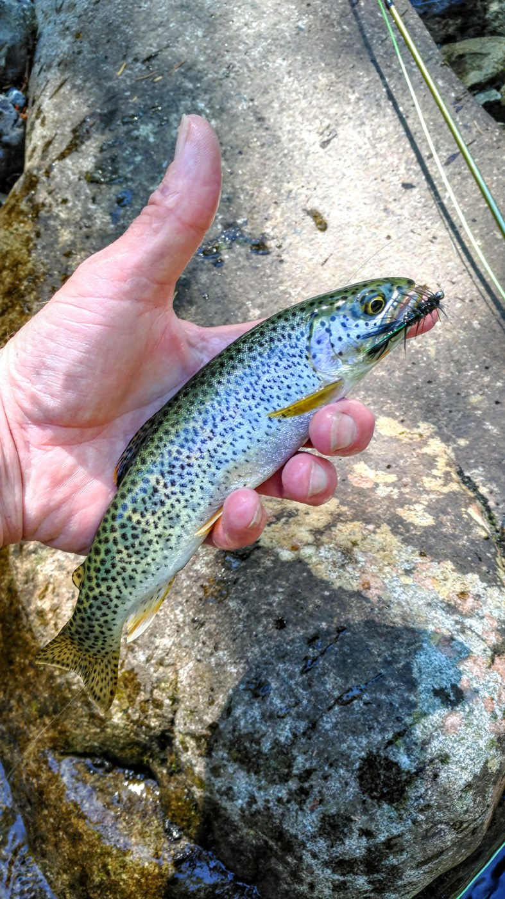 <em>Thursday, Jul. 22, 2021 -- Trout on a fly, hand holding fish [manual review]</em> -- <a href="https://www.wta.org/go-hiking/trip-reports/trip_report-2021-07-22-2588634464">https://www.wta.org/go-hiking/trip-reports/trip_report-2021-07-22-2588634464</a>

**Text mentions:**

- **Thursday, Jun. 19, 2025** -- https://www.wta.org/go-hiking/trip-reports/trip_report-2025-06-19.214440121457
    - text ("fisherman"): "...a couple of trail runners. The rest were a mix of climbers with their ropes and gear; a fisherman or two; small family groups and one church youth group; all were younger than we are - wh..."
- **Wednesday, May. 28, 2025** -- https://www.wta.org/go-hiking/trip-reports/trip_report-2025-05-29.103106028568
    - text ("packraft"): "...lakes to explore. The few folks I ran into were mostly trail runners. One woman lugged a packraft all the way up and was out in the middle of the lake. I encountered only 4 people on the..."
- **Sunday, Mar. 2, 2025** -- https://www.wta.org/go-hiking/trip-reports/trip_report-2025-03-03.142514512819
    - text ("fishing"): "...been even higher. I also noticed a few very early mosquitos and small flies so I'd bring fishing tackle if you're that way inclined as more abundant food and warmer water is likely to br..."
    - text ("trout"): "...kle if you're that way inclined as more abundant food and warmer water is likely to bring trout to the surface. All-in-all, a great way to spend a Sunday...."
- **Tuesday, Nov. 12, 2024** -- https://www.wta.org/go-hiking/trip-reports/trip_report-2024-11-12.162048141160
    - text ("trout"): "...ght about a Marten Lake adventure, but it is really difficult not to go throw bugs at the trout in Taylor, so yea - no lake today. Made it maybe a mile up the trail before hitting the..."
- **Tuesday, Oct. 15, 2024** -- https://www.wta.org/go-hiking/trip-reports/trip_report-2024-10-15.140818877847
    - text ("fisherman"): "...places to explore in the coming weeks. We didn't see anyone else on the trail except a fisherman arriving as we packed up to leave at 11. The road for the last 1/2 mile is a little potho..."
- **Thursday, Oct. 3, 2024** -- https://www.wta.org/go-hiking/trip-reports/trip_report-2024-10-03.223507332837
    - text ("fisherman"): ".... The steep trail up to Anderson is in pretty good shape, considering what it is, a steep fisherman’s climbing path. For more details on this trail see my Nov 3, 2023 trip report for Dog Mo..."
- **Saturday, Jun. 8, 2024** -- https://www.wta.org/go-hiking/trip-reports/trip_report-2024-06-09.131433957040
    - text ("fishing"): "...s never too busy down at the lake there but a few parties came and went. My partner tried fishing but no luck catching anything mid day. Dipped into the lake which was refreshing and surp..."
- **Wednesday, May. 15, 2024** -- https://www.wta.org/go-hiking/trip-reports/trip_report-2024-05-16.112519580096
    - text ("trout"): "...ascend the slab alongside the falls. A fly fisher worked the pond and teased out a little trout, as well. There was steady traffic at the little beach there, but it was never crowded. B..."
- **Thursday, May. 9, 2024** -- https://www.wta.org/go-hiking/trip-reports/trip_report-2024-05-09.165706651491
    - text ("creel"): "...site on the map halfway the lake is fully snow covered. - I checked the crossing of the creel to Nordrum Lake. It looks passable but unpleasant and I turned around there. I also expec..."
- **Tuesday, Jun. 28, 2022** -- https://www.wta.org/go-hiking/trip-reports/trip_report.2022-06-30.6326374548
    - text ("fishing"): "...ht now. I set up camp at my favorite spot on this lake (the outlet camp), broke out the fishing pole, and went down to wet my line. There is good fishing from the boulder in front of t..."
    - text ("fishing"): "...he outlet camp), broke out the fishing pole, and went down to wet my line. There is good fishing from the boulder in front of the lakeside camp. I started here but moved when a father-so..."
    - text ("fishing"): "...he weather was fine at first then the rain started. I spent a soggy afternoon and evening fishing before retiring to camp. I managed to get a cheery campfire going despite the rain, then..."
- **Sunday, May. 22, 2022** -- https://www.wta.org/go-hiking/trip-reports/trip_report-2022-05-28-9132078897
    - text ("fly fishing"): "...there were patches of snow near the trail. The falls were beautiful. Several people were fly fishing. One caught a fish. The trail is fairly rocky, so I need to pay attention to my feet...."
    - text ("fish"): "...near the trail. The falls were beautiful. Several people were fly fishing. One caught a fish. The trail is fairly rocky, so I need to pay attention to my feet. There were a coupl..."
- **Friday, Aug. 20, 2021** -- https://www.wta.org/go-hiking/trip-reports/trip_report-2021-08-20-4092309492
    - text ("trout"): "...pretty good footing really. The bridge over Marten Creek is very nice and we saw small trout in the pool just upstream. From there it’s another mile and a half to the well marked tur..."
- **Thursday, Jul. 22, 2021** -- https://www.wta.org/go-hiking/trip-reports/trip_report-2021-07-22-2588634464
    - text ("trout"): "...Meandered up Taylor River this morning with the fly pole searching for trout. Hit river at Marten Creek and caught plenty of scrappy, but small trout. Lots of fish in..."
    - text ("trout"): "...le searching for trout. Hit river at Marten Creek and caught plenty of scrappy, but small trout. Lots of fish in feeder creeks. Lots of berries down by river. No bugs. Be safe peop..."
- **Wednesday, Jul. 21, 2021** -- https://www.wta.org/go-hiking/trip-reports/trip_report-2021-07-22-6490936557
    - text ("trout"): "...ay in, and 4 on the way out (mostly day-hikers, but a few with larger packs). There was a trout in the pool at the bridge over Marten Creek - how do you suppose it got there? About 1..."
- **Monday, Jul. 20, 2020** -- https://www.wta.org/go-hiking/trip-reports/trip_report-2020-07-20-5279282491
    - text ("fishing"): "...River Rd had parking for about a half mile down the road. Original plans were a weekend fishing at snoqualmie, deer, and bear lakes, but given the volume we bailed at Marten Creek and h..."
- **Thursday, Jul. 2, 2020** -- https://www.wta.org/go-hiking/trip-reports/trip_report-2020-07-04-1680297752
    - text ("salmon"): "...was required and the restrooms were closed as well. It also worth to mention plenty of salmon-berries! They are ripe and everywhere! Such a delight! There are a few stream crossing..."
- **Saturday, Jul. 13, 2019** -- https://www.wta.org/go-hiking/trip-reports/trip_report.2019-07-14.5748628215
    - text ("fishing"): "...ls, and we ate a bunch of them. The bugs were around, but not bad at all. There was a guy fishing at the pond beneath the Falls that was catching lots of small trout. The hike itself is..."
    - text ("trout"): "...ll. There was a guy fishing at the pond beneath the Falls that was catching lots of small trout. The hike itself is through the woods, and there is not a lot of scenery, however it is..."
- **Sunday, May. 6, 2018** -- https://www.wta.org/go-hiking/trip-reports/trip_report.2018-05-07.4991452124
    - text ("fishing"): "...stly alone at the falls, with just a few other people here and there, and a couple people fishing...."
- **Sunday, Apr. 15, 2018** -- https://www.wta.org/go-hiking/trip-reports/trip_report.2018-04-15.8816380023
    - text ("trout"): "...a: The Washington State website tells me that Lipsy Lake get stocked with 50ish cutthroat trout almost every year (impressive, given the lake's .4 acre size), so if you're feeling lucky..."
    - text ("fish"): "...rry in your gear! (and practice catch-and-release, please; it wouldn't take too many kept fish to make this lake barren). You certainly don't need a boat to reach the whole lake, at le..."
- **Tuesday, Oct. 24, 2017** -- https://www.wta.org/go-hiking/trip-reports/trip_report.2017-10-25.7908196041
    - text ("fisherman"): "...pper falls you need to hike up the Marten Lake trail about 0.3 mile. This trail is an old fisherman's path so it is steep, muddy, rooty, slippery rocks and fallen trees to get over. I was a..."
- **Sunday, Sep. 3, 2017** -- https://www.wta.org/go-hiking/trip-reports/trip_report.2017-09-03.9322791182
    - text ("trout"): "...no views today, I did see more wildlife than I thought I would. A cool frog on the trail, trout in one of the creek and the highlight of today's hike -- a majestic owl just before Marte..."
- **Sunday, Jun. 28, 2015** -- https://www.wta.org/go-hiking/trip-reports/trip_report.2015-06-30.8215702390
    - text ("fly fishing"): "...they are just from the pictures. When we got there there was a group of high schoolers fly fishing, and a couple other young men. The latter tried to climb up the falls, and got about 2/3..."
- **Saturday, Jun. 27, 2015** -- https://www.wta.org/go-hiking/trip-reports/trip_report.2015-06-29.2510590141
    - text ("Fish"): "...e to ourselves, wandered around the shoreline and found a big rock on the edge for lunch. Fish were jumping in the lake. The lake is warm enough to swim in without screaming when you j..."
- **Sunday, Jul. 3, 2011** -- https://www.wta.org/go-hiking/trip-reports/trip_report.2011-07-06.9730748220
    - text ("fish"): ".... We saw two garter snakes as well - watch your kids and dogs. OH! And if you plan to fish, be aware that the lake is still somewhat frozen. A fisherman camping up there told us t..."
    - text ("fisherman"): "...dogs. OH! And if you plan to fish, be aware that the lake is still somewhat frozen. A fisherman camping up there told us that the fish are all hibernating near the bottom, and he didn't..."
    - text ("fish"): "...re that the lake is still somewhat frozen. A fisherman camping up there told us that the fish are all hibernating near the bottom, and he didn't have the right equipment to be fishing..."
- **Wednesday, Nov. 11, 2009** -- https://www.wta.org/go-hiking/trip-reports/trip_report.2009-11-12.4001741483
    - text ("Fish"): "...uncing that the road is closed 5.2 miles further on. Sure enough, there is a gate with a Fish & Wildlife ranger there to turn you around. Many dumptrucks on the road, indicating that..."
- **Saturday, Nov. 8, 2008** -- https://www.wta.org/go-hiking/trip-reports/trip_report.2008-11-16.5501401485
    - text ("fish"): "...other few seconds and it was gone, swept away. Hopefully it does a good job keeping some fish dry. I made a side trip up to the gas station at the pass for a new one only to find the..."
- **Tuesday, Oct. 28, 2008** -- https://www.wta.org/go-hiking/trip-reports/trip_report.2008-10-28.8860752927
    - text ("Fish"): "...f litter. The sign at the trailhead didn't say anything about hunting, but when I called Fish and Wildlife, they said to wear orange. A LOT of work has been done on the trail recentl..."
- **Friday, Jun. 9, 2006** -- https://www.wta.org/go-hiking/trip-reports/tripreport-2006061004
    - text ("fishing"): "...hats so unusual about this one is that out of 40 years of hiking, climbing scrambling and fishing, I'd never been up the Taylor River Trail before. The trail follows an old abandoned logg..."
- **Saturday, Aug. 9, 2003** -- https://www.wta.org/go-hiking/trip-reports/tripreport-2003081011
    - text ("trout"): "...turned to single track) so we fished the river instead of continuing on the road. Lots of trout in this pretty little river. River is catch and release, lure only. Drier trail on the wa..."
- **Monday, May. 19, 2003** -- https://www.wta.org/go-hiking/trip-reports/tripreport-2003052000
    - text ("fisherman"): "...work of the Taylor River Rd to the Big Creek bridge (big concrete bridge). The Dream Lake fisherman's trail starts just after the bridge. The trail climbs steeply for about 800 vertical fee..."
- **Friday, Jul. 5, 2002** -- https://www.wta.org/go-hiking/trip-reports/tripreport-2002070631
    - text ("fishermen"): "...s should lead to viable trails on either side). Dorothy was quite busy with hikers, kids, fishermen and what not - we beat it back down to our rides at the Dorothy Lake Trailhead. summary:..."
- **Tuesday, Jun. 25, 2002** -- https://www.wta.org/go-hiking/trip-reports/tripreport-2002062605
    - text ("trout"): ".... My usual overnight opener each year. Imagine my suprise to find the lake 99% frozen, no trout for dinner this year. Trail is good shape and fairly easy to follow some snow on upper st..."
- **Wednesday, May. 30, 2001** -- https://www.wta.org/go-hiking/trip-reports/tripreport-2001053108
    - text ("Fishing"): "...ming out at dusk. When we stopped for a break they started to swarm--take some bug spray. Fishing-- Dream Lake- no fish were biting a few were surfacing. Pothole Lake- I did not unpack my..."
    - text ("fish"): "...stopped for a break they started to swarm--take some bug spray. Fishing-- Dream Lake- no fish were biting a few were surfacing. Pothole Lake- I did not unpack my fishing pole, it was..."
    - text ("fishing"): "...- Dream Lake- no fish were biting a few were surfacing. Pothole Lake- I did not unpack my fishing pole, it was probably 8:30PM and getting dark. Do it again' probably not, this is one tr..."
- **Saturday, Mar. 4, 2000** -- https://www.wta.org/go-hiking/trip-reports/tripreport-2000030500
    - text ("fishing"): ".... I cut out a few small windfalls, and thanks to a few blokes who had a chainsaw (for ice-fishing), we cut out a few more. There are two windfalls exceeding eight inches in diameter throu..."
- **Tuesday, Aug. 24, 1999** -- https://www.wta.org/go-hiking/trip-reports/tripreport-1999082502
    - text ("Trout"): ".../21) with low clouds and a light drizzle unfortunately already there. Hit the trail up to Trout Lake at 7:15 and made my way to the lake without incident by 7:45. A few fish were rising..."
    - text ("fish"): "...rail up to Trout Lake at 7:15 and made my way to the lake without incident by 7:45. A few fish were rising, but I had no time to play, for my day was sure to be a long one. By 8 I was..."
    - text ("Trout"): "...play, for my day was sure to be a long one. By 8 I was at the first switch-back away from Trout Lake, and the turn off point for Delta, Otter, and Nazanne. I should have read John's rep..."

### PCT Section J - Snoqualmie Pass to Stevens Pass

https://www.wta.org/go-hiking/hikes/pacific-crest-trail-section-j-snoqualmie-pass-to-stevens-pass-east

_90 photo(s) downloaded for visual review, 5 contact sheet(s) generated._

**Fishing photos (2):**

 <em>Sunday, Jul. 30, 2017 -- Great pm fishing [caption match]</em> -- <a href="https://www.wta.org/go-hiking/trip-reports/trip_report.2017-08-07.7461628375">https://www.wta.org/go-hiking/trip-reports/trip_report.2017-08-07.7461628375</a>

 <em>Wednesday, Aug. 19, 2009 -- Beautiful Basin Lake. Trout in the water, goats on the rocks(photo by Riri). [caption match]</em> -- <a href="https://www.wta.org/go-hiking/trip-reports/trip_report.2009-08-19.6812279782">https://www.wta.org/go-hiking/trip-reports/trip_report.2009-08-19.6812279782</a>

**Text mentions:**

- **Saturday, Aug. 17, 2024** -- https://www.wta.org/go-hiking/trip-reports/trip_report-2024-08-18.235142266265
    - text ("fishing"): "...arrived at Peggy's Pond around 10:45. I saw two groups had set up camp, and two guys were fishing. I took some photos and headed back to the PCT junction. There I started to cold soak my..."
- **Saturday, Jul. 30, 2022** -- https://www.wta.org/go-hiking/trip-reports/trip_report.2022-08-01.3517577021
    - text ("fishermen"): "...n the 90s otherwise. Ran into ~6 parties total, some day hikers, some section hikers, 2 fishermen on the lake, several NOBO groups, and one SOBO group. Got back to the TH at ~1pm, count..."
- **Sunday, Jul. 24, 2022** -- https://www.wta.org/go-hiking/trip-reports/trip_report.2022-07-30.7329462936
    - text ("Trout"): "...8pm another group came and stayed next to us. I fished here and caught 2 beautiful Brook Trout. I let them both go to get bigger for next year. The sunset was beautiful and the reflect..."
    - text ("trout"): "...here and it was warm. Very nice lake to swim in. I also fished here and caught a rainbow trout. I didn’t want to keep it but he didn’t make it. It was delicious. Last night on the trai..."
- **Monday, Sep. 6, 2021** -- https://www.wta.org/go-hiking/trip-reports/trip_report-2021-09-06-3732351801
    - text ("fishing"): "...6 miles from the car I reached Ridge Lake at 11am. Good place to filter water or try some fishing, as I saw some trout cruising bye. I still had plenty of time and energy, so I continued..."
    - text ("trout"): "...reached Ridge Lake at 11am. Good place to filter water or try some fishing, as I saw some trout cruising bye. I still had plenty of time and energy, so I continued north on the PCT anot..."
- **Tuesday, Aug. 10, 2021** -- https://www.wta.org/go-hiking/trip-reports/trip_report-2021-08-16-1891690314
    - text ("fish"): "...t is fairly easy to navigate around or over the fallen trees (although a bit tiring). The fish were very active at Deep Lake and I saw a fisherman catch a couple trout. I waited out th..."
    - text ("fisherman"): "...fallen trees (although a bit tiring). The fish were very active at Deep Lake and I saw a fisherman catch a couple trout. I waited out the afternoon heat before ascending Cathedral Pass, bu..."
    - text ("trout"): "...bit tiring). The fish were very active at Deep Lake and I saw a fisherman catch a couple trout. I waited out the afternoon heat before ascending Cathedral Pass, but much to my content,..."
- **Wednesday, Jul. 21, 2021** -- https://www.wta.org/go-hiking/trip-reports/trip_report-2021-07-24-7995004358
    - text ("Fish"): "...ase consider buying their book. Day 1: Arrived at the Tucquala Meadows TH at the end of Fish Lake Rd, aka FS Rd 4430, midmorning on a Wednesday and scored the last spot in the primar..."
- **Wednesday, Jul. 7, 2021** -- https://www.wta.org/go-hiking/trip-reports/trip_report-2021-07-08-3384255205
    - text ("fishing"): "...snowfields about a mile past Ridge Lake. I decided to set up camp at Gravel Lake and go fishing instead! The trail is 90% melted out, but there are snowfields at a 45+ degree angle on..."
    - text ("trout"): "...meant for giants or Ents. There are good camps along Gravel's western shore and lots of trout in the lake. I caught a couple medium-sized rainbows and got tons of nibbles, but I woul..."
    - text ("trout"): "...nd got tons of nibbles, but I would have done better with better bait. I used these pink trout mallows that attracted the fish like moths to a flame, but they didn't like the taste. M..."
- **Friday, Jul. 2, 2021** -- https://www.wta.org/go-hiking/trip-reports/trip_report-2021-07-06-7164264591
    - text ("fishing"): "...first other people on trail just after the Hyas Lake trail junction, a couple guys going fishing. They warned me there was a ton of blowdown, and they were not lying. I scrambled over li..."
    - text ("fishing"): "...s, 1900'. Totals: 86 miles, 17.8k', 31 hours. Lessons learned: Don't bring a fishing rod on running trips. You will not have time or energy to fish. Always bring pants and..."
    - text ("fish"): "...rned: Don't bring a fishing rod on running trips. You will not have time or energy to fish. Always bring pants and a jacket. Your campsite may be substantially colder than the fo..."
- **Monday, Sep. 21, 2020** -- https://www.wta.org/go-hiking/trip-reports/trip_report-2020-09-27-0317147223
    - text ("fish"): "...see the clear blue Deception Lakes. So clear you can see right to the bottom and all the fish swimming there too! There is a great rock here where I dried my tent, enjoyed the lake vi..."
- **Saturday, Sep. 5, 2020** -- https://www.wta.org/go-hiking/trip-reports/trip_report-2020-09-12-8968315895
    - text ("fish"): "...is not steep, so it's easy to make your way around. It's certainly big enough to swim and fish in, but you may need to walk through a bit of mud to get to the deeper parts. No bugs t..."
- **Friday, Aug. 14, 2020** -- https://www.wta.org/go-hiking/trip-reports/trip_report-2020-08-24-2318000205
    - text ("Trout"): "...H: Tunnel Creek (alternate from Stevens Pass) N1 - Hope Lake N2 - Deception Lake (2 Brown Trout) N3 - Peggy's Pond N4 - Waptus Lake N5 - Lemah Meadow N6 - Spectacle Lake (1 Brown Trout..."
    - text ("Trout"): "...Trout) N3 - Peggy's Pond N4 - Waptus Lake N5 - Lemah Meadow N6 - Spectacle Lake (1 Brown Trout) N7 - Ridge Lake (1 Rainbow Trout) TH: Snoqualmie Parking Lot BONUS: Day Hiked the Enchan..."
    - text ("Trout"): "...us Lake N5 - Lemah Meadow N6 - Spectacle Lake (1 Brown Trout) N7 - Ridge Lake (1 Rainbow Trout) TH: Snoqualmie Parking Lot BONUS: Day Hiked the Enchantment Basin on our recovery day -..."
- **Sunday, Aug. 9, 2020** -- https://www.wta.org/go-hiking/trip-reports/trip_report-2020-08-13-7526237868
    - text ("fish"): "...tly and popping back out several seconds later. We saw one little guy pop back out with a fish squirming in its beak and then struggle to swallow the poor fellow whole. Departing from..."
    - text ("fish"): "...ll and sat by lakes for as long as we could stand being eaten alive by mosquitoes. We saw fish jump out of the water, probably to gulp down some mosquitoes. We saw yellow birds with lo..."
- **Tuesday, Aug. 4, 2020** -- https://www.wta.org/go-hiking/trip-reports/trip_report-2020-08-13-8313657070
    - text ("salmon"): "...ies!: There were great berries, especially along the trail north of Waptus. Huckle, blue, salmon and thimble. So tasty! Snow: Mostly gone. There were two small patches closer to Snoqu..."
- **Sunday, Aug. 2, 2020** -- https://www.wta.org/go-hiking/trip-reports/trip_report-2020-08-11-5370828794
    - text ("fly fishing"): "...lueberries, some thimbles, and tons of flowers right now all along the trail. We had some fly fishing rods and caught nothing, but we watched another group catch 9+ brook trout at Deception L..."
    - text ("trout"): "...had some fly fishing rods and caught nothing, but we watched another group catch 9+ brook trout at Deception Lake! HIGHLY RECOMMEND taking the spur trail down to Spectacle Lake for swim..."
- **Saturday, Jul. 25, 2020** -- https://www.wta.org/go-hiking/trip-reports/trip_report-2020-07-25-7399413868
    - text ("fish"): "...eep areas. Fortunately, Diamond Lake is a gem, a great water and lunch stop, with jumping fish. It’s a bit buggy but nature provided some resident dragon flies to help out, in addition..."
- **Saturday, Sep. 1, 2018** -- https://www.wta.org/go-hiking/trip-reports/trip_report.2018-09-02.5587711148
    - text ("fish"): "...ay night. Nice note: we saw a peregrine falcon at the lake and also a tiny salamander. No fish. Day 2: Continued up to Cathedral Pass and then connected with the PCT northbound. In t..."
- **Friday, Aug. 17, 2018** -- https://www.wta.org/go-hiking/trip-reports/trip_report.2018-09-10.3624735213
    - text ("fish"): "...andscape were nearly back to normal! Took some great water and land pictures including a fish hanging out under a rock. We watched the bats catch bugs silhouetted on the burning fire..."
    - text ("fish"): "...CS2447-2456.7] (8:15am – 3:15pm) Ate a lovely breakfast while watching fish jump for bugs-what a life! From Deception Lakes, we took the Surprise Gap alternate trai..."
- **Saturday, Aug. 11, 2018** -- https://www.wta.org/go-hiking/trip-reports/trip_report.2018-08-12.1793580341
    - text ("trout"): "...the lake. My GPS app (All Trails) was at 7 miles at Mig. The 9-year old caught his first trout of the trip later that evening, a nice 12-inch rainbow, which we promptly released. It wa..."
    - text ("trout"): "...ad a lazy and relaxing morning. Off of our lake rock, the 9 year old caught a couple more trout, including a beautiful 10-inch rainbow. Lots of fish in that lake! We left camp at 10:00..."
    - text ("fish"): "...the 9 year old caught a couple more trout, including a beautiful 10-inch rainbow. Lots of fish in that lake! We left camp at 10:00 and got to the Waptus River Bridge at 2:00, munching..."
- **Sunday, Jul. 30, 2017** -- https://www.wta.org/go-hiking/trip-reports/trip_report.2017-08-07.7461628375
- **Thursday, Aug. 25, 2016** -- https://www.wta.org/go-hiking/trip-reports/trip_report.2016-08-28.4469965852
    - text ("fishing"): "...inger root tea and the end of the night is a PERFECT nightcap! I’m glad I didn’t pack a fishing pole. I never read my Kindle. I brought a 40 degree bag, and slept with a base layer..."
- **Sunday, Aug. 21, 2016** -- https://www.wta.org/go-hiking/trip-reports/trip_report.2016-08-29.9491356415
    - text ("fish"): "...it offer ample opportunities for water and relaxation. Keep an eye out here, we had small fish swimming about as we filled our packs. Following this it's a long, mostly downhill march..."
- **Saturday, Jul. 18, 2015** -- https://www.wta.org/go-hiking/trip-reports/trip_report.2015-07-27.9058540829
    - text ("salmon"): "...e. That's to be expected, because it's in the open sun, and it would be hard to keep the salmon-berries out of the way. But the trail could be pulled back up the hill, and there are ma..."
- **Friday, Aug. 15, 2014** -- https://www.wta.org/go-hiking/trip-reports/trip_report.2014-08-20.0166720716
    - text ("fish"): "...weather, and our fresh blood. After a warm dinner, bottle of wine, and rousing game of go fish, we headed to bed hoping for sunshine on Saturday. Saturday I woke to rain, but luckily..."
- **Saturday, Aug. 31, 2013** -- https://www.wta.org/go-hiking/trip-reports/trip_report.2013-09-03.8038601134
    - text ("fish"): "...Saturday in a grassy location with a wee bit of ground water seepage which was o.k. The fish were not biting Saturday, but biting on Sunday! They feasted on the little yellow grass..."
    - text ("fish"): "...n the little yellow grasshoppers I found along an earlier trail walk to Joe Lake, but the fish were extremely adept at pulling the hoppers off the hook -without getting hooked. After s..."
    - text ("trout"): "...ely reported back to their buddies about the bogus flies going around. the largest of the trout caught was a little over 9 inches. Light hiking to Joe Lake and beyond then back to Ridg..."
- **Saturday, Aug. 17, 2013** -- https://www.wta.org/go-hiking/trip-reports/trip_report.2013-08-19.0650480457
    - text ("fishing"): "...r lake and deception lakes. We got back to deception lakes from surprise mt and did some fishing, didn't catch anything. we had a doe come right into camp to see what we were up, I think..."
    - text ("fish"): "...e up, I think it was about 15ft away. we also spent some time watching a hawk try to pick fish out of the lake. there was definitely fish in the lake, we saw them jumping, but they wer..."
    - text ("fish"): "...so spent some time watching a hawk try to pick fish out of the lake. there was definitely fish in the lake, we saw them jumping, but they were not interested in my lures. the bugs got..."
- **Sunday, Aug. 28, 2011** -- https://www.wta.org/go-hiking/trip-reports/trip_report.2011-08-29.3533708599
    - text ("trout"): "...re a steep descent to Mig Lake where we had lunch. A bit buggy but we saw a couple of 6" trout in the lake! Taking off from Mig we started a long climb, passing Hope Lake and then doi..."
- **Saturday, Aug. 29, 2009** -- https://www.wta.org/go-hiking/trip-reports/trip_report.2009-08-30.9382287045
    - text ("fish"): "...friend Lorie Drabant came over from Seattle Friday evening and stayed with us. Much tasty fish and crab was consumed and Saturday morning we woke up and made plans for Matt's first tra..."
- **Wednesday, Aug. 19, 2009** -- https://www.wta.org/go-hiking/trip-reports/trip_report.2009-08-19.6812279782
- **Sunday, Aug. 6, 2006** -- https://www.wta.org/go-hiking/trip-reports/tripreport-2006080609
    - text ("fisherman"): "...down was the order of the day. Trap Lake was a fabulous camp spot. There is an unsigned ‘fisherman trail’ from the PCT to the lake. The trail branches off the PCT approximately a quarter m..."

### Snoqualmie Lake

https://www.wta.org/go-hiking/hikes/snoqualmie-lake

_64 photo(s) downloaded for visual review, 4 contact sheet(s) generated._

**Text mentions:**

- **Tuesday, Jun. 16, 2026** -- https://www.wta.org/go-hiking/trip-reports/trip_report-2026-06-19.130105602348
    - text ("pack rafts"): "...The Alpine Washington Lake Baggers did a three-day trip to Lake Dorothy with pack rafts and had a grand time. Perfect weather and solitude, the only downside was the bugs. We sa..."
- **Wednesday, May. 28, 2025** -- https://www.wta.org/go-hiking/trip-reports/trip_report-2025-05-29.103106028568
    - text ("packraft"): "...lakes to explore. The few folks I ran into were mostly trail runners. One woman lugged a packraft all the way up and was out in the middle of the lake. I encountered only 4 people on the..."
- **Tuesday, Aug. 27, 2024** -- https://www.wta.org/go-hiking/trip-reports/trip_report-2024-08-31.200027983903
    - text ("fish"): "...ere future work parties can do drainage and pruning Crews dag up trash while rerouting (fish cans, and broken bottles, etc) and I also pick up toilet paper left behind rocks (yike)...."
- **Saturday, Aug. 3, 2024** -- https://www.wta.org/go-hiking/trip-reports/trip_report-2024-08-04.180107534503
    - text ("Trout"): "...to get a good one after starting hiking at 9am on a Saturday. I caught several Rainbow Trout during the evening fishing session using dry flies. Great trip!..."
    - text ("fishing"): "...starting hiking at 9am on a Saturday. I caught several Rainbow Trout during the evening fishing session using dry flies. Great trip!..."
- **Friday, Jun. 28, 2024** -- https://www.wta.org/go-hiking/trip-reports/trip_report-2024-06-29.091018321642
    - text ("fish"): "...tream and birds calling out. Swallows silently skimming the water for bugs, an occasional fish jumping out of the water. I’ll be heading back here with my pack soon to enjoy this more..."
- **Thursday, May. 9, 2024** -- https://www.wta.org/go-hiking/trip-reports/trip_report-2024-05-09.165706651491
    - text ("creel"): "...site on the map halfway the lake is fully snow covered. - I checked the crossing of the creel to Nordrum Lake. It looks passable but unpleasant and I turned around there. I also expec..."
- **Sunday, Jun. 4, 2023** -- https://www.wta.org/go-hiking/trip-reports/trip_report.2023-06-05.7870057858
    - text ("trout"): "...spring comes and goes fast. The lake seems quiet once you pass the rushing outlet, some trout patrolling the shore line, Cascade frogs calling and the longing call of the hermit thrus..."
- **Saturday, Jul. 9, 2022** -- https://www.wta.org/go-hiking/trip-reports/trip_report.2022-07-11.6472444397
    - text ("fishing"): "...and there were probably ~10 groups total for the night. We brought our Alpacka Raft and a fishing pole and paddled around the lake Saturday and Sunday. Didn't catch anything but had sever..."
- **Tuesday, Jun. 28, 2022** -- https://www.wta.org/go-hiking/trip-reports/trip_report.2022-06-30.6326374548
    - text ("fishing"): "...ht now. I set up camp at my favorite spot on this lake (the outlet camp), broke out the fishing pole, and went down to wet my line. There is good fishing from the boulder in front of t..."
    - text ("fishing"): "...he outlet camp), broke out the fishing pole, and went down to wet my line. There is good fishing from the boulder in front of the lakeside camp. I started here but moved when a father-so..."
    - text ("fishing"): "...he weather was fine at first then the rain started. I spent a soggy afternoon and evening fishing before retiring to camp. I managed to get a cheery campfire going despite the rain, then..."
- **Saturday, Jul. 17, 2021** -- https://www.wta.org/go-hiking/trip-reports/trip_report-2021-07-17-4623383758
    - text ("salmon"): "...ger lily, goatsbeard, bleeding heart (minimal), and Queen's cup. Berries were thimble and salmon, plus mountain ash. Bears: there was a sign at the TH warning campers about "active bears..."
- **Monday, Sep. 28, 2020** -- https://www.wta.org/go-hiking/trip-reports/trip_report-2020-09-30-5506709243
    - text ("salmon"): "...ed this it seems unlikely. We pulled out the garbage from the pile including full cans of salmon, plastic bottles, and critter chewed food packets, but weren’t able to take the heavy, so..."
- **Saturday, Aug. 15, 2020** -- https://www.wta.org/go-hiking/trip-reports/trip_report-2020-08-17-0419469105
    - text ("fish"): "...but nothing DEET and bug repellant can't handle. The lake water was cold and while we saw fish rising, we were unable to catch any despite our 20+ man hours of fly fishing. We hardly h..."
    - text ("fly fishing"): "...ld and while we saw fish rising, we were unable to catch any despite our 20+ man hours of fly fishing. We hardly had any bites. The second night we walked about a quarter of a mile to a sec..."
    - text ("fisherman"): "...ightly smaller peninsula. After the first couple of bridges there is a small animal trail/fisherman's trail heading off to the right. This goes down to a spacious campsite with plenty of ro..."
- **Sunday, Jul. 26, 2020** -- https://www.wta.org/go-hiking/trip-reports/trip_report-2020-07-27-7577307475
    - text ("fishing"): "...Hiked up with plans to spend the night at Snoqualmie Lake, good fishing hooked into a 7inch rainbow trout within 10 minutes of casting. Weather was good, bugs pr..."
    - text ("fishing"): "...e important things) If anyone finds some gear up at the main campsite at the lake such as fishing rods and a sleeping pad and tackle box and took it back out do let me know if you don't m..."
    - text ("tackle box"): "...some gear up at the main campsite at the lake such as fishing rods and a sleeping pad and tackle box and took it back out do let me know if you don't mind at thjsma@gmail.com. If youre open..."
- **Friday, Jun. 30, 2017** -- https://www.wta.org/go-hiking/trip-reports/trip_report.2017-07-03.5696007480
    - text ("fishing"): "...'ll ever make the effort to go up to Marten again. The other party that came up did enjoy fishing for trout however but I'm not a fisherman. Used my headnet and some bug spray, the gn..."
    - text ("fisherman"): "...ten again. The other party that came up did enjoy fishing for trout however but I'm not a fisherman. Used my headnet and some bug spray, the gnats were pretty swarmy but I didn't see or..."
- **Saturday, Jun. 27, 2015** -- https://www.wta.org/go-hiking/trip-reports/trip_report.2015-06-29.2510590141
    - text ("Fish"): "...e to ourselves, wandered around the shoreline and found a big rock on the edge for lunch. Fish were jumping in the lake. The lake is warm enough to swim in without screaming when you j..."
- **Friday, Jul. 4, 2014** -- https://www.wta.org/go-hiking/trip-reports/trip_report.2014-07-10.7507029812
    - text ("fish"): "...spray! Even with spray they tend to like to get in your face constantly. We also tried to fish a little bit but we are novice to fly fishing and didn't catch anything. The fish were ve..."
    - text ("fly fishing"): "...e to get in your face constantly. We also tried to fish a little bit but we are novice to fly fishing and didn't catch anything. The fish were very active though!..."
    - text ("fish"): "...ried to fish a little bit but we are novice to fly fishing and didn't catch anything. The fish were very active though!..."
- **Saturday, Jun. 28, 2014** -- https://www.wta.org/go-hiking/trip-reports/trip_report.2014-06-30.4428908753
    - text ("fish"): "...could have used less rain, but at least the bugs weren't bad. Although I didn't catch a fish, I did however catch some good rookie backpacking lessons for the next journey: cut needl..."
- **Saturday, Aug. 31, 2013** -- https://www.wta.org/go-hiking/trip-reports/trip_report.2013-09-03.4425564844
    - text ("fish"): "...The lake is beautiful and slightly warm. I definitely did my share of swimming. Lots of fish jumping, but they were rather picky. Another couple we spoke didn't have any luck catchi..."
    - text ("fish"): "...g, but they were rather picky. Another couple we spoke didn't have any luck catching any fish either. Another time I suppose. On the way home on Sunday we passed a lot of day hikers..."
- **Sunday, Jul. 3, 2011** -- https://www.wta.org/go-hiking/trip-reports/trip_report.2011-07-06.9730748220
    - text ("fish"): ".... We saw two garter snakes as well - watch your kids and dogs. OH! And if you plan to fish, be aware that the lake is still somewhat frozen. A fisherman camping up there told us t..."
    - text ("fisherman"): "...dogs. OH! And if you plan to fish, be aware that the lake is still somewhat frozen. A fisherman camping up there told us that the fish are all hibernating near the bottom, and he didn't..."
    - text ("fish"): "...re that the lake is still somewhat frozen. A fisherman camping up there told us that the fish are all hibernating near the bottom, and he didn't have the right equipment to be fishing..."
- **Tuesday, Jul. 20, 2010** -- https://www.wta.org/go-hiking/trip-reports/trip_report.2010-07-25.3753072124
    - text ("fish"): "...very muddy, so most of my time was helping the dog get through the washouts and mud. The fish were biting, steep shoreline made it a little difficult to get the fly line out far enoug..."
- **Tuesday, Jul. 20, 2010** -- https://www.wta.org/go-hiking/trip-reports/trip_report.2010-07-25.9297946843
    - text ("fish"): "...very muddy, so most of my time was helping the dog get through the washouts and mud. The fish were biting, steep shoreline made it a little difficult to get the fly line out far enoug..."
- **Thursday, May. 26, 2005** -- https://www.wta.org/go-hiking/trip-reports/tripreport-2005052712
    - text ("Fishing"): "...out Sunday in the cool mist. No bugs around until a hatch occurred on Saturday evening! Fishing Conditions: 12 inch rainbow trout are active in Snoqualmie Lake...."
    - text ("trout"): "...s around until a hatch occurred on Saturday evening! Fishing Conditions: 12 inch rainbow trout are active in Snoqualmie Lake...."
- **Friday, Jul. 5, 2002** -- https://www.wta.org/go-hiking/trip-reports/tripreport-2002070631
    - text ("fishermen"): "...s should lead to viable trails on either side). Dorothy was quite busy with hikers, kids, fishermen and what not - we beat it back down to our rides at the Dorothy Lake Trailhead. summary:..."
- **Tuesday, Jun. 25, 2002** -- https://www.wta.org/go-hiking/trip-reports/tripreport-2002062605
    - text ("trout"): ".... My usual overnight opener each year. Imagine my suprise to find the lake 99% frozen, no trout for dinner this year. Trail is good shape and fairly easy to follow some snow on upper st..."
- **Wednesday, Jun. 19, 2002** -- https://www.wta.org/go-hiking/trip-reports/tripreport-2002062007
    - text ("fish"): "...l and you need to follow the cairns. The lake is still 90% frozen over, no sign of little fish interested in feeding after the long winter. Past Snoqualmie Lake, the trail appears to b..."
- **Wednesday, Sep. 2, 1998** -- https://www.wta.org/go-hiking/trip-reports/tripreport-1998090300
    - text ("fishing"): "...he nights warm and moonlit. The only even slight deficiency during our stay was the poor fishing. The fish just weren't biting! I managed only one morning of fried cutthroat. We were..."
- **Sunday, Jun. 28, 1998** -- https://www.wta.org/go-hiking/trip-reports/tripreport-1998062906
    - text ("fishing"): "...have been better and despite the negative reports of those who we passed coming down, the fishing was great! I caught about a dozen fiesty 7 - 12 inch cutthroat - several got roasted ove..."
    - text ("trout"): "...r fire and were quite tasty! Email me if you want an amazingly simple and very delicious trout roasting technique... All of the 'sites' were filled up by Saturday night but Sunday nigh..."
- **Sunday, May. 24, 1998** -- https://www.wta.org/go-hiking/trip-reports/tripreport-1998052508
    - text ("fish"): "...Small patches of water are open on the lakes (10%), primarily at inlets and outlets. The fish were still sleeping but enjoyed tossing a line anyway. Taylor River trail was in good co..."

### Spade Lake

https://www.wta.org/go-hiking/hikes/spade-lake

_78 photo(s) downloaded for visual review, 4 contact sheet(s) generated._

**Fishing photos (2):**

 <em>Friday, Sep. 10, 2021 -- Fish with beautiful Spade Lake water color [caption match]</em> -- <a href="https://www.wta.org/go-hiking/trip-reports/trip_report-2021-09-14-9750762762">https://www.wta.org/go-hiking/trip-reports/trip_report-2021-09-14-9750762762</a>

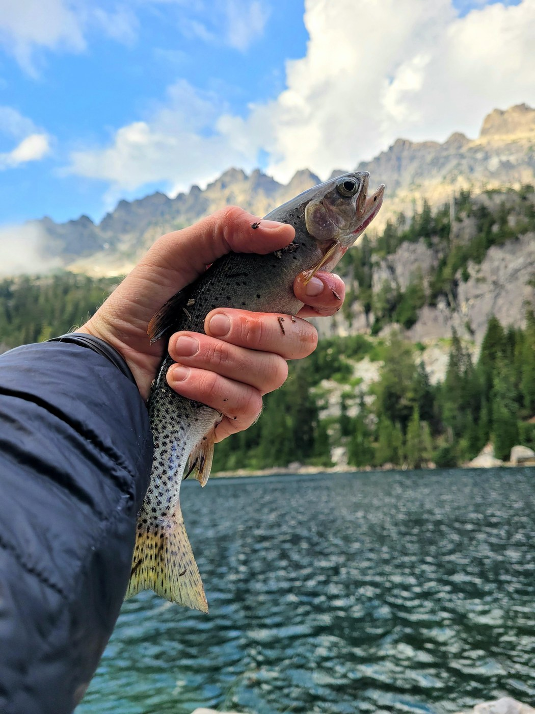 <em>Saturday, Aug. 20, 2022 -- Trout catch, hand holding fish [manual review]</em> -- <a href="https://www.wta.org/go-hiking/trip-reports/trip_report.2022-08-26.2558375688">https://www.wta.org/go-hiking/trip-reports/trip_report.2022-08-26.2558375688</a>

**Text mentions:**

- **Friday, Jul. 3, 2026** -- https://www.wta.org/go-hiking/trip-reports/trip_report-2026-07-05.155228418461
    - text ("fish"): "...were the worst for me at Venus - I got swarmed every time I stopped moving. I saw lots of fish in the lake. I also climbed up above the lake using the boot path on the left - definitel..."
- **Thursday, Aug. 21, 2025** -- https://www.wta.org/go-hiking/trip-reports/trip_report-2025-10-06.134422051720
    - text ("pack rafts"): "...olor painting which I’ve never done before on a backpacking trip! Next, we both took our pack rafts out onto Spade Lake where we explored floated about for an hour or so before eating lunch..."
- **Sunday, Sep. 8, 2024** -- https://www.wta.org/go-hiking/trip-reports/trip_report-2024-09-08.162456627601
    - text ("fisherman"): "...rday, we hiked to Spade Lake. This trail was a hard climb for me. It's more a glorified fisherman's trail. It starts by climbing straight up for a long time before traversing, then drops..."
- **Sunday, Sep. 8, 2024** -- https://www.wta.org/go-hiking/trip-reports/trip_report-2024-09-08.190941491715
    - text ("fisherman"): "...l appeared to be far away. After a bit of this traverse, and up around 5700 ft, I found a fisherman's/hunter's trail!! With this trail my pace quickened, and pretty soon I was on the ridge..."
    - text ("fisherman"): ".... The drainage looked promising, so I decided to take it, in the hope that I would find a fisherman's trail. After a good amount of good travel, I came up to a 200ft vertical drop with this..."
- **Friday, Sep. 6, 2024** -- https://www.wta.org/go-hiking/trip-reports/trip_report-2024-09-12.210409103545
    - text ("fish"): "...of trial and error we found a campsite about halfway up the lake. Tried unsuccessfully to fish, saw a few fishees rise out in the lake but nothing close in. Saturday morning 8:30 head..."
    - text ("fishing"): "...f hiking around to find a spot to get down to the lake that wasn’t occupied. Again, tried fishing but not successful, but trout were evident in the lake. 2 of our party went on to Venus,..."
    - text ("trout"): "...o get down to the lake that wasn’t occupied. Again, tried fishing but not successful, but trout were evident in the lake. 2 of our party went on to Venus, 3 Returned down the same trail..."
- **Friday, Aug. 30, 2024** -- https://www.wta.org/go-hiking/trip-reports/trip_report-2024-09-02.080016538789
    - text ("fishing"): "...3 there were just a few real spots left but many cars seemed to be there for swimming and fishing right at the TH. Got back around noon on Sunday and there were cars everywhere, all down..."
    - text ("fish"): "...swimming and the grounds gets super squishy past the immediate pebbly shore. We saw some fish in the lake. No toilet any more and the one that still existed by the Spade Trail spli..."
    - text ("fish"): "...were painful and we wished we had brought our sandals up from Waptus. We saw decent size fish here too. Spade to Venus: Once we hit the end of the lake there were a lot of little..."
- **Friday, Jul. 28, 2023** -- https://www.wta.org/go-hiking/trip-reports/trip_report.2023-07-31.7501769173
    - text ("fish"): "...pups needed water twice before we reached any. Stunning views up at Spade. Caught and ate fish. Many neighbors (2-4 groups depending on the night) and day hikers throughout the weekend..."
- **Friday, Sep. 2, 2022** -- https://www.wta.org/go-hiking/trip-reports/trip_report.2022-09-05.1076696973
    - text ("trout"): "...not a problem. Plenty of campsites at Waptus and Spade, none at Venus. No snow. Plenty of trout in Waptus and Spade lakes. Permits required: NW Forest Pass, self-issued backcountry perm..."
    - text ("fish"): "...s from seeing into the far distance. The lake itself was turquoise and clear. We saw some fish jumping, and indeed, a nearby camper said he caught some trout. We had dinner on a rocky..."
    - text ("trout"): "...oise and clear. We saw some fish jumping, and indeed, a nearby camper said he caught some trout. We had dinner on a rocky beach and climbed into the tent for the night. Saturday morni..."
- **Saturday, Aug. 20, 2022** -- https://www.wta.org/go-hiking/trip-reports/trip_report.2022-08-26.2558375688
    - text ("fishing"): "...I went up and over Dutch Miller Gap to Spade Lake for a 4 day fishing and hiking adventure. The Dingford Road is very rough and potholed. You will need at le..."
    - text ("trout"): "...an a 1/2 mile down the trail east of the lake (no stock camping allowed at Ivanhoe). The trout fishing at the lake is excellent, but don't expect to land anything huge. The next morn..."
    - text ("fishing"): "...attered about. I found a nice spot in the rocks close to the lake and busted out the old fishing pole. I caught my limit that evening and again the next morning, making for an excellent..."
- **Friday, Sep. 10, 2021** -- https://www.wta.org/go-hiking/trip-reports/trip_report-2021-09-15-4999451036
    - text ("fisherman"): "...ours. Our water filter broke in the morning and we had to ration water on the way back. A fisherman named Larry overheard us discussing our predicament and he gave us a liter of water to sh..."
    - text ("trout"): "...e saw otters in Waptus lake, and a bunch of deer, some bats, snakes, pika, chipmunks, and trout. Bugs were not so bad. I wore one of those bug bands and I only got bitten twice the whol..."
- **Friday, Sep. 10, 2021** -- https://www.wta.org/go-hiking/trip-reports/trip_report-2021-09-14-9750762762
    - text ("fishing"): "...itely changing as the bushes are all changing colors as you get up from Waptus. Oh ya.. fishing was good ;)..."
- **Sunday, Aug. 23, 2020** -- https://www.wta.org/go-hiking/trip-reports/trip_report-2020-08-24-7443229969
    - text ("fisherman"): "...y tired legs in the ice cold water, enjoying the views and had a nice conversation with a fisherman. Early to bed because I had designs on the summit of Mt. Daniel the next morning. Took..."
- **Tuesday, Aug. 4, 2020** -- https://www.wta.org/go-hiking/trip-reports/trip_report-2020-08-05-1311845905
    - text ("fishing"): "...climb. A few campers, but not too busy. We hung out near a campsite that had 3 abandoned fishing poles and scattered toilet paper which was disappointing. I wish people would stop going..."
- **Friday, Jul. 31, 2020** -- https://www.wta.org/go-hiking/trip-reports/trip_report-2020-08-04-2315336793
    - text ("fishing"): "...rei.com/learn/expert-advice/hygiene-sanitation.html Lastly, there were also abandoned fishing poles and lots of dead fish in the lake. We assumed this was from not using the proper ca..."
    - text ("fish"): "...iene-sanitation.html Lastly, there were also abandoned fishing poles and lots of dead fish in the lake. We assumed this was from not using the proper catch and release hooks. :( Al..."
- **Thursday, Jul. 30, 2020** -- https://www.wta.org/go-hiking/trip-reports/trip_report-2020-08-02-5708475169
    - text ("fish"): "...and trash around the lake was disappointing. Unburied feces and tp in the bushes and no fish in the lake. I won't be back as it is not worth the trudge to get up there. It would b..."
- **Friday, Jul. 24, 2020** -- https://www.wta.org/go-hiking/trip-reports/trip_report-2020-07-27-2198119127
    - text ("pack rafts"): "...of the lake, although a bit small for our group of three. A quick dip and a float on our pack rafts in the afternoon felt glorious. There was unfortunately no escape from the bugs later tha..."
- **Wednesday, Jul. 22, 2020** -- https://www.wta.org/go-hiking/trip-reports/trip_report-2020-07-22-9214469044
    - text ("salmon"): "...rs of clothes and mosquito netting for head. Lots of wildflowers! Berries were huckle and salmon. Spade Lake trail-- IMO, the whole trail is an obstacle. Steep grade comprised of slip..."
- **Wednesday, Jul. 15, 2020** -- https://www.wta.org/go-hiking/trip-reports/trip_report-2020-07-18-0457955478
    - text ("fishing"): "...camped around the lake. There was definitely space for many more. A couple of folks were fishing, but I don't think they had any luck...."
- **Saturday, Jul. 11, 2020** -- https://www.wta.org/go-hiking/trip-reports/trip_report-2020-07-17-7396449333
    - text ("fishing"): "...t windy, and was seemingly unoccupied. I debated making camp and took a few casts with my fishing pole (no bites and no fish observed), but decided to press on to Lake Terence. The trai..."
    - text ("fish"): "...ccupied. I debated making camp and took a few casts with my fishing pole (no bites and no fish observed), but decided to press on to Lake Terence. The trail to Lake Terence was rough..."
    - text ("fish"): "...spot I found was right where the trail meets the lake. I was all alone. There were a few fish rising, but in the middle of the lake, and I got no bites fishing from the shore. I arriv..."
- **Saturday, Aug. 31, 2019** -- https://www.wta.org/go-hiking/trip-reports/trip_report.2019-09-06.1711463810
    - text ("fish"): "...s fabulous--chilly but great for swimming in the hot afternoon sun, crystal clear waters, fish flopping. Sunday we headed up to Spade. With our added mile from our campsite to the S..."
- **Sunday, Jul. 21, 2019** -- https://www.wta.org/go-hiking/trip-reports/trip_report.2019-07-25.2324684381
    - text ("fish"): "...eat site with a large rock to dry our gear that we washed in the lake. There were lots of fish to watch leaping out of the lake and grey jays hanging out with us throughout the afterno..."
- **Wednesday, Sep. 5, 2018** -- https://www.wta.org/go-hiking/trip-reports/trip_report.2018-09-05.6720850320
    - text ("fish"): "...lake to find a nice slab for lunch and a nap before heading back. There are some sizable fish in the lake, water is so clear I could watch them swimming around...."
- **Friday, Aug. 4, 2017** -- https://www.wta.org/go-hiking/trip-reports/trip_report.2017-08-07.7295551501
    - text ("fish"): "...ing up into Venus just felt like entering a different world. We watched an osprey fly and fish up there for a while which was icing on the cake. We were back at camp around 6:30pm. B..."
- **Thursday, Jul. 16, 2015** -- https://www.wta.org/go-hiking/trip-reports/trip_report.2015-07-22.0096799091
    - text ("fish"): "...y group would dare get in except for wading up to their knees. In the evening and morning fish were jumping everywhere. We found a nice camp spot on the east side of the lake right nex..."
- **Tuesday, Aug. 11, 2009** -- https://www.wta.org/go-hiking/trip-reports/trip_report.2009-08-15.7527956026
    - text ("fish"): "...en on Wednesday night, it cleared, and we got to see the meteor shower. We caught a few fish there, including one 16" probably 3lb lunker that I thought was going to pull my daughter..."
    - text ("fishing"): "...nker that I thought was going to pull my daughter into the lake from the log that she was fishing on. We left our base camp and hiked up to Spade Lake. This trail is in fair shape, but h..."
    - text ("fish"): "...til the traverse into the upper valley. The lake itself is gorgeous and we caught about 6 fish within 10 minutes of putting our poles in the water. Until the mosquitoes, then the cold..."
- **Friday, Sep. 21, 2007** -- https://www.wta.org/go-hiking/trip-reports/tripreport-2007092206
    - text ("fishermen"): "...ot necessarily quicker. About halfway down the Spade Lake Trail, I ran into two dayhiking fishermen who had words of praise for my ancient pack, and had recorded a temperature of 35 degrees..."
- **Saturday, Sep. 8, 2007** -- https://www.wta.org/go-hiking/trip-reports/tripreport-2007090915
    - text ("fisherman"): "...we we're feeling fortunate to have had 5 days of such great weather. We headed out on the fisherman's around the far side of the lake. We discoverd a few more camping areas along the first..."
- **Saturday, Aug. 15, 1998** -- https://www.wta.org/go-hiking/trip-reports/tripreport-1998081606
    - text ("fishing"): "...t beautiful lakes in the Alpine Lakes Wilderness, and worth every tortuous mile. Great fishing at both Spade Lake and Venus Lake, if you can make the journey!..."

### Dingford Creek-Hester Lake

https://www.wta.org/go-hiking/hikes/dingford-creek-hester-lake

_32 photo(s) downloaded for visual review, 2 contact sheet(s) generated._

**Fishing photos (1):**

 <em>Saturday, Aug. 27, 2016 -- Rainbow trout for dunner [caption match]</em> -- <a href="https://www.wta.org/go-hiking/trip-reports/trip_report.2016-09-01.2826767182">https://www.wta.org/go-hiking/trip-reports/trip_report.2016-09-01.2826767182</a>

**Text mentions:**

- **Sunday, Jun. 21, 2026** -- https://www.wta.org/go-hiking/trip-reports/trip_report-2026-06-23.182847334587
    - text ("fishing"): "...Hiked up to Hester lake for a fathers day fishing excursion. Let me tell you, from the start of the gravel road to the end of the hike, it..."
    - text ("fishing"): "...would be a real chore. Despite this, the lake was beautiful and we were fully immersed in fishing for 3 hours. We saw many jump, had a few bites and eventually caught a pretty good sized..."
- **Saturday, Jun. 6, 2026** -- https://www.wta.org/go-hiking/trip-reports/trip_report-2026-06-06.212718216809
    - text ("salmon"): "...right now). That, combined with some rain, constantly brushing up against wet chest-high salmon and huckleberry bushes, and rain turning to snow at the lake make for kind of miserable c..."
- **Friday, May. 22, 2026** -- https://www.wta.org/go-hiking/trip-reports/trip_report-2026-05-26.143840957781
    - text ("fish"): "...s it is closed to use, and you shouldn't go through there. Wildlife at Hester: Tons of fish in the lake, frogs, pika, bald eagle, and I even heard a Western Screech Owl in the night..."
- **Friday, May. 9, 2025** -- https://www.wta.org/go-hiking/trip-reports/trip_report-2025-05-10.024243234014
    - text ("fishermen"): "...oday, traveling the six mile gravel road to the Dingford Creek Trailhead and climbing the fishermen’s trail next to Goat Creek up to Horseshoe Lake. I’m honestly having a hard time picturin..."
    - text ("fishing"): "...seshoe Lake. I’m honestly having a hard time picturing someone going up that trail with a fishing pole and coming back down it with their caught fish! But if that’s you, go now as I clear..."
    - text ("fish"): "...someone going up that trail with a fishing pole and coming back down it with their caught fish! But if that’s you, go now as I cleared away all the spiderwebs for you. I didn’t go to M..."
- **Thursday, Jul. 13, 2023** -- https://www.wta.org/go-hiking/trip-reports/trip_report.2023-07-24.1458658237
    - text ("fishing"): "...rs backpacking up, and 3.5 going down, but we ran into a couple groups who day hiked. The fishing is great, the group next to us caught 10 fish in an hour and I would recommend rooster lu..."
    - text ("fish"): "...into a couple groups who day hiked. The fishing is great, the group next to us caught 10 fish in an hour and I would recommend rooster lures. The trail was overgrown in several places..."
- **Friday, Jun. 9, 2023** -- https://www.wta.org/go-hiking/trip-reports/trip_report.2023-06-11.3174330721
    - text ("trout"): "...mud. We spent the night but not the two we planned on given the rain. There are a lot of trout in the lake and I am sure that it is beautiful on a clear day, which we didn't have. Ov..."
- **Friday, Sep. 9, 2022** -- https://www.wta.org/go-hiking/trip-reports/trip_report.2022-09-10.5208113584
    - text ("Fish"): "...the lake that would be flat enough to pitch a tent, but hammock camping would be doable. Fish were jumping a bit, and I saw lots of frogs and butterflies. The butterflies were actuall..."
- **Wednesday, Aug. 25, 2021** -- https://www.wta.org/go-hiking/trip-reports/trip_report-2021-08-30-7305390260
    - text ("fish"): "...amping at the lake Friday and Saturday. At the lake, there are three nice camp sites, and fish jumping. The water was warm enough for two of us to take a short "swim", though there are..."
- **Saturday, Aug. 15, 2020** -- https://www.wta.org/go-hiking/trip-reports/trip_report-2020-08-15-7787762348
    - text ("fishing"): "...the lake is very steep and technical, but the lake makes it all worth it. Great swimming, fishing and spots for lunching. I think we two other parties on our entire hike. In summary, a..."
- **Sunday, Jun. 24, 2018** -- https://www.wta.org/go-hiking/trip-reports/trip_report.2018-07-01.0814899217
    - text ("fish"): "...irst aid skills. This trail isn't well maintained but the trek was SO WORTH IT. Lots of fish jumping and a nice view of Mt Price. Still snow up on the summit, but in a few weeks, I t..."
- **Saturday, Aug. 27, 2016** -- https://www.wta.org/go-hiking/trip-reports/trip_report.2016-09-01.2826767182
    - text ("fishing"): "...total of 8 other people during the course of an overnight. The lake is beautiful and the fishing was great in the evening so fish was on the menu for dunner. The trail is a bit steep at..."
    - text ("fish"): "...course of an overnight. The lake is beautiful and the fishing was great in the evening so fish was on the menu for dunner. The trail is a bit steep at the beginning and end, but mostly..."
- **Friday, May. 23, 2014** -- https://www.wta.org/go-hiking/trip-reports/trip_report.2014-05-29.1948787145
    - text ("fishing"): "...ear. I was planning on getting up to Hester lake by about 2 and spend the rest of the day fishing and exploring. However, there was more snow than I expected and I decided it was time to..."
- **Saturday, Aug. 3, 2013** -- https://www.wta.org/go-hiking/trip-reports/trip_report.2013-08-06.9414225373
    - text ("Fish"): "...d a good route down to the lake, but once we did, it was lovely. A nice spot for lunch. Fish were jumping and the bugs were staying low to the water becoming food for the fish. We d..."
    - text ("fish"): "...unch. Fish were jumping and the bugs were staying low to the water becoming food for the fish. We didn't have many issues with bugs biting us. All in all, it was nice. Next time we'..."
- **Saturday, Sep. 15, 2012** -- https://www.wta.org/go-hiking/trip-reports/trip_report.2012-09-21.1285723320
    - text ("fishing"): "...d by 7:30am and to my surprise there were probably 10 cars there. Luckily almost all were fishing the river rather than taking the hike. First mile is switchback, which can be a tough way..."
    - text ("fish"): "...g back next year for an overnight so I can really enjoy the lake and hopefully catch some fish...."
- **Friday, Oct. 14, 2011** -- https://www.wta.org/go-hiking/trip-reports/trip_report.2011-10-15.7006880043
    - text ("fisherman"): "...trail is rocky,wet and overgrown. The comment was made a couple of times if this wasn't a fisherman's trail because of the brush and how wet the climb had become. The going is slow with all..."
- **Saturday, Nov. 8, 2008** -- https://www.wta.org/go-hiking/trip-reports/trip_report.2008-11-09.7352125939
    - text ("fishing"): "...nd. Take my word for it, just don't do it. Hike to the lake, camp, have a fire, bring the fishing rod, just don't go around the west side of the lake (at least not down low near the water..."
- **Monday, Oct. 29, 2007** -- https://www.wta.org/go-hiking/trip-reports/tripreport-2007103004
    - text ("fisherman"): "...empts. I made great time to my jump off point of the Dingford Creek Trail. I left via the fisherman's trail to Horseshoe Lake. The trail has a few more blowdowns than I remember but is easy..."
- **Sunday, Jun. 25, 2006** -- https://www.wta.org/go-hiking/trip-reports/tripreport-2006062604
    - text ("fisherman"): "...ged to get an early enough start to have some cooler temps on the way up. There is a good fisherman's trail that starts between the 4th and 5th branches of Goat Creek. The trail starts betw..."
- **Monday, Oct. 6, 2003** -- https://www.wta.org/go-hiking/trip-reports/tripreport-2003100701
    - text ("fish"): "...e before I made my way to Merlin Lake, I didn't have any luck. I did see some evidence of fish which seemed might be good sized. The route to Merlin is straight forward I just followed..."
- **Tuesday, Jul. 15, 2003** -- https://www.wta.org/go-hiking/trip-reports/tripreport-2003071604
    - text ("fly fishing"): "...od sized blow overs to climb over. I set up camp at Myrtle lake and tried my hand at some fly fishing. I had some success so I decided to try Little Myrtle. The trail to Little Myrtle is much..."
    - text ("fish"): "...on the west side contrary to both my maps. Little Myrtle looks more promising for bigger fish due to the fact it is not so shallow. I did not have any luck however, most of which was..."
- **Sunday, Jul. 21, 2002** -- https://www.wta.org/go-hiking/trip-reports/tripreport-2002072222
    - text ("fish"): "...urrent creek branch. Horseshoe and Goat Lks are beautiful and have no snow, few bugs (few fish) and are even swimable! The trail looked like only one or two had been to Horseshoe earli..."
- **Saturday, Jul. 7, 2001** -- https://www.wta.org/go-hiking/trip-reports/tripreport-2001070800
    - text ("fisherman"): "...n my hike turned up Goat Creek and improved substantially. ""100 Hikes"" mentions a rough fisherman's trail leading up the north bank to the lakes and that's essentially correct - except th..."
- **Saturday, Jun. 24, 2000** -- https://www.wta.org/go-hiking/trip-reports/tripreport-2000062411
    - text ("fish"): "...ost the trail in snow. Hester Lake (elev 3,886 ft) is quite big and it was 100% melted. A fish was seen at the outlet logjam. We continued offtrail, on to Little Hester Lake from the n..."
    - text ("fish"): "...wave, I expect it will be melted within a week. We went around Little Hester looking for fish, but did not see any. On the return trip we decided to try the south side of Hester Lak..."
- **Sunday, Jun. 14, 1998** -- https://www.wta.org/go-hiking/trip-reports/tripreport-1998061409
    - text ("trout"): "...at the lake. I sat on the driftwood at the near end of the lake and watched many rainbow trout while I ate my lunch. The lake is quite lovely, in a cirque beneath Mt. Price, not your m..."

### Spectacle Lake

https://www.wta.org/go-hiking/hikes/spectacle-lake

_45 photo(s) downloaded for visual review, 3 contact sheet(s) generated._

**Text mentions:**

- **Saturday, Oct. 4, 2025** -- https://www.wta.org/go-hiking/trip-reports/trip_report-2025-10-08.231736548771
    - text ("salmon"): "...Found a salmon-pink shoe above Spectacle and left it at TH if owner happens to see this & can get back t..."
- **Sunday, Jul. 7, 2024** -- https://www.wta.org/go-hiking/trip-reports/trip_report-2024-07-10.160250545871
    - text ("fishing"): "...l destination, with several great places to camp and still feel private. Wish I brought a fishing pole! Road: easily passable for my Honda Fit, parking for ~30 cars, pit toilet at TH..."
- **Saturday, Jul. 8, 2023** -- https://www.wta.org/go-hiking/trip-reports/trip_report.2023-07-10.5039228819
    - text ("trout"): "...of breaks, probably 2 hours worth of breaks. Totally Worth it. Even caught and released a trout at the lake...."
- **Saturday, Jul. 1, 2023** -- https://www.wta.org/go-hiking/trip-reports/trip_report.2023-07-03.9759961448
    - text ("fish"): "...rom the lake to the waterfall, so we had a built in sound machine to sleep to. There were fish jumping, ducks swimming, and birds diving. I would love to see this place in the fall...."
- **Friday, Jul. 24, 2020** -- https://www.wta.org/go-hiking/trip-reports/trip_report-2020-07-26-3146519425
    - text ("fishing"): "...e Lake, they were TERRIBLE at Pete Lake (and normally, bugs do not bother me!) No luck fishing at either lake!..."
- **Friday, Jul. 3, 2020** -- https://www.wta.org/go-hiking/trip-reports/trip_report-2020-07-06-0293112553
    - text ("fishing"): "...ble to find some more secluded campsites near the lake inlet. We set up camp and did some fishing until sunset and called it an early night due to the mosquitos. The mosquitos were a bit..."
- **Saturday, Jul. 27, 2019** -- https://www.wta.org/go-hiking/trip-reports/trip_report.2019-07-29.3567177548
    - text ("fisherman"): "...e maps that i downloaded show other routes that are no longer in existence - probably old fisherman routes that went more direct instead of using the PCT. Use real maps or very recently up..."
- **Wednesday, Jul. 3, 2019** -- https://www.wta.org/go-hiking/trip-reports/trip_report.2019-07-05.5611088595
    - text ("Fishing"): "...re 10 - 15 parties camped on the peninsula and 5 - 10 camped across the arm of the lake. Fishing was poor, with only timid strikes during the 30 minutes a day the fish were rising...."
    - text ("fish"): "...m of the lake. Fishing was poor, with only timid strikes during the 30 minutes a day the fish were rising...."
- **Wednesday, Aug. 22, 2018** -- https://www.wta.org/go-hiking/trip-reports/trip_report.2018-08-27.0886834903
    - text ("fish"): "...s constant during our 3 night stay, which kept the bugs at bay. My boyfriend attempted to fish, but there were zero fish jumping; he tried grasshoppers, worms, and power-bait, but didn..."
    - text ("fish"): "...ght stay, which kept the bugs at bay. My boyfriend attempted to fish, but there were zero fish jumping; he tried grasshoppers, worms, and power-bait, but didn’t get any bites. The lake..."
- **Friday, Aug. 17, 2018** -- https://www.wta.org/go-hiking/trip-reports/trip_report.2018-08-19.1969487473
    - text ("fish"): "...g lot to reach Pete Lake and we found a lovely spot right on the lake to set up camp. The fish were certainly biting although alas my husband did not catch any fish. The smoke had blow..."
    - text ("fish"): "...to set up camp. The fish were certainly biting although alas my husband did not catch any fish. The smoke had blown out with the wind so we enjoyed a smoke free evening. We had origina..."
- **Friday, Aug. 3, 2018** -- https://www.wta.org/go-hiking/trip-reports/trip_report.2018-08-08.0999033186
    - text ("Fish"): "...elevation gain from Spectacle. We saw a marmot, many pikas and frogs, and a few deer. Fish were also jumping in Spectacle. Spectacle is truly one of the jewels of the Cascade lake..."
- **Saturday, Jul. 21, 2018** -- https://www.wta.org/go-hiking/trip-reports/trip_report.2018-07-29.7265903067
    - text ("fishing"): "...walk to Pete Lake. Lots of people were already camped there and I saw folks floating and fishing. There are lots of social trails at Pete Lake so a couple times I got off the main trail..."
- **Saturday, Jul. 14, 2018** -- https://www.wta.org/go-hiking/trip-reports/trip_report.2018-07-16.9697824627
    - text ("fish"): "...ding geomorphology, idyllic campsites, and (in my case) friendly people out here to raft, fish, or impress me with how high off the rocks they're willing to dive. It's quite a place...."
- **Wednesday, Aug. 24, 2016** -- https://www.wta.org/go-hiking/trip-reports/trip_report.2016-09-01.3414578463
    - text ("fishing"): "...1pm. Got the spot on the far end of the peninsula (my favorite camp spot ever). Did some fishing and swimming and met some cool people up at the lake. Lots of people camping up there for..."
- **Sunday, Jul. 10, 2016** -- https://www.wta.org/go-hiking/trip-reports/trip_report.2016-07-10.4353112134
    - text ("Fish"): "...le to trail turn off right turn (going up), we did and ended up looking down on the lake. Fish are jumping at sun down and the water is cold as ever (but worth a swim). We saw a team o..."
- **Monday, Aug. 6, 2012** -- https://www.wta.org/go-hiking/trip-reports/trip_report.2012-08-21.0321047074
    - text ("trout"): "...site at Spectacle Lake. It was beautiful the whole time we were up there. Lots of smaller trout in the lake. Clear skies both nights we were up there. The next morning we woke up about..."
    - text ("fishing"): "...llow) to Glacier Lake. When we got up there about half the lake was melted off. I found a fishing pole at the southern end of the lake, if you lost if shoot me an email and I'll try and g..."
- **Friday, Jul. 3, 2009** -- https://www.wta.org/go-hiking/trip-reports/trip_report.2009-07-10.1583753850
    - text ("fishing"): "...along the island. Remember no campfires at Spectacle. Someone else on the trail said the fishing's good up there...but we didn't bring our poles...."
- **Saturday, Aug. 9, 2008** -- https://www.wta.org/go-hiking/trip-reports/tripreport-2008081011
    - text ("fishing"): "...Couldn't find anybody to go with me, so I set off with Rugger to explore the fishing at Pete Lake and Spectacle Lake. Left the TH around noon on Friday for a leisurely hike t..."
    - text ("fish"): "...the inlet and thought I'd try drowning some flies in the lake. Although I could see a few fish jumping out in the middle of the lake, none would venture within range of my line. Satur..."
- **Saturday, Aug. 2, 2008** -- https://www.wta.org/go-hiking/trip-reports/tripreport-2008080305
    - text ("fish"): "...get to the peninsula where most of the camp sites are (unless it looks crowded). Not much fish action. Exquisite glacier-polished granite everywhere. I was extremely impressed with the..."
- **Monday, Sep. 3, 2007** -- https://www.wta.org/go-hiking/trip-reports/tripreport-2007090404
    - text ("fishing"): "...out. Everybody swam in Spectacle & a few in Glacier Lake. We were able to watch an osprey fishing in the early mornings. He seemed to have better luck than our own fishermen. The fall col..."
    - text ("fishermen"): "...watch an osprey fishing in the early mornings. He seemed to have better luck than our own fishermen. The fall color is coming on nicely & the blueberries were thick, resulting in not a few..."
- **Sunday, Aug. 19, 2007** -- https://www.wta.org/go-hiking/trip-reports/tripreport-2007082003
    - text ("trout"): "...grassy meadow glowing bright green in the waning summer heat. With innumerable acrobatic trout. Magica. Then everyone gets to pay by an infinite climb on a hot muggy day up to Spectac..."
- **Saturday, Sep. 11, 1999** -- https://www.wta.org/go-hiking/trip-reports/tripreport-1999091206
    - text ("Fish"): "...ake had apparently been drinking and shooting of firearms during the night, prompting the Fish & Wildlife people to come in and investigate. When we passed their campsite, there were l..."
- **Saturday, Sep. 12, 1998** -- https://www.wta.org/go-hiking/trip-reports/tripreport-1998091305
    - text ("fisherman"): "...re lots of camping places on the finger of land dividing the two sections. Pat is a fly-fisherman and he was watching the waters carefully. He didn't bring his gear but I wonder if he wis..."

### Gold Creek Trail to Alaska Lake

https://www.wta.org/go-hiking/hikes/alaska-lake

_33 photo(s) downloaded for visual review, 2 contact sheet(s) generated._

**Text mentions:**

- **Monday, Oct. 14, 2024** -- https://www.wta.org/go-hiking/trip-reports/trip_report-2024-10-18.113756181061
    - text ("Salmon"): "...ing its thing. Didn't see another person the whole time until I got back to the pond. The Salmon are hanging out in the river, fun to watch them for awhile. Great hike, elevation is very..."
- **Saturday, Sep. 28, 2024** -- https://www.wta.org/go-hiking/trip-reports/trip_report-2024-09-30.171915277001
    - text ("fish"): "...aft" - cut trees and bows everywhere and, at Hester, a bunch of paracord, bullet casings, fish heads, garbage, and other signs of ...bushcraft. I saw a light from a hiker on the PCT..."
- **Sunday, Oct. 2, 2022** -- https://www.wta.org/go-hiking/trip-reports/trip_report.2022-10-12.9686360661
    - text ("trout"): "...ver. I fished at the lake while my brother slung a hammock nearby. I caught a couple of trout, both of which were too small to be worth keeping. None of the others I saw looked much b..."
    - text ("fishing"): ".... A couple of years ago, at this same time of year, my father and I did have a successful fishing day here. The short road to the Gold Creek trailhead needs some grading, but it's fine..."
- **Tuesday, Aug. 10, 2021** -- https://www.wta.org/go-hiking/trip-reports/trip_report-2021-08-10-3388643251
    - text ("fishing"): "...cairns through the rock sections. The lake is just lovely, plenty deep for swimming and fishing and a gorgeous blue color. I highly recommend taking the way trail around the right (nort..."
- **Thursday, Aug. 5, 2021** -- https://www.wta.org/go-hiking/trip-reports/trip_report-2021-08-05-0255862598
    - text ("fish"): "...There’s a great camp spot on the north side of the lake. Spent one night there, caught a fish for dinner, then headed down in the morning. Super sore now, but worth every muscle ache!..."
- **Monday, Jul. 20, 2020** -- https://www.wta.org/go-hiking/trip-reports/trip_report-2020-07-23-3057289207
    - text ("fish"): "...'s no sign of a switchback and the bushes are just as unpleasant as in the valley. The fish were jumping in the lake when we arrived, and we caught several beautiful rainbow trout w..."
    - text ("trout"): "...he fish were jumping in the lake when we arrived, and we caught several beautiful rainbow trout which we ate that night. (I caught one on my first cast.) On our second day, having bee..."
    - text ("fishing"): "...nmaintained trail and remote location? We left the next morning after some more enjoyable fishing and came back to an extremely busy trailhead, but it looked like everyone was just visiti..."
- **Sunday, Aug. 18, 2019** -- https://www.wta.org/go-hiking/trip-reports/trip_report.2019-08-19.8463803142
    - text ("fishing"): "..., took a dip, and ate some snacks. Shared the lake with what seemed to be a single group, fishing. After Alaska, whether or not you thought the mile climb up to the lake was interesting..."
- **Thursday, Oct. 11, 2018** -- https://www.wta.org/go-hiking/trip-reports/trip_report.2018-10-11.5245503522
    - text ("salmon"): "...e-u, then a few notes about the hike. Okay, the hike-u: Away from the world Red salmon swim in Gold Creek And steam rises in sun Notes about the hike: This is a lovely..."
    - text ("salmon"): "...he colors really popping, and so many places that just asked to be touched. Also, tons of salmon right now in the creek below the pond. The trail to Alaska Lake is very steep, but I foun..."
- **Saturday, Aug. 6, 2016** -- https://www.wta.org/go-hiking/trip-reports/trip_report.2016-08-07.5005409691
    - text ("fish"): "...p to camp before dark despite our late start. The lake was peaceful and lovely. We didn't fish, but other hikers said they had some success with fishing. Overall, we only encountered a..."
    - text ("fishing"): "...was peaceful and lovely. We didn't fish, but other hikers said they had some success with fishing. Overall, we only encountered a handful of people along the whole trail. The camp at the..."
- **Saturday, Aug. 6, 2016** -- https://www.wta.org/go-hiking/trip-reports/trip_report.2016-08-06.1724174805
    - text ("fishing"): "...e. The temperature was perfect. And the lake was beautiful. One of my friends brought his fishing pole and caught several rainbow trout. Most of them were pretty small - the largest being..."
    - text ("trout"): "...lake was beautiful. One of my friends brought his fishing pole and caught several rainbow trout. Most of them were pretty small - the largest being about 8". We released them all back i..."
- **Saturday, Jul. 16, 2016** -- https://www.wta.org/go-hiking/trip-reports/trip_report.2016-07-18.1430656302
    - text ("fishing"): "...s a difficult stretch but it was worth it--we had the lake to ourselves that night! Good fishing and we were able to see lights from a few PCT hikers that night, as the PCT goes along th..."
- **Saturday, Jun. 4, 2016** -- https://www.wta.org/go-hiking/trip-reports/trip_report.2016-06-06.1045349305
    - text ("trout"): ".... Be carefull, many of these small logs are floating freely. I saw at least two foot long trout here during my picnic. The descent down was again swift. Lots of giant steps through scr..."
- **Tuesday, Jul. 7, 2015** -- https://www.wta.org/go-hiking/trip-reports/trip_report.2015-07-07.9620159272
    - text ("trout"): "...but the lake is worth it. Took me about 40 mins up from the valley. Lots of tiny little trout jumping, frogs, dippers doing their dance. Due to the heavy brush, there'd be no way to..."
- **Wednesday, Jul. 25, 2012** -- https://www.wta.org/go-hiking/trip-reports/trip_report.2012-07-26.0243702367
    - text ("fishing"): "..., saw only six cars there. Met a nice older gentleman on my way in; he said don't bother fishing today, which was fine as I wasn't. Looks like there has been a good deal of recent trail..."
    - text ("fish"): "...end - some waterfalls into the lake, a herd of elk on the far shore, an eagle diving for fish, anything. So, that's twelve and a half miles roundtrip. Three and half hours up, two a..."
- **Saturday, Sep. 3, 2011** -- https://www.wta.org/go-hiking/trip-reports/trip_report.2011-09-05.7180589797
    - text ("fisherman"): "...lovely, as is the lake, but you do have to work for it. There was one tent at the lake, a fisherman, and the 5 young men who'd passed us below were taking frigid dips in the water, screamin..."
- **Friday, Aug. 5, 2011** -- https://www.wta.org/go-hiking/trip-reports/trip_report.2011-08-07.5845781350
    - text ("fishing"): "...and enjoy the beautiful alpine lake! Water level at Alaska Lake is high so getting to a fishing spot is tricky but the fish are plentiful as always...."
    - text ("fish"): "...lake! Water level at Alaska Lake is high so getting to a fishing spot is tricky but the fish are plentiful as always...."
- **Sunday, Aug. 17, 2008** -- https://www.wta.org/go-hiking/trip-reports/tripreport-2008081803
    - text ("fishing"): "...else had camped at Joe lake this year. The bugs were intense at Joe Lake, but so was the fishing for sub-10"" cutthroat trout. Also saw a black bear at Joe Lake. Lots of flowers at Joe l..."
    - text ("trout"): "...is year. The bugs were intense at Joe Lake, but so was the fishing for sub-10"" cutthroat trout. Also saw a black bear at Joe Lake. Lots of flowers at Joe lake and a few snow patches. T..."
- **Friday, Jul. 15, 2005** -- https://www.wta.org/go-hiking/trip-reports/tripreport-2005071611
    - text ("fishing"): "...up to the lake is very steep and can be difficult and dangerous at times (when wet). The fishing up at Joe Lake was very good. I landed myself some nice trout for dinner. Bring bug repel..."
    - text ("trout"): "...at times (when wet). The fishing up at Joe Lake was very good. I landed myself some nice trout for dinner. Bring bug repellant and allow yourself extra time to negotiate the less maint..."
- **Tuesday, Sep. 2, 2003** -- https://www.wta.org/go-hiking/trip-reports/tripreport-2003090305
    - text ("fishing"): "...ting with the avalanche debris and formations in the lake. We passed two guys camping and fishing, and saw another couple that made it to the outlet, amazing for a such HOT weekday in ear..."
- **Wednesday, Jul. 2, 2003** -- https://www.wta.org/go-hiking/trip-reports/tripreport-2003070307
    - text ("fish"): "...bout 3 h 30 m to get back down to my car. I fished in the lake and caught only one little fish...."
- **Friday, Jul. 19, 2002** -- https://www.wta.org/go-hiking/trip-reports/tripreport-2002072030
    - text ("fish"): "...to the lake which had a snow beach. A couple of good campsites and I hear that there was fish up there. The bugs were never that bad but bring your bug dope...."
- **Monday, Aug. 9, 1999** -- https://www.wta.org/go-hiking/trip-reports/tripreport-1999081005
    - text ("fishing"): "...Went up August 10, to go fishing, the trail had snow on parts of the trail, and the creeks were high to cross. There was s..."

### Marten Lake

https://www.wta.org/go-hiking/hikes/marten-lake

_45 photo(s) downloaded for visual review, 3 contact sheet(s) generated._

**Fishing photos (3):**

 <em>Sunday, Jul. 13, 2025 -- Salmon Berry glade [caption match]</em> -- <a href="https://www.wta.org/go-hiking/trip-reports/trip_report-2025-07-14.155634149188">https://www.wta.org/go-hiking/trip-reports/trip_report-2025-07-14.155634149188</a>

 <em>Saturday, Jun. 22, 2024 -- Pack raft session! [caption match]</em> -- <a href="https://www.wta.org/go-hiking/trip-reports/trip_report-2024-06-22.221318052452">https://www.wta.org/go-hiking/trip-reports/trip_report-2024-06-22.221318052452</a>

 <em>Tuesday, Jun. 20, 2017 -- Lightweight pack raft for the win!.....by Cliff Birdsall [caption match]</em> -- <a href="https://www.wta.org/go-hiking/trip-reports/trip_report.2017-06-20.0332400901">https://www.wta.org/go-hiking/trip-reports/trip_report.2017-06-20.0332400901</a>

**Text mentions:**

- **Sunday, Jul. 13, 2025** -- https://www.wta.org/go-hiking/trip-reports/trip_report-2025-07-14.155634149188
- **Tuesday, Jan. 14, 2025** -- https://www.wta.org/go-hiking/trip-reports/trip_report-2025-01-15.194959981770
    - text ("fisherman"): "...oose the mountain dog and I made it up to Marten lake on a nice January day. The climbers/fisherman's trail that leaves the main Snoqualmie lake trail is rough in places but mostly easy to..."
- **Saturday, Jun. 22, 2024** -- https://www.wta.org/go-hiking/trip-reports/trip_report-2024-06-22.221318052452
    - text ("pack raft"): "...Me and a friend decided to hike up and pack raft on Marten Lake for WA Trails Day. The 1st half of the trail was straight forward and eas..."
    - text ("pack raft"): "...ugged section of trail. We spent about an hr taking turns floating on the lake with the pack raft after eating snack/lunch. Weather was partly sunny. Bugs on at the lake were the non bi..."
- **Friday, May. 31, 2024** -- https://www.wta.org/go-hiking/trip-reports/trip_report-2024-06-03.142935042590
    - text ("fly rod"): "...I found it to be a blast, and the lake was very pretty underneath Rooster Mt. Brought the fly rod, and I got some swipes, but no real bites. To the absolute douches who have decided that..."
- **Thursday, May. 25, 2023** -- https://www.wta.org/go-hiking/trip-reports/trip_report.2023-05-26.7033436320
    - text ("fisherman"): "...re trees have fallen across and work around trails are less obvious. Basically a climbers/fisherman's trail with some trail tape, some log cuts, brush cuts. We climbed up steadily, with few..."
- **Thursday, May. 28, 2020** -- https://www.wta.org/go-hiking/trip-reports/trip_report-2020-05-28-7667955034
    - text ("fishermen"): "...rail is an exercise in route finding, patience and balance (bring poles). Its for serious fishermen, fisherwomen and discerning hikers only. Its a heavy-berm, blown down tree lovers drea..."
- **Friday, May. 24, 2019** -- https://www.wta.org/go-hiking/trip-reports/trip_report.2019-05-28.9810565320
    - text ("fisherman"): "...bridge crossing at marten creek. as soon as we started up what other reports noted as a "fisherman" and "bouldering" trail we quickly realized we needed to rely on our Gaia GPS iPhone app..."
- **Saturday, May. 4, 2019** -- https://www.wta.org/go-hiking/trip-reports/trip_report.2019-05-04.0477725867
    - text ("Salmon"): "...becomes exposed 1/2 way up around the very big rock, where it opens up to 'snack alley' (Salmon/Huckleberry bushes). This will be very overgrown in the next few weeks if not maintained...."
- **Tuesday, Apr. 23, 2019** -- https://www.wta.org/go-hiking/trip-reports/trip_report.2019-04-24.2297191801
    - text ("fisherman"): "...y. Only saw evidence of one other person at the lake recently, and the trail is more of a fisherman's path: it has root scrambles, muddy slopes, and there's still drifts of snow up by the l..."
- **Tuesday, Oct. 24, 2017** -- https://www.wta.org/go-hiking/trip-reports/trip_report.2017-10-25.7908196041
    - text ("fisherman"): "...pper falls you need to hike up the Marten Lake trail about 0.3 mile. This trail is an old fisherman's path so it is steep, muddy, rooty, slippery rocks and fallen trees to get over. I was a..."
- **Friday, Jul. 7, 2017** -- https://www.wta.org/go-hiking/trip-reports/trip_report.2017-07-09.3134423701
    - text ("fishing"): "...e walking. Lake is great, very clear. I was the only one there. Very few bugs. Tried fishing for a while, nothing. Saw a couple of mid sized trout and lot of fry. I am wondering if..."
    - text ("trout"): "...ne there. Very few bugs. Tried fishing for a while, nothing. Saw a couple of mid sized trout and lot of fry. I am wondering if the fry were stocked. There is a good campsite near t..."
- **Friday, Jun. 30, 2017** -- https://www.wta.org/go-hiking/trip-reports/trip_report.2017-07-03.5696007480
    - text ("fishing"): "...'ll ever make the effort to go up to Marten again. The other party that came up did enjoy fishing for trout however but I'm not a fisherman. Used my headnet and some bug spray, the gn..."
    - text ("fisherman"): "...ten again. The other party that came up did enjoy fishing for trout however but I'm not a fisherman. Used my headnet and some bug spray, the gnats were pretty swarmy but I didn't see or..."
- **Tuesday, Jun. 20, 2017** -- https://www.wta.org/go-hiking/trip-reports/trip_report.2017-06-20.0332400901
    - text ("pack rafts"): "...I explored this beautiful lake last fall in a rainy day and recently purchased some pack rafts so I took two friends back up to spend some time cruising the lake and lazily lounging in..."
- **Sunday, Aug. 14, 2016** -- https://www.wta.org/go-hiking/trip-reports/trip_report.2016-08-16.9724121253
    - text ("fish"): "...threw bushes and shrubs get to get down to the lake. Not much of a choice if you want to fish there. Beautiful lake with fish in it!!..."
    - text ("fish"): "...et down to the lake. Not much of a choice if you want to fish there. Beautiful lake with fish in it!!..."
- **Tuesday, Aug. 19, 2003** -- https://www.wta.org/go-hiking/trip-reports/tripreport-2003082007
    - text ("fishing"): "...brush.Someone has bushed the trail.It's narrow .I think I would it be good to carry your fishing pole then to have in your pack,like I did and get hung up and snapp your tip off the pole..."
    - text ("fish"): "...really bad if your foot goes in one.I finally got to the lake and had my lunch.I had two fish jump out of the water in front of me.They just couldn't wait and I couldn't wait either.I..."
    - text ("fish"): "...fell off this tree in to the lake to save my pole.I grabbed it and started bring this hug fish in.Soon has I pulled it out It fell off.I had a nice cool hike back and no fish and cover..."
- **Saturday, Aug. 9, 2003** -- https://www.wta.org/go-hiking/trip-reports/tripreport-2003081011
    - text ("trout"): "...turned to single track) so we fished the river instead of continuing on the road. Lots of trout in this pretty little river. River is catch and release, lure only. Drier trail on the wa..."
- **Tuesday, Jul. 9, 2002** -- https://www.wta.org/go-hiking/trip-reports/tripreport-2002071011
    - text ("Fishing"): "...Backpacked into Marten Lake on July 10, 2002 and hiked out the following day. Fishing was slow, mosquitoes numerous, and the weather hot! The Middle Fork Road has not improve..."
    - text ("fish"): "...to expect, and still found this hike to be quite a challenge. Enjoy the lake, catch some fish, and have a great hike...."
- **Wednesday, Jun. 6, 2001** -- https://www.wta.org/go-hiking/trip-reports/tripreport-2001060707
    - text ("Fishing"): "...ion- let alone a cinnamon black bear. There were plenty of bugs --take some bug spray. Fishing-- Marten Lake was completely thawed, some snow was still scattered in the trees. I enjoye..."
    - text ("fishing"): "...hawed, some snow was still scattered in the trees. I enjoyed an 3 hours + of relaxing and fishing. I did not catch any fish, but probably with a raft and give the fish a few more weeks to..."
    - text ("fish"): "...attered in the trees. I enjoyed an 3 hours + of relaxing and fishing. I did not catch any fish, but probably with a raft and give the fish a few more weeks to get thawed out and get hu..."
- **Friday, Jul. 17, 1998** -- https://www.wta.org/go-hiking/trip-reports/tripreport-1998071812
    - text ("Fishing"): "...ry large flat slabs of terraced rock forming a series of waterfalls each about 2ft. high. Fishing was slow on this occasion I caught only three Rainbows in the 9-10in. class...."
- **Tuesday, Jun. 30, 1998** -- https://www.wta.org/go-hiking/trip-reports/tripreport-1998070103
    - text ("fishing"): "...iked the Marten Creek Trail #1006 to Marten Lake on July 1st. First the good stuff - the fishing from my inflatable boat was very good, even late in the morning. Caught several 10in. tr..."
    - text ("trout"): "...ng from my inflatable boat was very good, even late in the morning. Caught several 10in. trout, lost many others and released four in the 8in. range. - The trail in unimproved with m..."
- **Thursday, Jul. 31, 1997** -- https://www.wta.org/go-hiking/trip-reports/tripreport-1997080102
    - text ("trout"): "...on the other side of the lake outlet. Beautiful little lake, nice swimming, many small trout. No trail around lake -- a difficult bushwack at best. Nearby lakes on map don't look e..."

### Dingford Creek-Myrtle Lake

https://www.wta.org/go-hiking/hikes/dingford-creek-myrtle-lake

_37 photo(s) downloaded for visual review, 2 contact sheet(s) generated._

**Fishing photos (1):**

 <em>Sunday, Jun. 3, 2018 -- Still frozen at the lake, but apparently full of fish [caption match]</em> -- <a href="https://www.wta.org/go-hiking/trip-reports/trip_report.2018-06-04.7531738165">https://www.wta.org/go-hiking/trip-reports/trip_report.2018-06-04.7531738165</a>

**Text mentions:**

- **Friday, May. 22, 2026** -- https://www.wta.org/go-hiking/trip-reports/trip_report-2026-05-26.143840957781
    - text ("fish"): "...s it is closed to use, and you shouldn't go through there. Wildlife at Hester: Tons of fish in the lake, frogs, pika, bald eagle, and I even heard a Western Screech Owl in the night..."
- **Friday, May. 9, 2025** -- https://www.wta.org/go-hiking/trip-reports/trip_report-2025-05-10.024243234014
    - text ("fishermen"): "...oday, traveling the six mile gravel road to the Dingford Creek Trailhead and climbing the fishermen’s trail next to Goat Creek up to Horseshoe Lake. I’m honestly having a hard time picturin..."
    - text ("fishing"): "...seshoe Lake. I’m honestly having a hard time picturing someone going up that trail with a fishing pole and coming back down it with their caught fish! But if that’s you, go now as I clear..."
    - text ("fish"): "...someone going up that trail with a fishing pole and coming back down it with their caught fish! But if that’s you, go now as I cleared away all the spiderwebs for you. I didn’t go to M..."
- **Sunday, Aug. 6, 2023** -- https://www.wta.org/go-hiking/trip-reports/trip_report-2025-04-18.214626614907
    - text ("fish"): "...Hester Lake.) only a couple were difficult to bypass. The lake was quiet with just a few fish rising. The water was surprisingly warm, but the bottom of the lake is pretty muddy. Grea..."
- **Saturday, Sep. 21, 2019** -- https://www.wta.org/go-hiking/trip-reports/trip_report.2019-09-24.4970660518
    - text ("fishing"): "...A friend and I decided to do one last fishing trip in the mountains before he moves to Houston next month, as there aren't a whole lot..."
    - text ("fishermen"): "...I do. Altogether, though, the trail isn't bad; it's perfect for kids, beginners, and fat fishermen with delusions of grandeur. EDIT: To clarify, I guess the trail isn't THAT easy; it's not..."
    - text ("Fishing"): "...steeply up to Little Myrtle) so I turned around to go set up camp near the outlet stream. Fishing-wise, this lake is a pain in the rear. The parts of the lake you can easily get to (the s..."
- **Friday, Aug. 9, 2019** -- https://www.wta.org/go-hiking/trip-reports/trip_report.2019-08-11.8239300345
    - text ("fishing"): "...Picked Myrtle because of a fishing report from another site. Got to the trailhead at 4pm. Last few miles were of normal fore..."
- **Saturday, Jul. 27, 2019** -- https://www.wta.org/go-hiking/trip-reports/trip_report.2019-07-29.6390951039
    - text ("fish"): "...mplained about the mosquitoes but I did not think they were all that bad. We caught some fish and had them for breakfast. Only saw two other people while we were there and they were..."
- **Friday, Jun. 14, 2019** -- https://www.wta.org/go-hiking/trip-reports/trip_report.2019-06-17.8755243574
    - text ("trout"): "...fields. Briefly joined by group of 8 on a day hike before they departed. Caught a rainbow trout and ate lunch before heading back. Circled around northern tip of Myrtle Lake at return...."
    - text ("fishing"): "...trip. 4 or 5 great secluded sites on north and northwest shores once things dry out. More fishing yielded a couple of small catches. No big wildlife - frogs, a few small birds, squirrel...."
- **Sunday, Dec. 16, 2018** -- https://www.wta.org/go-hiking/trip-reports/trip_report.2018-12-16.4569089013
    - text ("fisherman"): "...the Middle Fork road each weekend, white car, license plate BJD0082. Not a hiker, not a fisherman, not a bird watcher. He's sketchy, I've spoke to him and will again next weekend. 9:0..."
- **Sunday, Jun. 3, 2018** -- https://www.wta.org/go-hiking/trip-reports/trip_report.2018-06-04.7531738165
    - text ("trout"): "...s mostly frozen and covered in snow still. Myrtle Lake is supposedly stocked with lots of trout and so I did this hike as a bit of a scout trip for coming back to fish, glad I didn't br..."
    - text ("fish"): "...ked with lots of trout and so I did this hike as a bit of a scout trip for coming back to fish, glad I didn't bring the poles and the tent this time around because all of the camp site..."
    - text ("fish"): "...stop on the way back from a long hike with delicious meatballs. I'll return to camp and fish this place in July when I figure that the snow should finally be melted. If you want a..."
- **Saturday, Sep. 2, 2017** -- https://www.wta.org/go-hiking/trip-reports/trip_report.2017-09-03.9867692698
    - text ("fishing"): "...It also looked like there were some good camping spots and we passed a lot of people with fishing poles, so my guess is that Myrtle Lake is stocked. The Blueberries were ripe, but mostl..."
- **Saturday, Sep. 14, 2013** -- https://www.wta.org/go-hiking/trip-reports/trip_report.2013-09-19.1105508103
    - text ("trout"): "...ine and half surrounded by massive granite walls that make for big echoes. A few 4-5 inch trout were cruising the shallows in the larger lake but we didn't see any in Snowflake. The mel..."
- **Wednesday, Sep. 4, 2013** -- https://www.wta.org/go-hiking/trip-reports/trip_report.2013-09-08.5662046914
    - text ("fly fishing"): "...ned up Dingford Creek to Myrtle Lake. Rained on us every day but we had one great day of fly fishing and the blueberries and blue huckleberries were great. The views were nice when the sun..."
    - text ("fish"): "...were great. The views were nice when the sun came out and the little lake was fun to fly fish. Also, a WTA trail crew was on the trail making life easy for hikers. These guys rock!..."
- **Wednesday, Jul. 10, 2013** -- https://www.wta.org/go-hiking/trip-reports/trip_report.2013-07-18.1671127029
    - text ("Fish"): "...snow patches above Little Myrtle but all navigable. Heather was just starting to bloom. Fish biting at Myrtle and lots of hummingbirds. Bugs not too bad--mostly gnats...."
- **Saturday, May. 29, 2010** -- https://www.wta.org/go-hiking/trip-reports/trip_report.2011-06-19.9905185586
    - text ("fishermen"): "...two major destinations, the other being Hester Lake. Frequented mostly by backpackers and fishermen, the lakes don’t see a great deal of traffic. This is probably because, in addition to th..."
- **Monday, Aug. 16, 2004** -- https://www.wta.org/go-hiking/trip-reports/tripreport-2004081700
    - text ("fishing"): "...and 15 minutes to get there, and a little over 2 hours to get back to the trailhead. The fishing is also pretty good at this lake. The best thing is all the blueberries starting at aroun..."
- **Saturday, Aug. 7, 2004** -- https://www.wta.org/go-hiking/trip-reports/tripreport-2004080803
    - text ("fishing"): "...). Myrtle lake is pretty nice and we have come here quite a few times over the years. The fishing is still pretty decent and there are quite a few areas for exploring and climbing. Sunday..."
- **Tuesday, Jul. 29, 2003** -- https://www.wta.org/go-hiking/trip-reports/tripreport-2003073001
    - text ("fishermen"): "...s in.I went to Myrtle and my friend went to Hester.To Myrtle was not bad it's more like a fishermen trail.The boardwalks are not stable so be careful and some muddy spots. I got up to the l..."
    - text ("fishing"): "...nd finally found a space without the sun beating down on me.I so wished that I brought my fishing pole.The fish were jumping all over the lake.They where rubbing it in.I got back to the j..."
- **Tuesday, Jul. 15, 2003** -- https://www.wta.org/go-hiking/trip-reports/tripreport-2003071604
    - text ("fly fishing"): "...od sized blow overs to climb over. I set up camp at Myrtle lake and tried my hand at some fly fishing. I had some success so I decided to try Little Myrtle. The trail to Little Myrtle is much..."
    - text ("fish"): "...on the west side contrary to both my maps. Little Myrtle looks more promising for bigger fish due to the fact it is not so shallow. I did not have any luck however, most of which was..."
- **Sunday, Jul. 21, 2002** -- https://www.wta.org/go-hiking/trip-reports/tripreport-2002072222
    - text ("fish"): "...urrent creek branch. Horseshoe and Goat Lks are beautiful and have no snow, few bugs (few fish) and are even swimable! The trail looked like only one or two had been to Horseshoe earli..."
- **Friday, Aug. 4, 2000** -- https://www.wta.org/go-hiking/trip-reports/tripreport-2000080505
    - text ("trout"): "...rch across the lake. For a moment or two it seemed quite hopeful that I might release the trout I caught to it. I didn't have an opportuinty to explore Little Myrtle Lake, and will defe..."

### Hyas Lake

https://www.wta.org/go-hiking/hikes/hyas-lake

_26 photo(s) downloaded for visual review, 2 contact sheet(s) generated._

**Fishing photos (1):**

 <em>Wednesday, Jul. 29, 2020 -- Beautiful Cutthroat trout from Tuck Lake [caption match]</em> -- <a href="https://www.wta.org/go-hiking/trip-reports/trip_report-2020-08-11-5802699959">https://www.wta.org/go-hiking/trip-reports/trip_report-2020-08-11-5802699959</a>

**Text mentions:**

- **Sunday, Sep. 3, 2023** -- https://www.wta.org/go-hiking/trip-reports/trip_report.2023-09-04.2686943641
    - text ("Fish"): "...We car camped at Fish Lake Camground Saturday night and got to the trailhead around 8:30am. The parking lot was..."
- **Monday, Jul. 3, 2023** -- https://www.wta.org/go-hiking/trip-reports/trip_report.2023-07-03.3363083282
    - text ("fishing"): "...My wife and I hiked to the north end of the lake for some fishing. We caught two good size western brook trout. They were going after the green roster tail..."
- **Tuesday, Aug. 3, 2021** -- https://www.wta.org/go-hiking/trip-reports/trip_report-2021-08-07-2670121371
    - text ("Fish"): "...it's 7 inches of clearance. At 8:30 AM on a Tuesday the parking area was around 1/3 full. Fish Lake (more of a river in a wide marsh) near the trailhead is beautiful in it's own right,..."
- **Wednesday, Sep. 30, 2020** -- https://www.wta.org/go-hiking/trip-reports/trip_report-2020-09-30-7936001770
    - text ("Fish"): "...my favorite hiking/climbing areas but every time I go I am reminded of how much I despise Fish Lake Road. Lol. It's not that it's too horrible, as forest service roads go, it's pretty..."
- **Wednesday, Jul. 29, 2020** -- https://www.wta.org/go-hiking/trip-reports/trip_report-2020-08-11-5802699959
    - text ("fishing"): "...ke and Cathedral Rock, and access to a sandy beach. We stayed the night here and did some fishing and the kids did a little swimming in the shallow water. We slept in hammocks. Watch out..."
    - text ("trout"): "...his body! Tuck Lake is a beautiful lake though! We caught a couple beautiful Cutthroat trout that night as well. Over all it was tough but worth it and we definitely have some inte..."
- **Friday, Jul. 19, 2019** -- https://www.wta.org/go-hiking/trip-reports/trip_report.2019-07-22.4813259835
    - text ("Fishing"): "...per into the wilderness, but the lake was still private and quiet, incredibly relaxing. Fishing was superb, and I caught two good-sized Brook trout. Very tasty, and full of bug exoskele..."
    - text ("trout"): "...e and quiet, incredibly relaxing. Fishing was superb, and I caught two good-sized Brook trout. Very tasty, and full of bug exoskeletons – happy fish make good eating. Overall, an ex..."
    - text ("fish"): "...and I caught two good-sized Brook trout. Very tasty, and full of bug exoskeletons – happy fish make good eating. Overall, an excellent trip for newbies, a great place to relax, good..."
- **Saturday, Sep. 1, 2018** -- https://www.wta.org/go-hiking/trip-reports/trip_report.2018-09-02.5587711148
    - text ("fish"): "...ay night. Nice note: we saw a peregrine falcon at the lake and also a tiny salamander. No fish. Day 2: Continued up to Cathedral Pass and then connected with the PCT northbound. In t..."
- **Friday, Jul. 24, 2015** -- https://www.wta.org/go-hiking/trip-reports/trip_report.2018-08-19.7269049151
    - text ("fish"): "...found a lovely camp spot on the lake. Luckily the weather dried out and we caught 3 small fish (catch and release) at Tuck Lake and enjoyed a crisp and cool evening. Unfortunately we d..."
- **Tuesday, Jul. 7, 2015** -- https://www.wta.org/go-hiking/trip-reports/trip_report.2016-05-01.8590359056
    - text ("fish"): "...ain source of income for the little towns around. For patrol officers it is like shooting fish i a barrel- no one is driving the speed limit as it is totally inappropriate for the road..."
- **Saturday, Aug. 17, 2013** -- https://www.wta.org/go-hiking/trip-reports/trip_report.2013-08-19.0650480457
    - text ("fishing"): "...r lake and deception lakes. We got back to deception lakes from surprise mt and did some fishing, didn't catch anything. we had a doe come right into camp to see what we were up, I think..."
    - text ("fish"): "...e up, I think it was about 15ft away. we also spent some time watching a hawk try to pick fish out of the lake. there was definitely fish in the lake, we saw them jumping, but they wer..."
    - text ("fish"): "...so spent some time watching a hawk try to pick fish out of the lake. there was definitely fish in the lake, we saw them jumping, but they were not interested in my lures. the bugs got..."
- **Wednesday, Jul. 31, 2013** -- https://www.wta.org/go-hiking/trip-reports/trip_report.2013-08-02.8842291607
    - text ("fishing"): "...half of the trip back, 4 overnighters just after I returned to the trail and 3 coming up fishing after that. A nice quick run into the Alpine Lakes Wilderness on a easy trail even if th..."
- **Saturday, Jun. 18, 2011** -- https://www.wta.org/go-hiking/trip-reports/trip_report.2011-06-18.3250689421
    - text ("Fish"): "...tree blocking the road about 3/4 of mile before the trailhead so we had to park just past Fish Lake walk-in campground. The trail has some running water on it and we didn't encounter l..."
- **Saturday, Jul. 25, 2009** -- https://www.wta.org/go-hiking/trip-reports/trip_report.2009-07-29.7263596448
    - text ("Fish"): "...tter Creek?, I don't know) without a problem. Car-camped the first night just before the Fish Lake Guard Station, tons of wildflowers, TONS OF BUGS. Thunderstorms both Friday and Sat..."
- **Saturday, Jun. 27, 2009** -- https://www.wta.org/go-hiking/trip-reports/trip_report.2009-06-28.4402902045
    - text ("Fish"): "...Hyas Lake trail is located at the end of the Fish Lake Road (4330). It is about twelve miles on the dirt road but do know that at Scatter..."
- **Monday, Aug. 27, 2007** -- https://www.wta.org/go-hiking/trip-reports/tripreport-2007082806
    - text ("salmon"): "...of way. The result was the moon was dark, dusky red in the exact center, with a lighter, salmon-red around the edges. I stayed up long enough to hear Dark Side of the Moon (of course),..."
- **Saturday, Sep. 30, 2006** -- https://www.wta.org/go-hiking/trip-reports/tripreport-2006100110
    - text ("fishing"): "...C2 took off after work for 3 days of fishing at Tuck and Robin. Passed Hyas in the dark and reached the junction at dawn.At the Robins..."
    - text ("Fishing"): "...efore dark. Next morning we revisited the potholes and down the gully toward Phoebe Lake. Fishing here was splendid, nearly every cast was a winner (we caught fish in every lake we visite..."
    - text ("fish"): "...toward Phoebe Lake. Fishing here was splendid, nearly every cast was a winner (we caught fish in every lake we visited, Tuck, Tucks Pot, both Robins, all 3 Granite Mountain Potholes,..."
- **Sunday, Aug. 24, 2003** -- https://www.wta.org/go-hiking/trip-reports/tripreport-2003082501
    - text ("fishing"): "...goal was to camp at Jade per the recommendation of ""The Curtis"". However, the excellent fishing/swimming beach combined with the sunning rock and rather nice sheltered site w/abundant b..."
    - text ("fishing"): "...le ""routes"" can be confusing. Marmot is a fine large and realtively warm lake. Plus the fishing was great. We were pulling in cutthroats with a brilliant green along the top. Kept two f..."
    - text ("fishing"): "...rick to cap an OUTSTANDING hike. Good weather, great destination, MINIMAL bugs, Excellent fishing, few folks...."
- **Friday, Sep. 7, 2001** -- https://www.wta.org/go-hiking/trip-reports/tripreport-2001090809
    - text ("fish"): "...all along the lake and they were all empty. Great campsites, sandy beaches, great views, fish in the lake and most everyone on the trail heading further up to the many destinations up..."

### Nordrum Lake

https://www.wta.org/go-hiking/hikes/nordrum-lake

_36 photo(s) downloaded for visual review, 2 contact sheet(s) generated._

**Fishing photos (2):**

 <em>Monday, Sep. 11, 2017 -- MW Rainbow Trout, caught on a DickNite 50/50 [caption match]</em> -- <a href="https://www.wta.org/go-hiking/trip-reports/trip_report.2017-09-15.9848338230">https://www.wta.org/go-hiking/trip-reports/trip_report.2017-09-15.9848338230</a>

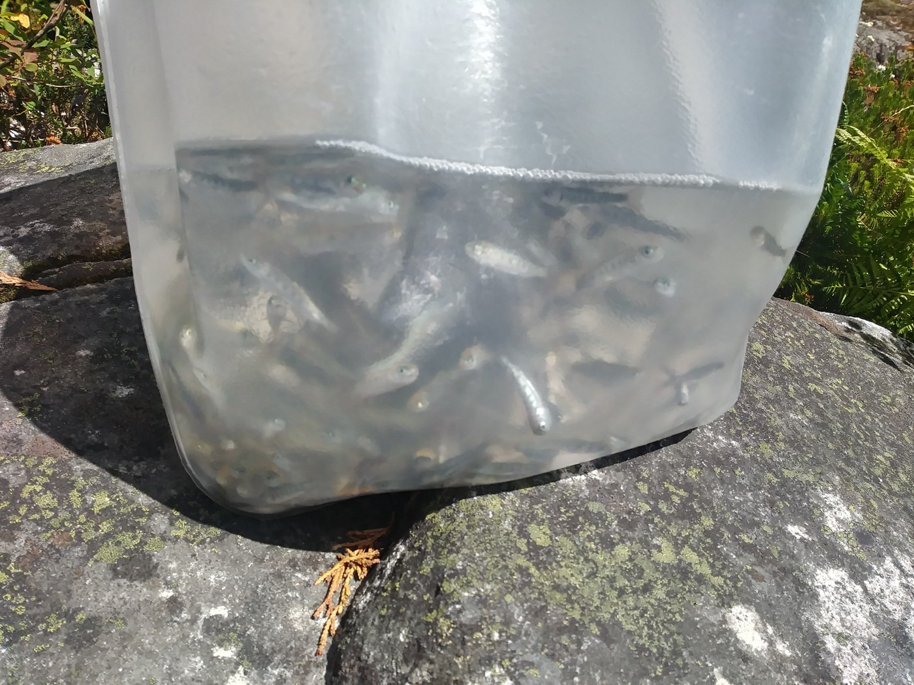 <em>Monday, Sep. 11, 2017 -- Bag of trout fry -- a stocking event [manual review]</em> -- <a href="https://www.wta.org/go-hiking/trip-reports/trip_report.2017-09-15.9848338230">https://www.wta.org/go-hiking/trip-reports/trip_report.2017-09-15.9848338230</a>

**Text mentions:**

- **Thursday, May. 9, 2024** -- https://www.wta.org/go-hiking/trip-reports/trip_report-2024-05-09.165706651491
    - text ("creel"): "...site on the map halfway the lake is fully snow covered. - I checked the crossing of the creel to Nordrum Lake. It looks passable but unpleasant and I turned around there. I also expec..."
- **Friday, Aug. 19, 2022** -- https://www.wta.org/go-hiking/trip-reports/trip_report.2022-08-22.0602156783
    - text ("fishing"): "...d it together! I lost my phone up at Lunker lake. If anyone is going up to nordrum and fishing I will share all the secrets if you are willing to go look for my phone...."
- **Wednesday, Jul. 21, 2021** -- https://www.wta.org/go-hiking/trip-reports/trip_report-2021-07-21-2400369132
    - text ("fish"): "...that way too--I guess they made it since we never saw them again. The lake has at least 1 fish in it -- we caught an 8" rainbow and threw it back in the AM -- but there's little eviden..."
    - text ("fish"): "...caught an 8" rainbow and threw it back in the AM -- but there's little evidence of other fish, despite the copious quantities of gnats, mosquitos, and black flies. Bring a head net an..."
- **Saturday, Jul. 11, 2020** -- https://www.wta.org/go-hiking/trip-reports/trip_report-2020-07-12-6399662028
    - text ("fisherman"): "...wn to the lake, but the trail is very visible. One interesting piece is that there is a "fisherman's/animal trail" leading around the right side of the lake from the saddle as the trail be..."
    - text ("fish"): "...challenging hike, you will will really like this adventure to Nordrum (we did not see any fish rising in the lake, but we did not bring fishing gear)...."
    - text ("fishing"): "...is adventure to Nordrum (we did not see any fish rising in the lake, but we did not bring fishing gear)...."
- **Monday, Sep. 11, 2017** -- https://www.wta.org/go-hiking/trip-reports/trip_report.2017-09-15.9848338230
    - text ("Trout"): "...Finally made it back to Nordrum to stock it with 1000 Mount Whitney Rainbow Trout. Did this with my dad as part of the Trail Blazers program. The trail was exactly how i..."
    - text ("fishing"): "...nly difference was it was more slippery, given that there is less sun and more dew. The fishing was pretty awesome at the top, caught a few trout and many many bites. Be careful at th..."
    - text ("trout"): "...there is less sun and more dew. The fishing was pretty awesome at the top, caught a few trout and many many bites. Be careful at the stream crossing on the Nordrum trail; the log is..."
- **Monday, Jul. 17, 2017** -- https://www.wta.org/go-hiking/trip-reports/trip_report.2017-07-21.0675283290
    - text ("trout"): "...This was a scouting trip for my Dad and I, as we are planning on stocking this lake with trout later in the summer through The Trailblazers program. Long hike, better as an overnighter..."
    - text ("fish"): "...old growth. The lake and surrounding area is stunning, and there are plenty of good sized fish in there! (surface feeding on the many flying bugs around there - my dad caught a beautif..."
    - text ("fish"): "...the trouble. We would love to see this trail used more, and would love to see some of our fish caught! Unfortunately WTA as very limited info on the hike, which we're trying to help wi..."
- **Friday, Jun. 30, 2017** -- https://www.wta.org/go-hiking/trip-reports/trip_report.2017-07-03.5696007480
    - text ("fishing"): "...'ll ever make the effort to go up to Marten again. The other party that came up did enjoy fishing for trout however but I'm not a fisherman. Used my headnet and some bug spray, the gn..."
    - text ("fisherman"): "...ten again. The other party that came up did enjoy fishing for trout however but I'm not a fisherman. Used my headnet and some bug spray, the gnats were pretty swarmy but I didn't see or..."
- **Friday, Jul. 4, 2014** -- https://www.wta.org/go-hiking/trip-reports/trip_report.2014-07-10.7507029812
    - text ("fish"): "...spray! Even with spray they tend to like to get in your face constantly. We also tried to fish a little bit but we are novice to fly fishing and didn't catch anything. The fish were ve..."
    - text ("fly fishing"): "...e to get in your face constantly. We also tried to fish a little bit but we are novice to fly fishing and didn't catch anything. The fish were very active though!..."
    - text ("fish"): "...ried to fish a little bit but we are novice to fly fishing and didn't catch anything. The fish were very active though!..."
- **Friday, Jul. 22, 2011** -- https://www.wta.org/go-hiking/trip-reports/trip_report.2011-07-26.4390040409
    - text ("fishing"): "...granite bed with the old trail visible on the far side. After crossing the creek the old fishing trail resumes. No snow until just before the lake and then it's several feet deep. Watch..."
- **Tuesday, Jul. 20, 2010** -- https://www.wta.org/go-hiking/trip-reports/trip_report.2010-07-25.3753072124
    - text ("fish"): "...very muddy, so most of my time was helping the dog get through the washouts and mud. The fish were biting, steep shoreline made it a little difficult to get the fly line out far enoug..."
- **Tuesday, Jul. 20, 2010** -- https://www.wta.org/go-hiking/trip-reports/trip_report.2010-07-25.9297946843
    - text ("fish"): "...very muddy, so most of my time was helping the dog get through the washouts and mud. The fish were biting, steep shoreline made it a little difficult to get the fly line out far enoug..."
- **Monday, Jul. 19, 2010** -- https://www.wta.org/go-hiking/trip-reports/trip_report.2010-07-25.5241940232
    - text ("fish"): "...very muddy, so most of my time was helping the dog get through the washouts and mud. The fish were biting, steep shoreline made it a litte difficult to get the fly line out far enough..."
- **Saturday, Aug. 9, 2003** -- https://www.wta.org/go-hiking/trip-reports/tripreport-2003081011
    - text ("trout"): "...turned to single track) so we fished the river instead of continuing on the road. Lots of trout in this pretty little river. River is catch and release, lure only. Drier trail on the wa..."
- **Friday, Jul. 26, 2002** -- https://www.wta.org/go-hiking/trip-reports/tripreport-2002072726
    - text ("Fishing"): ".... and way trails seem non-existant. Mining activity including blasting above Quartz Lake. Fishing was poor,two fisherman I met also fished Rock and Lunker without success. Undoubtedly the..."
    - text ("fisherman"): "...non-existant. Mining activity including blasting above Quartz Lake. Fishing was poor,two fisherman I met also fished Rock and Lunker without success. Undoubtedly there is some good fishing..."
    - text ("fishing"): "...sherman I met also fished Rock and Lunker without success. Undoubtedly there is some good fishing in these parts but they ain't zackly jumpin in the boat. With my over night pack it was a..."
- **Wednesday, May. 30, 2001** -- https://www.wta.org/go-hiking/trip-reports/tripreport-2001053108
    - text ("Fishing"): "...ming out at dusk. When we stopped for a break they started to swarm--take some bug spray. Fishing-- Dream Lake- no fish were biting a few were surfacing. Pothole Lake- I did not unpack my..."
    - text ("fish"): "...stopped for a break they started to swarm--take some bug spray. Fishing-- Dream Lake- no fish were biting a few were surfacing. Pothole Lake- I did not unpack my fishing pole, it was..."
    - text ("fishing"): "...- Dream Lake- no fish were biting a few were surfacing. Pothole Lake- I did not unpack my fishing pole, it was probably 8:30PM and getting dark. Do it again' probably not, this is one tr..."
- **Friday, Jul. 21, 2000** -- https://www.wta.org/go-hiking/trip-reports/tripreport-2000072209
    - text ("fish"): "...pped out the fly gear, perched myself on a strategic rock, and proceeded to pull two nice fish from the water. But, after a 30-minute siesta is was time for us to get moving; a short t..."
    - text ("fish"): "...so I picked and slid my way down. Once down, I was able to peer through the trees and see fish rising in Judy Lake below; couldn’t wait to get down there. Waited for Phil to appear for..."
    - text ("fly fishing"): "...nice at the lake I almost wanted to stay behind, wade around near the outlet, and do some fly fishing while Phil headed up to the saddle to the southwest of Carole. Yet, I knew I wouldn’t be..."
- **Monday, Aug. 23, 1999** -- https://www.wta.org/go-hiking/trip-reports/tripreport-1999082403
    - text ("fishing"): "...are also a couple of very slippery spots so travel cautiously. The lake was unpopulated, fishing excellent (11 in. Cutthroat), and the insect population was staggering. My insect repelle..."
- **Saturday, Jul. 11, 1998** -- https://www.wta.org/go-hiking/trip-reports/tripreport-1998071207
    - text ("fishing"): "...ourse, was taken by the only other person there (who was not very friendly, either). The fishing was good. I caught only cut-throat trout. None of which had any real size. However, th..."
    - text ("trout"): "...ere (who was not very friendly, either). The fishing was good. I caught only cut-throat trout. None of which had any real size. However, the lake is large and might hold something b..."
    - text ("fish"): "...lake is large and might hold something bigger than the 10 inchers I caught. You can fly-fish from the bank in several spots. After an all-night rain and what looked to be another da..."

### Cooper River

https://www.wta.org/go-hiking/hikes/cooper-river

_32 photo(s) downloaded for visual review, 2 contact sheet(s) generated._

**Fishing photos (2):**

 <em>Thursday, Oct. 27, 2022 -- Spawning salmon [caption match]</em> -- <a href="https://www.wta.org/go-hiking/trip-reports/trip_report.2022-10-28.4290333855">https://www.wta.org/go-hiking/trip-reports/trip_report.2022-10-28.4290333855</a>

 <em>Saturday, Sep. 12, 2020 -- Salmon were seen jumping up this waterfall [caption match]</em> -- <a href="https://www.wta.org/go-hiking/trip-reports/trip_report-2020-09-13-0213321501">https://www.wta.org/go-hiking/trip-reports/trip_report-2020-09-13-0213321501</a>

**Text mentions:**

- **Friday, Jul. 4, 2025** -- https://www.wta.org/go-hiking/trip-reports/trip_report-2025-07-05.180445322166
    - text ("packraft"): "...Lake, near Quick creek. There were tons of other hikers, plus a fun party that brought a packraft. My partner and I gathered water and started hiking west, up the Waptus Pass Trail, aroun..."
- **Thursday, Oct. 27, 2022** -- https://www.wta.org/go-hiking/trip-reports/trip_report.2022-10-28.4290333855
    - text ("salmon"): "...car at Salmon la Sac trailhead. At the swimming hole at the trailhead we saw 18 spawning salmon. It was outstanding to see them swimming in the shallows. A few were pristine looking whe..."
    - text ("salmon"): "...e really beat up from their long journey. When we returned after our hike we could see no salmon. Maybe they were resting before continuing upstream. This trail is in excellent condition..."
- **Sunday, Oct. 9, 2022** -- https://www.wta.org/go-hiking/trip-reports/trip_report.2022-10-10.6535644796
    - text ("salmon"): "...you're in the right place.) It's a nice trail, and the river was very clear - we spotted salmon in the pools near the trailhead! It was Sunday so there were other hikers out today, bu..."
- **Wednesday, Jul. 7, 2021** -- https://www.wta.org/go-hiking/trip-reports/trip_report-2021-07-09-6138748892
    - text ("fishing"): "...lf). The Cooper River trail is well-used and delightful, with even a few swimming / fishing / picnicking spots as it approaches the Cooper Lake road. From there follow the road a fe..."
    - text ("fishing"): "...sites toward the lake). There is also a rough, lakeside way trail to informal camping and fishing sites (you can easily bushwack up to the main trail if necessary). I seemed to be t..."
- **Thursday, Jun. 10, 2021** -- https://www.wta.org/go-hiking/trip-reports/trip_report-2021-06-13-6868885134
    - text ("fish"): "...ms and shoreside trees are flooded. Lots of water, good news for farmers, city folks and fish. Robert & Laurie Michelson..."
- **Monday, Nov. 9, 2020** -- https://www.wta.org/go-hiking/trip-reports/trip_report-2020-11-12-2685651191
    - text ("Fish"): "...this outcome because we knew what to do. This included reporting the incident to Dept. of Fish and Wildlife. While cougar attacks are rare, they do happen. Please use this as an opport..."
- **Sunday, Oct. 11, 2020** -- https://www.wta.org/go-hiking/trip-reports/trip_report-2020-10-14-3289817185
    - text ("salmon"): "...from the Salmon la Sac trailhead is a waterfall and pool with about 60 bright red sockeye salmon swimming lazily in the current. These are the namesake salmon of the area, missing for a..."
    - text ("salmon"): "...bout 60 bright red sockeye salmon swimming lazily in the current. These are the namesake salmon of the area, missing for almost 100 years due to water development in the Yakima - sockey..."
    - text ("fish"): "...reintroduced sockeye to Cle Elum. Now the Yakima Basin Integrated Plan is working to make fish passage permanent - that project is about half way done. This is a huge win for salmon,..."
- **Sunday, Sep. 27, 2020** -- https://www.wta.org/go-hiking/trip-reports/trip_report-2020-09-27-7290035883
    - text ("fish"): "...ing after yesterday’s rain. A short way up from the trailhead I saw a dozen or more large fish spawning in a calm pool below. The road has potholes so take it slow. The trail was in go..."
- **Sunday, Sep. 20, 2020** -- https://www.wta.org/go-hiking/trip-reports/trip_report-2020-09-21-2777535454
    - text ("salmon"): "...r one just past the trailhead at Salmon la Sac. Not very crowded. BONUS: can watch the salmon spawning in the Cle Elum river. Watch from the bridge that goes over the river on the roa..."
- **Saturday, Sep. 12, 2020** -- https://www.wta.org/go-hiking/trip-reports/trip_report-2020-09-13-0213321501
    - text ("salmon"): "...H ( see video ). When we passed that same pool earlier in the day there were many sockeye salmon arriving from downstream and resting there (see salmon spawning video posted below). We s..."
    - text ("salmon"): "...in the day there were many sockeye salmon arriving from downstream and resting there (see salmon spawning video posted below). We saw salmon jumping up the waterfalls upstream. Autumn le..."
    - text ("salmon"): "...riving from downstream and resting there (see salmon spawning video posted below). We saw salmon jumping up the waterfalls upstream. Autumn leaves are just beginning to change along the..."
- **Tuesday, Aug. 11, 2020** -- https://www.wta.org/go-hiking/trip-reports/trip_report-2020-08-11-9012461374
    - text ("fishing"): "...nk most people were out on the lake. We heard worms are the preferred bait if you plan on fishing here. Pro tip- if you’re staying at a cabin in the woods and some of your party like to..."
- **Thursday, Jul. 16, 2020** -- https://www.wta.org/go-hiking/trip-reports/trip_report-2020-07-19-4379088116
    - text ("fishing"): "...ere were still some bugs. Unfortunately, the previous campers here were pigs. There was fishing line, power bait marshmallows, granola bar wrappers etc. laying around everywhere. They..."
- **Saturday, Jul. 11, 2020** -- https://www.wta.org/go-hiking/trip-reports/trip_report-2020-07-12-9996429675
    - text ("salmon"): "...of their droppings, though, they seem to be well-fed! As long as you aren't wearing your salmon-scented deodorant that day, you probably won't be bothered by them! The Tired Creek tra..."
- **Thursday, Jun. 11, 2020** -- https://www.wta.org/go-hiking/trip-reports/trip_report-2020-06-11-9758828272
    - text ("salmon"): "...hike, as we have always opted for the macho 22-mile trail to Waptus Lake. Cooper River, a salmon spawning ground, is another jade-colored river, wild and gorgeous. The whole area is just..."
- **Saturday, May. 4, 2019** -- https://www.wta.org/go-hiking/trip-reports/trip_report.2019-05-04.3490098852
    - text ("Salmon"): "...Beautiful day to hike Salmon La Saq area! Unfortunately we did not make it to Cooper Lake—only going up about 2.5 mile..."
- **Sunday, Oct. 2, 2011** -- https://www.wta.org/go-hiking/trip-reports/trip_report.2011-10-02.9350388188
    - text ("fishing"): "...and you're lucky, you might see a dipper feeding along the shore and a pair of mergansers fishing. This trail is not in the wilderness. Judging by tracks, it is used sometimes by mount..."
- **Friday, Apr. 27, 2001** -- https://www.wta.org/go-hiking/trip-reports/tripreport-2001042808
    - text ("Salmon"): "...prouting up everywhere and few cars were in sight. The trailhead is located just past the Salmon LaSac campground and is fairly well marked. The camp is still closed and snow covered but..."

### Lower Tuscohatchie Lake

https://www.wta.org/go-hiking/hikes/lower-tuscohatchie-lake-1011

_40 photo(s) downloaded for visual review, 2 contact sheet(s) generated._

**Text mentions:**

- **Tuesday, Aug. 19, 2025** -- https://www.wta.org/go-hiking/trip-reports/trip_report-2025-08-19.175307992588
    - text ("salmon"): "...FLORA: Wildflowers are past their prime but berries are abundant: watermelon, thimble, salmon, blue, and huckleberries. FAUNA: We had 13 bird species including a belted kingfisher (..."
- **Wednesday, Jul. 24, 2024** -- https://www.wta.org/go-hiking/trip-reports/trip_report-2024-07-29.154056328141
    - text ("salmon"): "...ortion of the hike, with views of Pratt Lake and Kaleetan Peak, lots of wildflowers, ripe salmon and huckleberry bushes (and soon to be ripe thimbleberry), and a pika chirping at me as I..."
- **Saturday, Jul. 23, 2022** -- https://www.wta.org/go-hiking/trip-reports/trip_report.2022-08-04.3862476968
    - text ("fish"): "...day afternoon after a refreshing dip. Only wildlife seen was 1 frog, 1 toad, 2 chipmunks, fish jumping, and about 25 hikers. Gorgeous weather made for a great weekend in the woods...."
- **Tuesday, Jul. 12, 2022** -- https://www.wta.org/go-hiking/trip-reports/trip_report.2022-07-18.4621007475
    - text ("fishing"): "...red around 60 miles w/10,000ft or so of gain in three days (the fourth was a zero day for fishing). 90% of the entire loop was snow free, with the climb up Mt. Defiance from the NW being..."
    - text ("fishing"): ".... Day 2: Thompson Lake to... Nowhere! I took a zero day at Thompson and spent the day fishing and exploring the lake basin. I moved my camp to a more agreeable spot after another par..."
    - text ("fishing"): "...en scuttled! Very sad day. I also found a Shasta Root Beer can from the 50's when I was fishing. Remember folks, it hasta be Shasta! The trout were jumping all over the lake throughou..."
- **Friday, Jul. 8, 2022** -- https://www.wta.org/go-hiking/trip-reports/trip_report.2022-07-14.0961525826
    - text ("fish"): "...people and especially a lot of runners. As we passed Lower Tuscohatchie Lake, we saw many fish jumping. This was the only fish activity we saw the whole time, and my later attempt to f..."
    - text ("fish"): "...unners. As we passed Lower Tuscohatchie Lake, we saw many fish jumping. This was the only fish activity we saw the whole time, and my later attempt to fish at Island was futile. We saw..."
    - text ("fish"): "...h jumping. This was the only fish activity we saw the whole time, and my later attempt to fish at Island was futile. We saw a couple packrafters who said they also saw little activity..."
- **Saturday, Aug. 28, 2021** -- https://www.wta.org/go-hiking/trip-reports/trip_report-2021-08-29-5887859193
    - text ("fishing"): "...shade of blue. There were several other groups but not that many. There were some people fishing in the lake. Melakwa Lake to Franklin Falls Trailhead: From Melakwa to Slickrock it i..."
- **Sunday, Jul. 18, 2021** -- https://www.wta.org/go-hiking/trip-reports/trip_report-2021-07-23-7983683638
    - text ("fishing"): "...ot too bad. I was hoping Pratt Lake's river outlet would be wide enough for some stream fishing, but it's practically underground, completely covered by boulders and slabs of rock. Not..."
    - text ("fish"): "...cally underground, completely covered by boulders and slabs of rock. Not only could I not fish, but I couldn't even really refill my water filter there, and instead used the lake (whic..."
    - text ("fishing"): "...tlet river from Lower Tuscohatchie was jammed with driftwood and logs, providing an ideal fishing grounds for small trout, and not only did I see them jumping all evening just offshore bu..."
- **Wednesday, Aug. 26, 2020** -- https://www.wta.org/go-hiking/trip-reports/trip_report-2020-08-29-7266310501
    - text ("fishing"): "...asily found a camp site right by the lake and set up camp. The water was very warm. Tried fishing but no luck. Not many campers, mostly day hikers. Got up the next day for our big leg..."
    - text ("fishing"): "...psite thanks to a fellow female hiker who suggested it. Set up camp and tried our hand at fishing again, no joy. Friday morning, woke up early, had a quick breakfast and made our way t..."
    - text ("fishing"): "...ough camp and take in the beauty. If only our leaders of our countries...I digress. Tried fishing again and in a few minutes, was rewarded with a nice 8 inch brookie! Carefully released i..."
- **Monday, Jul. 27, 2020** -- https://www.wta.org/go-hiking/trip-reports/trip_report-2020-07-29-6483951063
    - text ("trout"): "...all by ourselves! Beautiful lake, not too many bugs (surprisingly!), caught some rainbow trout. Generally the trail to our camp was in good shape. Plenty of rocks in the descent to..."
- **Friday, Aug. 24, 2018** -- https://www.wta.org/go-hiking/trip-reports/trip_report.2018-08-28.1475382212
    - text ("Fish"): "...ut also thistle, aster, even gentian near Kaleetan Lake. Fauna: Saw some smaller birds. Fish are jumping at Lower Tuscohatchie. Little frogs are too. Squirrels and chipmunks. Heard a..."
    - text ("fish"): "...have a wide range of locations from which to view access it. Bugs skimmed on the surface, fish jumped at them from below. Even with the cool weather, Lower Tuscohatchie was still “warm..."
- **Sunday, Jun. 18, 2017** -- https://www.wta.org/go-hiking/trip-reports/trip_report.2017-06-18.5745295002
    - text ("fishing"): "...ath around the lake. When I got to the very-small day-use area, I noticed a couple people fishing in the lake. It was all just very picturesque, and I couldn't complain! But I felt that f..."
- **Saturday, Jul. 23, 2016** -- https://www.wta.org/go-hiking/trip-reports/trip_report.2016-07-24.1349256212
    - text ("fisherman"): "...run through the Enchantments. A quality and 'stellar' character. A number of day hikers, fisherman, and a couple of overnight teams were arriving as I departed. From Melakwa, I descended w..."
- **Saturday, Jul. 16, 2016** -- https://www.wta.org/go-hiking/trip-reports/trip_report.2016-07-17.0948794590
    - text ("fishing"): "...efore doubling back to the logjam for a quick dip and a celebratory apple. One person was fishing just north of the logjam. After changing into a fresh set of clothes, I doubled back the..."
- **Thursday, Jun. 11, 2015** -- https://www.wta.org/go-hiking/trip-reports/trip_report.2015-06-15.4480870199
    - text ("fishing"): "...hat previous reports had advised was unexpectedly slippery. We met up with two guys there fishing? Down the stream. We crossed on the rocks a bit upstream from the log without difficulty...."
- **Saturday, Jul. 19, 2014** -- https://www.wta.org/go-hiking/trip-reports/trip_report.2014-07-20.5047648608
    - text ("salmon"): "...s. This trail clearly receives less use than the one up the Melakwa. There were plenty of salmon and blue berry bushes along the way and some of the berries were quite tasty. We reached..."
- **Sunday, Jul. 19, 1998** -- https://www.wta.org/go-hiking/trip-reports/tripreport-1998072001
    - text ("trout"): "...of Lower Tuscohatchie up to the plateau where there are two small shallow lakes (lots of trout junping), and up another 1/2 mile waterfall to the Upper Tusohatchie Lake. I thought sur..."

### Alta Mountain

https://www.wta.org/go-hiking/hikes/alta-mountain

_48 photo(s) downloaded for visual review, 3 contact sheet(s) generated._

**Text mentions:**

- **Monday, Jun. 22, 2026** -- https://www.wta.org/go-hiking/trip-reports/trip_report-2026-06-23.220825820430
    - text ("trout"): "...h routes. Once at the lake I sat and had a lunch while bugs made a lunch of me. Lake trout were plentiful and I wished for a rod and line. After a sizable blood donation I set out..."
- **Tuesday, Oct. 18, 2022** -- https://www.wta.org/go-hiking/trip-reports/trip_report.2022-10-22.6498496363
    - text ("fish"): "...nsects, rustling of leaves, etc. The only occasional sound was when a jet flew over or a fish gulping a late-night snack. It was eeriely quiet. Alta Mountain and Lila Lake Excurs..."
- **Saturday, Sep. 3, 2022** -- https://www.wta.org/go-hiking/trip-reports/trip_report.2022-09-06.7170241515
    - text ("trout"): "...with tons of camping spots around the lakes. Fished Rampart Lakes and caught two small trout, but there's definitely bigger fish in there. Also fished Lila lake but had 0 luck, a few..."
    - text ("fish"): "...e lakes. Fished Rampart Lakes and caught two small trout, but there's definitely bigger fish in there. Also fished Lila lake but had 0 luck, a few nibbles but no catches. They're in..."
- **Sunday, Aug. 23, 2020** -- https://www.wta.org/go-hiking/trip-reports/trip_report-2020-08-24-5521215576
    - text ("trout"): "...reful and take your time in these sections. Got to Rachel in under 2 hrs, ate and watched trout swimming in the shallows, then headed up to the Lila-Rampart Junction. This section is sh..."
- **Tuesday, Sep. 25, 2018** -- https://www.wta.org/go-hiking/trip-reports/trip_report.2018-09-27.6373206741
    - text ("fish"): "...got to Rachel Lake; we found a nice camping spot only steps away from the water. Saw many fish jumping. Alta Mountain The trail from Rachel Lake to the junction is relatively shor..."
    - text ("fish"): "...ort and easy. The lakes were much cooler than expected. They're deep and some are full of fish. In my opinion, since this area isn't very long or difficult, I would say it's well worth..."
- **Saturday, Sep. 1, 2018** -- https://www.wta.org/go-hiking/trip-reports/trip_report.2018-09-12.1838557761
    - text ("fishing"): "...lakes. If you look around you will find a lot of hidden tent pads. I don't know how the fishing is here but a lot of people had poles in the water. Lila Lake looked to be less popula..."
- **Sunday, Jul. 29, 2018** -- https://www.wta.org/go-hiking/trip-reports/trip_report.2018-07-30.4976844775
    - text ("trout"): "...and a head-scarf were a big help (and, admittedly, I've got some bug bites now...) - the trout need something to feed on, eh? The water was very refreshing (and a bit of a safe haven..."
- **Thursday, Sep. 28, 2017** -- https://www.wta.org/go-hiking/trip-reports/trip_report.2017-09-29.1091668114
    - text ("fishing"): "...le blow down the entire way. At Rachel Lake there were several people camping and a few fishing. The fall colors are spectacular and there are even a few still ripe blueberries. The tra..."
- **Sunday, Jul. 23, 2017** -- https://www.wta.org/go-hiking/trip-reports/trip_report.2017-07-25.9212947150
    - text ("trout"): "...amped out on one of the many nice campsites near the little lakes of Rampart, saw lots of trout. Bug were pretty brutal up here all times of the day except at night, went through a whol..."
- **Sunday, Jun. 19, 2016** -- https://www.wta.org/go-hiking/trip-reports/trip_report.2016-06-20.0405862035
    - text ("fish"): "...creek in sections about half mile below the lake. It’s pretty awesome. You could probably fish in it if you wanted to. I ran into several groups thinking they were off-course in disbel..."
- **Monday, Oct. 13, 2014** -- https://www.wta.org/go-hiking/trip-reports/trip_report.2014-10-14.5049676440
    - text ("fishing"): "...new to me) and it was perfect in solitude. On the way back down I did see a hiker with a fishing pole headed up. Wonder if he caught anything! The trail to Alta is more narrow and steep..."
- **Sunday, Oct. 2, 2011** -- https://www.wta.org/go-hiking/trip-reports/trip_report.2011-10-08.4684225728
    - text ("fish"): "...ok a break to munch on some food. The lake is huge and dark blue in color with some small fish in it. There were a couple small birds that got close to us wanting any scraps of food le..."
- **Saturday, Sep. 8, 2007** -- https://www.wta.org/go-hiking/trip-reports/tripreport-2007090906
    - text ("fisherman"): "...to the west of the Rampart Lakes. As noted in a previous report the road (FS 136) to the fisherman's trail to Lakes Laura and Lillian is on it's last legs. My Forester made it OK but the r..."
- **Friday, Aug. 24, 2007** -- https://www.wta.org/go-hiking/trip-reports/tripreport-2007082406
    - text ("fishermen"): "...south on the often rocky PCT #2000. Along the way we encountered families on horseback, fishermen and a number of long-distance hikers; one group had been hiking since April. We didn’t us..."
    - text ("fishermen"): "...in, reminding us a little of the Enchantments. We camped on the large rock island and the fishermen of our group were glad to see activity rings on the water. Wednesday we day hiked south..."
- **Saturday, Aug. 16, 2003** -- https://www.wta.org/go-hiking/trip-reports/tripreport-2003081707
    - text ("fishermen"): "...ttle skittish. Rachel Lake was very pretty, of course. The only other person I saw was a fishermen down by the south bay, and a lady who arrived 10 minutes after me and punctured the still..."

### Marmot Lake

https://www.wta.org/go-hiking/hikes/marmot-lake

_33 photo(s) downloaded for visual review, 2 contact sheet(s) generated._

**Text mentions:**

- **Sunday, Aug. 27, 2023** -- https://www.wta.org/go-hiking/trip-reports/trip_report.2023-08-31.7038621865
    - text ("fishing"): "...Also, be sure to inspect your selected spot before putting an air mattress down. We found fishing hooks on the ground right next to our tent. Day 2 - Robin Lakes -> Granite Mountain..."
- **Thursday, Aug. 4, 2022** -- https://www.wta.org/go-hiking/trip-reports/trip_report.2022-08-07.9858256204
    - text ("trout"): "...pots on a cool, cloudy Thursday. Also fwiw, Marmot seems to have a very healthy cutthroat trout population. The trail leaving marmot gets a little more rugged. As you wind your way ar..."
- **Tuesday, Aug. 3, 2021** -- https://www.wta.org/go-hiking/trip-reports/trip_report-2021-08-07-2670121371
    - text ("Fish"): "...it's 7 inches of clearance. At 8:30 AM on a Tuesday the parking area was around 1/3 full. Fish Lake (more of a river in a wide marsh) near the trailhead is beautiful in it's own right,..."
- **Saturday, Aug. 31, 2019** -- https://www.wta.org/go-hiking/trip-reports/trip_report.2019-09-03.2013996536
    - text ("fish"): "...water access sometimes requires 5 minutes of walking depending on your hike. Caught a few fish in Marmot lake as well. Saturday night was utterly packed with hikers. People had tents s..."
- **Wednesday, Aug. 28, 2019** -- https://www.wta.org/go-hiking/trip-reports/trip_report.2019-08-30.0637578299
    - text ("fish"): "...e only people in the basin for two days… All thoughts of people were forgotten as I saw fish rising across Marmot Like. I broke into a headlong sprint, bursting through huckleberries..."
    - text ("fish"): "...about 45 minutes to no avail; either the bite had ended, or I had hallucinated all those fish. Leg 2: Marmot Lake to Dip Top Gap While I was fishing, I spotted another 3 tents..."
    - text ("fishing"): "...I had hallucinated all those fish. Leg 2: Marmot Lake to Dip Top Gap While I was fishing, I spotted another 3 tents speckled across the shoreline, and another two parties passed..."
- **Saturday, Aug. 3, 2019** -- https://www.wta.org/go-hiking/trip-reports/trip_report.2019-08-14.7994028683
    - text ("fish"): "...to drop off quickly. Monday morning, I sat on rock by the lake and had breakfast. Watch fish jumping for food and saw a couple swimming. Then read my magazines and took a little nap..."
- **Sunday, Jul. 21, 2019** -- https://www.wta.org/go-hiking/trip-reports/trip_report.2019-08-03.7386194972
    - text ("fishing"): "...ally wish you had filled the water bottle at the big crossing. Deep lake is really nice, fishing was excellent and we had a side hike to Lake Vincent which was a little difficult. Reall..."
- **Sunday, Jul. 2, 2017** -- https://www.wta.org/go-hiking/trip-reports/trip_report.2017-07-06.6377309083
    - text ("fish"): "...ourselves the second night and only ran into one other group at Jade! My husband caught a fish on Marmot, he said it had been stocked somewhat recently. The route to Jade from Marmot i..."
- **Tuesday, Jul. 7, 2015** -- https://www.wta.org/go-hiking/trip-reports/trip_report.2015-07-19.6235419466
    - text ("fishing"): "...Headed out mid-week for a great overnight trip at Marmot and Jade Lakes. Weather and fishing were outstanding and no bugs...."
- **Friday, Aug. 15, 2014** -- https://www.wta.org/go-hiking/trip-reports/trip_report.2014-08-20.0166720716
    - text ("fish"): "...weather, and our fresh blood. After a warm dinner, bottle of wine, and rousing game of go fish, we headed to bed hoping for sunshine on Saturday. Saturday I woke to rain, but luckily..."
- **Friday, Jul. 19, 2013** -- https://www.wta.org/go-hiking/trip-reports/trip_report.2013-07-23.1032146653
    - text ("fishing"): "...ay progressed, more backpackers arrived and set up camp around us, and several folks were fishing, though we only saw a handful of fish being caught. After setting up camp, we set out fo..."
    - text ("fish"): "...nd set up camp around us, and several folks were fishing, though we only saw a handful of fish being caught. After setting up camp, we set out for Jade Lake with aspirations to get on..."
- **Saturday, Jul. 25, 2009** -- https://www.wta.org/go-hiking/trip-reports/trip_report.2009-07-29.7263596448
    - text ("Fish"): "...tter Creek?, I don't know) without a problem. Car-camped the first night just before the Fish Lake Guard Station, tons of wildflowers, TONS OF BUGS. Thunderstorms both Friday and Sat..."
- **Friday, Sep. 14, 2001** -- https://www.wta.org/go-hiking/trip-reports/tripreport-2001091514
    - text ("Fishing"): "...before the climb to Marmot lake begins. Arrived to find only a single camper at the lake. Fishing was reasonable--dinner was great with a huckleberry glaze. Next day hiked to the upper en..."
- **Friday, Jul. 28, 2000** -- https://www.wta.org/go-hiking/trip-reports/tripreport-2000072909
    - text ("fishermen"): "...pretty, with rock walls surrounding it. There are some great foot soaking rocks and some fishermen caught enough cutthroat they were offering to give some away. After soaking our tired fe..."
- **Tuesday, Aug. 4, 1998** -- https://www.wta.org/go-hiking/trip-reports/tripreport-1998080500
    - text ("fish"): "...water temperature in the lake itself was close to 70 degrees - great for swimming. I fly fish and caught and released numerous cutthroat trout ( I wish that others would practice catc..."
    - text ("trout"): "...o 70 degrees - great for swimming. I fly fish and caught and released numerous cutthroat trout ( I wish that others would practice catch and release)...these lakes can not take a lot o..."
    - text ("fishing"): "...I wish that others would practice catch and release)...these lakes can not take a lot of fishing pressure. It was a wonderful trip in a beautiful area...."

### Dutch Miller Gap

https://www.wta.org/go-hiking/hikes/dutch-miller-gap

_14 photo(s) downloaded for visual review, 1 contact sheet(s) generated._

**Text mentions:**

- **Friday, Jun. 12, 2026** -- https://www.wta.org/go-hiking/trip-reports/trip_report-2026-06-15.152946727088
    - text ("fishermen"): "...a much sketchier crossing. Waptus is beautiful with tons of camp site options. Lots of fishermen on the trail. The trail around the NE side of Waptus until the junction with the PCT was..."
- **Tuesday, Sep. 3, 2024** -- https://www.wta.org/go-hiking/trip-reports/trip_report-2024-09-06.023956375155
    - text ("fishing"): "...watch your footing! There are 2 campsites: N shore and SW shore. SW camp is better for fishing as the N camp is atop some cliffs. In the morning, I packed and headed back the way I c..."
- **Saturday, Aug. 20, 2022** -- https://www.wta.org/go-hiking/trip-reports/trip_report.2022-08-26.2558375688
    - text ("fishing"): "...I went up and over Dutch Miller Gap to Spade Lake for a 4 day fishing and hiking adventure. The Dingford Road is very rough and potholed. You will need at le..."
    - text ("trout"): "...an a 1/2 mile down the trail east of the lake (no stock camping allowed at Ivanhoe). The trout fishing at the lake is excellent, but don't expect to land anything huge. The next morn..."
    - text ("fishing"): "...attered about. I found a nice spot in the rocks close to the lake and busted out the old fishing pole. I caught my limit that evening and again the next morning, making for an excellent..."
- **Tuesday, Sep. 9, 2008** -- https://www.wta.org/go-hiking/trip-reports/tripreport-2008090801
    - text ("fisherman"): "...terrain. From unnamed lake, at lower edge and right of outlet, we found a cairn and faint fisherman's trail leading down a ways and then left into a rock slot weakness through first band of..."
- **Friday, Jul. 25, 2008** -- https://www.wta.org/go-hiking/trip-reports/tripreport-2008072631
    - text ("fish"): "...over, camp two. Morning day three is beautiful at Ivanhoe, great views of valley behind, fish jumping at lake ahead, waterfalls cascading at both sides of lake. On to La Bohn, take ea..."
- **Saturday, Sep. 8, 2007** -- https://www.wta.org/go-hiking/trip-reports/tripreport-2007090915
    - text ("fisherman"): "...we we're feeling fortunate to have had 5 days of such great weather. We headed out on the fisherman's around the far side of the lake. We discoverd a few more camping areas along the first..."
- **Thursday, Jul. 8, 2004** -- https://www.wta.org/go-hiking/trip-reports/tripreport-2004070901
    - text ("fishing"): "...lippery and hard to find at times, this is managable. The next day and a half were spent fishing the various lakes in the valley. No snow. Bugs were moderate. Fishing is good on Lockett/..."
    - text ("Fishing"): "...d a half were spent fishing the various lakes in the valley. No snow. Bugs were moderate. Fishing is good on Lockett/Ilswoot. Overall good trip...."
- **Tuesday, Aug. 28, 2001** -- https://www.wta.org/go-hiking/trip-reports/tripreport-2001082904
    - text ("fish"): "...wildlife sights and sounds. Marmots and pikas are everywhere, at least one Chain Lake has fish, and raptors (appear to be Merlins) patrol the sky with incredible acrobatic ability. Fr..."
    - text ("fishing"): "...South side of the outlet that had been previously reported to me by a HiLaker (high lakes fishing club member), that comes up from the valley floor. Having said that, let me state that at..."
    - text ("fisherman"): "...hat comes up from the valley floor. Having said that, let me state that at best this is a fisherman’s trail, and one would still need to find an observable beginning alleged to be located S..."
- **Friday, Jul. 28, 2000** -- https://www.wta.org/go-hiking/trip-reports/tripreport-2000072918
    - text ("fishing"): "...he sand for them. Both days extremely hot, spent both middays up to my waist in shorts, fishing catch and release in the cold river. Hot, bright, sunny day, great view of Burnt Boot, co..."
    - text ("fish"): "...in the cold river. Hot, bright, sunny day, great view of Burnt Boot, cold clear water, a fish in every green swirling pool, HEAVEN. Exited without problem Sunday afternoon. Parking..."

### Sunday Lake

https://www.wta.org/go-hiking/hikes/sunday-lake

_9 photo(s) downloaded for visual review, 1 contact sheet(s) generated._

**Fishing photos (1):**

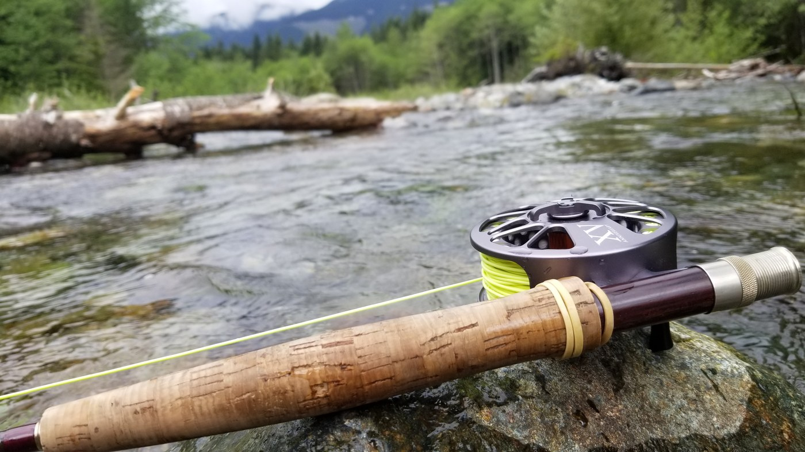 <em>Friday, May. 25, 2018 -- Fly rod and reel by the water [manual review]</em> -- <a href="https://www.wta.org/go-hiking/trip-reports/trip_report.2018-06-04.6417194305">https://www.wta.org/go-hiking/trip-reports/trip_report.2018-06-04.6417194305</a>

**Text mentions:**

- **Monday, Jun. 22, 2026** -- https://www.wta.org/go-hiking/trip-reports/trip_report-2026-06-24.132501950717
    - text ("fish"): "...the water. Not much shore access, but I found a spot to walk out on a downed tree and the fish were jumping all around. Continued to the far end of the lake and found some good swimmi..."
- **Tuesday, Jul. 11, 2023** -- https://www.wta.org/go-hiking/trip-reports/trip_report.2023-07-12.4836491666
    - text ("Fish"): "...bad, but we needed our bug spray or sleeves to be comfortable when we stopped for lunch. Fish were jumping like crazy at noon at the lake. Wished I'd had my pole...."
- **Saturday, May. 9, 2020** -- https://www.wta.org/go-hiking/trip-reports/trip_report-2020-05-09-0387676821
    - text ("fisherman"): "...he river crossing is doable if you know what you’re doing (thankfully my husband is a fly fisherman) and the snow is almost gone. This was a great hike for social distancing as we saw very..."
- **Friday, May. 25, 2018** -- https://www.wta.org/go-hiking/trip-reports/trip_report.2018-06-04.6417194305
    - text ("fly fishing"): "...Great day for a hike but not so great for the fly fishing. The trail is harder to find, with the sign tucked one the sub-forest road about 50 yar..."
    - text ("fly fishing"): "...tially, and a "lovers" spot about 300ft closer to the Lake. We hiked around the perimeter fly fishing with no bites, but found the creek to be fairly successful. We only saw one group of camp..."
- **Saturday, Jun. 10, 2017** -- https://www.wta.org/go-hiking/trip-reports/trip_report.2017-06-11.3239387981
    - text ("fishing"): "...trail head continues on the other side of the river. Not very much lake access. Few good fishing spots ,fish were jumpingbut, i had no luck. One campsite was all to be seen but probly be..."
- **Saturday, Jun. 10, 2017** -- https://www.wta.org/go-hiking/trip-reports/trip_report.2017-06-11.3444218122
    - text ("fishing"): "...trail head continues on the other side of the river. Not very much lake access. Few good fishing spots ,fish were jumpingbut, i had no luck. One campsite was all to be seen but probly be..."
- **Saturday, Aug. 6, 2005** -- https://www.wta.org/go-hiking/trip-reports/tripreport-2005080706
    - text ("trout"): "...y a low spot which collects the silt from the valley above it. There were plenty of small trout jumping but there was not much in the way of camping spots. The trail degrades quickly pa..."
- **Saturday, Jun. 3, 2000** -- https://www.wta.org/go-hiking/trip-reports/tripreport-2000060422
    - text ("fish"): "...declared victory about a mile short of the lake. One mystery was solved. ""Are there any fish in Sunday Lake'"" A sleek nine-inch rainbow lazily harvested insects served up by the cur..."

### Kaleetan Lake

https://www.wta.org/go-hiking/hikes/kaleetan-lake

_20 photo(s) downloaded for visual review, 1 contact sheet(s) generated._

**Text mentions:**

- **Friday, Aug. 11, 2023** -- https://www.wta.org/go-hiking/trip-reports/trip_report.2023-08-15.0962940457
    - text ("fish"): "...ity to swim out to the island, which my watch measured at around 150m. I saw one small fish feeding at Kaleetan Lake and saw one swimming around at Island, but otherwise no signs of..."
    - text ("fish"): "...feeding at Kaleetan Lake and saw one swimming around at Island, but otherwise no signs of fish activity. Despite sunny weather, long days out, and Evie's fair complexion, we didn't n..."
- **Saturday, Jul. 23, 2022** -- https://www.wta.org/go-hiking/trip-reports/trip_report.2022-08-04.3862476968
    - text ("fish"): "...day afternoon after a refreshing dip. Only wildlife seen was 1 frog, 1 toad, 2 chipmunks, fish jumping, and about 25 hikers. Gorgeous weather made for a great weekend in the woods...."
- **Sunday, Aug. 4, 2019** -- https://www.wta.org/go-hiking/trip-reports/trip_report.2019-08-13.4284953973
    - text ("fish"): "...gh while I was there, but past late afternoon I had the place to myself. I didn’t see any fish jumping the whole time I was there. I originally camped on the north shore, but it was..."
    - text ("fishing"): "...a jaunt down to Island Lake for lunch. It’s an especially pretty little lake. Someone was fishing with no luck. After lunch, I discovered that I had dropped my bag of gummy bears last t..."
    - text ("fish"): "...ade and swim, with trees to sit or lie on. It has a great view of Kaleetan Peak. I saw no fish jumping, though. I’m not sure if the fish just weren’t hungry or if there’s some reason t..."
- **Saturday, Jun. 8, 2019** -- https://www.wta.org/go-hiking/trip-reports/trip_report.2019-06-10.0716506945
    - text ("fishing"): "...ake. We had to bushwhack pretty heavily to explore around the lake. We also brought along fishing poles because WDFW said it was overabundant with trout, but we only caught a couple 6 inc..."
    - text ("trout"): "...the lake. We also brought along fishing poles because WDFW said it was overabundant with trout, but we only caught a couple 6 inchers so I wouldn’t call it overabundant. Overall, it’s..."
- **Friday, Aug. 24, 2018** -- https://www.wta.org/go-hiking/trip-reports/trip_report.2018-08-28.1475382212
    - text ("Fish"): "...ut also thistle, aster, even gentian near Kaleetan Lake. Fauna: Saw some smaller birds. Fish are jumping at Lower Tuscohatchie. Little frogs are too. Squirrels and chipmunks. Heard a..."
    - text ("fish"): "...have a wide range of locations from which to view access it. Bugs skimmed on the surface, fish jumped at them from below. Even with the cool weather, Lower Tuscohatchie was still “warm..."
- **Thursday, Jun. 11, 2015** -- https://www.wta.org/go-hiking/trip-reports/trip_report.2015-06-15.4480870199
    - text ("fishing"): "...hat previous reports had advised was unexpectedly slippery. We met up with two guys there fishing? Down the stream. We crossed on the rocks a bit upstream from the log without difficulty...."
- **Friday, Jul. 5, 2013** -- https://www.wta.org/go-hiking/trip-reports/trip_report.2013-07-07.3846375364
    - text ("fish"): "...e is marshy, but not that bad. The lake is large and very scenic. For those who like to fish, none of the lake seemed to have much activity, far down from recent years...."
- **Thursday, Aug. 19, 1999** -- https://www.wta.org/go-hiking/trip-reports/tripreport-1999082011
    - text ("trout"): "...top at the outlet, the best camp is located 1/2 way up the north shoreline. Lots of small trout jumping, with a few larger fish seen but not caught. The next morning we caught the Kalee..."
    - text ("fish"): "...is located 1/2 way up the north shoreline. Lots of small trout jumping, with a few larger fish seen but not caught. The next morning we caught the Kaleetan Lake Trail near Tuscohatchie..."
    - text ("fish"): "...AROUND the ridge at 4200' to drop gently to Windy Lake. We stoppped briefly to lunch and fish (saw fish, no bites) and then took the trail the short mile further to Kaleetan Lake. The..."

### Lila Lake

https://www.wta.org/go-hiking/hikes/lila-lake

_25 photo(s) downloaded for visual review, 2 contact sheet(s) generated._

**Fishing photos (1):**

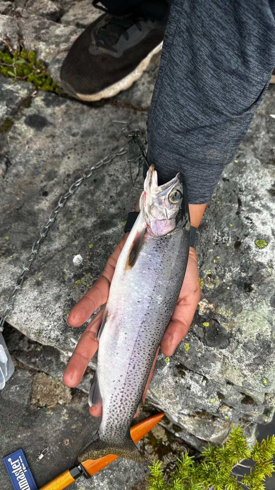 <em>Sunday, Jul. 20, 2025 -- Trout catch with tackle box visible [manual review]</em> -- <a href="https://www.wta.org/go-hiking/trip-reports/trip_report-2025-07-22.111755700378">https://www.wta.org/go-hiking/trip-reports/trip_report-2025-07-22.111755700378</a>

**Text mentions:**

- **Sunday, Jul. 20, 2025** -- https://www.wta.org/go-hiking/trip-reports/trip_report-2025-07-22.111755700378
    - text ("trout"): "...Very beautiful lakes, highly recommend caught some beautiful cutthroat, trout rainbow plenty of camping zones..."
- **Sunday, Sep. 15, 2024** -- https://www.wta.org/go-hiking/trip-reports/trip_report-2024-09-15.210619390344
    - text ("fly fishing"): "...t to the lake, we spent over an hour eating and relaxing. 2 group members spent some time fly fishing. We only saw one other hiker at Lila Lakes today. All of the campsites we passed were ava..."
- **Tuesday, Oct. 18, 2022** -- https://www.wta.org/go-hiking/trip-reports/trip_report.2022-10-22.6498496363
    - text ("fish"): "...nsects, rustling of leaves, etc. The only occasional sound was when a jet flew over or a fish gulping a late-night snack. It was eeriely quiet. Alta Mountain and Lila Lake Excurs..."
- **Saturday, Sep. 3, 2022** -- https://www.wta.org/go-hiking/trip-reports/trip_report.2022-09-06.7170241515
    - text ("trout"): "...with tons of camping spots around the lakes. Fished Rampart Lakes and caught two small trout, but there's definitely bigger fish in there. Also fished Lila lake but had 0 luck, a few..."
    - text ("fish"): "...e lakes. Fished Rampart Lakes and caught two small trout, but there's definitely bigger fish in there. Also fished Lila lake but had 0 luck, a few nibbles but no catches. They're in..."
- **Sunday, Aug. 23, 2020** -- https://www.wta.org/go-hiking/trip-reports/trip_report-2020-08-24-5521215576
    - text ("trout"): "...reful and take your time in these sections. Got to Rachel in under 2 hrs, ate and watched trout swimming in the shallows, then headed up to the Lila-Rampart Junction. This section is sh..."
- **Tuesday, Sep. 25, 2018** -- https://www.wta.org/go-hiking/trip-reports/trip_report.2018-09-27.6373206741
    - text ("fish"): "...got to Rachel Lake; we found a nice camping spot only steps away from the water. Saw many fish jumping. Alta Mountain The trail from Rachel Lake to the junction is relatively shor..."
    - text ("fish"): "...ort and easy. The lakes were much cooler than expected. They're deep and some are full of fish. In my opinion, since this area isn't very long or difficult, I would say it's well worth..."
- **Thursday, Sep. 28, 2017** -- https://www.wta.org/go-hiking/trip-reports/trip_report.2017-09-29.1091668114
    - text ("fishing"): "...le blow down the entire way. At Rachel Lake there were several people camping and a few fishing. The fall colors are spectacular and there are even a few still ripe blueberries. The tra..."

### Lake Laura Backdoor

https://www.wta.org/go-hiking/hikes/lake-laura-backdoor

_17 photo(s) downloaded for visual review, 1 contact sheet(s) generated._

**Text mentions:**

- **Sunday, Jul. 5, 2026** -- https://www.wta.org/go-hiking/trip-reports/trip_report-2026-07-05.153959886868
    - text ("fish"): "...lped. I was the only one up there for about a half hour lots of great places to watch the fish jump and catch bugs and climb around. There are some great views looking down to Lake Lau..."
- **Saturday, Aug. 9, 2025** -- https://www.wta.org/go-hiking/trip-reports/trip_report-2025-08-09.203715763413
    - text ("fishing"): "...ake is beautiful and was busy today with a couple tents set up on the other side, someone fishing from a raft, people walking around the lake, and people headed up to and coming down from..."
- **Friday, Jul. 7, 2023** -- https://www.wta.org/go-hiking/trip-reports/trip_report.2023-07-12.6848398001
    - text ("trout"): "...to Rampart Lakes. Taking in the scenery, a nice swim and even catching a couple cutthroat trout as the reward for the effort put in to make it to the lakes. A couple very small snow pat..."
- **Wednesday, Aug. 17, 2016** -- https://www.wta.org/go-hiking/trip-reports/trip_report.2016-08-17.1282805487
    - text ("fish"): "...el the awesome cool water in our legs. Yes, you will see water snakes and frogs and some fish, just ignore them, and they will go away. Then we went back to the tree with the mark an..."
- **Friday, Oct. 23, 2015** -- https://www.wta.org/go-hiking/trip-reports/trip_report.2015-10-25.3890485980
    - text ("fish"): "...very small but pretty but probably not on my list to go back to! Don't think there is any fish in this lake either. I tried for a couple hours with no bites...."
- **Sunday, May. 17, 2015** -- https://www.wta.org/go-hiking/trip-reports/trip_report.2015-05-18.1643316976
    - text ("fish"): "...terfall-fed. There's really no shortage of waterfalls on this hike. We saw fairly large fish in it as well. The hike down with a young kid and big clumsy dog was stressful - lots of..."
- **Wednesday, Jul. 30, 2008** -- https://www.wta.org/go-hiking/trip-reports/trip_report.2009-07-30.3980739556
    - text ("fisherman"): "...ad is obvious. It crosses a minor creek, and starts the climb. The climb is very steep (fisherman's path), really class 2. On the way down, I had to use my hands in one spot, and rely on..."

### Thompson Lake via Granite Creek Trail

https://www.wta.org/go-hiking/hikes/thompson-lake-via-granite-creek-trail

_21 photo(s) downloaded for visual review, 2 contact sheet(s) generated._

**Text mentions:**

- **Saturday, Jul. 5, 2025** -- https://www.wta.org/go-hiking/trip-reports/trip_report-2025-07-10.110939134828
    - text ("fishing"): "...ssed from the treeless meadows. Descending to Thompson Lake, I saw a couple folks with fishing gear -- the lake is a renowned spot for snagging beautiful fish. Climbing over the ridge,..."
    - text ("fish"): "...aw a couple folks with fishing gear -- the lake is a renowned spot for snagging beautiful fish. Climbing over the ridge, you exit the wilderness boundary, and follow a rocky path down,..."
- **Thursday, Jun. 6, 2024** -- https://www.wta.org/go-hiking/trip-reports/trip_report-2024-06-06.155415992733
    - text ("fishing"): "...ek/Connector junction and the junction between Thompson/Granite Lakes. 5 backpackers with fishing poles, a pair of trail runners, and a few solo-small group hikers. Trillium, maidenhair f..."
- **Tuesday, Jul. 12, 2022** -- https://www.wta.org/go-hiking/trip-reports/trip_report.2022-07-18.4621007475
    - text ("fishing"): "...red around 60 miles w/10,000ft or so of gain in three days (the fourth was a zero day for fishing). 90% of the entire loop was snow free, with the climb up Mt. Defiance from the NW being..."
    - text ("fishing"): ".... Day 2: Thompson Lake to... Nowhere! I took a zero day at Thompson and spent the day fishing and exploring the lake basin. I moved my camp to a more agreeable spot after another par..."
    - text ("fishing"): "...en scuttled! Very sad day. I also found a Shasta Root Beer can from the 50's when I was fishing. Remember folks, it hasta be Shasta! The trout were jumping all over the lake throughou..."
- **Sunday, Jul. 18, 2021** -- https://www.wta.org/go-hiking/trip-reports/trip_report-2021-07-22-0271738886
    - text ("fishermen"): "...woke early and crossed the Pratt River Bar to Middle Fork Road, passing a couple dawn fly-fishermen who said they hadn’t caught anything in two days. This would turn out to be a recurring t..."
    - text ("fish"): "...own to the shore. Thompson is an absolutely gorgeous lake, complete with islands, jumping fish and sweet campsites. It also sits below 4000ft in the Alpine Lakes Wilderness, which can..."
    - text ("fishing"): "...pfires! When there’s no burn ban, of course… I cooked lunch at the lake and did a little fishing but didn’t have any luck. With the fishing, that is. Lunch was definitely a success. Se..."
- **Saturday, Aug. 17, 2019** -- https://www.wta.org/go-hiking/trip-reports/trip_report.2019-08-19.1395275775
    - text ("fisherman"): "...es. I had ventured the 0.7 miles to the lakes previously, so kept going, passing one lone fisherman coming down the hill. The trail to Thomson Lake was well established, even for the few pe..."
    - text ("fishing"): "...sy for me, so I continued eastwards. The next unnamed lake featured a solitary man with a fishing rod, his hammock in the background. At Rainbow Lake, three tents were on the shore, which..."
    - text ("fishing"): "...few steps, changed into shorts, and forded the Middle Fork River as two folks cast their fishing flies above stream. At this point, I had roughly 40 minutes to traverse the 6.5 miles..."
- **Saturday, Jul. 16, 2016** -- https://www.wta.org/go-hiking/trip-reports/trip_report.2016-07-22.1133479307
    - text ("fish"): "...ompson Lake. What a great lake. A few decently-sized islands, deep blue water and jumping fish. There was one guy crossing the lake to the largest island on a backpacking raft. Good id..."

### Ivanhoe Lake

https://www.wta.org/go-hiking/hikes/ivanhoe-lake

_12 photo(s) downloaded for visual review, 1 contact sheet(s) generated._

**Text mentions:**

- **Friday, Jun. 12, 2026** -- https://www.wta.org/go-hiking/trip-reports/trip_report-2026-06-15.152946727088
    - text ("fishermen"): "...a much sketchier crossing. Waptus is beautiful with tons of camp site options. Lots of fishermen on the trail. The trail around the NE side of Waptus until the junction with the PCT was..."
- **Tuesday, Sep. 3, 2024** -- https://www.wta.org/go-hiking/trip-reports/trip_report-2024-09-06.023956375155
    - text ("fishing"): "...watch your footing! There are 2 campsites: N shore and SW shore. SW camp is better for fishing as the N camp is atop some cliffs. In the morning, I packed and headed back the way I c..."
- **Saturday, Aug. 20, 2022** -- https://www.wta.org/go-hiking/trip-reports/trip_report.2022-08-26.2558375688
    - text ("fishing"): "...I went up and over Dutch Miller Gap to Spade Lake for a 4 day fishing and hiking adventure. The Dingford Road is very rough and potholed. You will need at le..."
    - text ("trout"): "...an a 1/2 mile down the trail east of the lake (no stock camping allowed at Ivanhoe). The trout fishing at the lake is excellent, but don't expect to land anything huge. The next morn..."
    - text ("fishing"): "...attered about. I found a nice spot in the rocks close to the lake and busted out the old fishing pole. I caught my limit that evening and again the next morning, making for an excellent..."
- **Friday, Jul. 1, 2016** -- https://www.wta.org/go-hiking/trip-reports/trip_report.2016-07-04.6422431000
    - text ("trout"): "...e rocks on the east side of the south-shore peninsula. My partner brought in a cutthroat trout, and we missed several others. The lake was still a bit cold for more than a quick dip a..."
- **Friday, Jul. 25, 2008** -- https://www.wta.org/go-hiking/trip-reports/tripreport-2008072631
    - text ("fish"): "...over, camp two. Morning day three is beautiful at Ivanhoe, great views of valley behind, fish jumping at lake ahead, waterfalls cascading at both sides of lake. On to La Bohn, take ea..."
- **Tuesday, Aug. 28, 2001** -- https://www.wta.org/go-hiking/trip-reports/tripreport-2001082904
    - text ("fish"): "...wildlife sights and sounds. Marmots and pikas are everywhere, at least one Chain Lake has fish, and raptors (appear to be Merlins) patrol the sky with incredible acrobatic ability. Fr..."
    - text ("fishing"): "...South side of the outlet that had been previously reported to me by a HiLaker (high lakes fishing club member), that comes up from the valley floor. Having said that, let me state that at..."
    - text ("fisherman"): "...hat comes up from the valley floor. Having said that, let me state that at best this is a fisherman’s trail, and one would still need to find an observable beginning alleged to be located S..."

### Kendall Peak Lakes

https://www.wta.org/go-hiking/hikes/kendall-peak-lakes

_9 photo(s) downloaded for visual review, 1 contact sheet(s) generated._

**Fishing photos (1):**

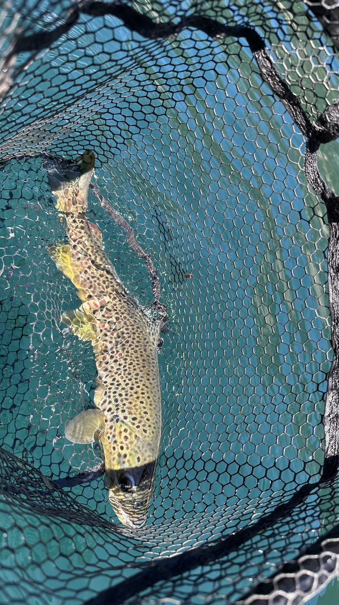 <em>Sunday, May. 31, 2026 -- Brown trout caught in a landing net [manual review]</em> -- <a href="https://www.wta.org/go-hiking/trip-reports/trip_report-2026-06-01.135853180340">https://www.wta.org/go-hiking/trip-reports/trip_report-2026-06-01.135853180340</a>

**Text mentions:**

- **Sunday, May. 31, 2026** -- https://www.wta.org/go-hiking/trip-reports/trip_report-2026-06-01.135853180340
    - text ("packrafts"): "...ut 10 mi round trip. My recorded mileage on my Garmin watch is off because we brought our packrafts up and i forgot to pause the recording while we were on the water. All in all this was a..."
- **Friday, Sep. 5, 2025** -- https://www.wta.org/go-hiking/trip-reports/trip_report-2025-09-08.151926812818
    - text ("trout"): "...ke but ran into a young and fit hiker coming down who reported a pretty lake stocked with trout but also a hard to find trail that he located only on the way down. Going up we actuall..."
- **Monday, Jun. 12, 2023** -- https://www.wta.org/go-hiking/trip-reports/trip_report.2023-06-13.7940352533
    - text ("trout"): "...hing the outlet at 16:00). The 2nd lake was snow free and a glorious emerald green with trout rising -- and an bird of prey splashing down in pursuit of one. We went right around the..."
- **Sunday, Jul. 26, 2020** -- https://www.wta.org/go-hiking/trip-reports/trip_report-2020-07-28-7607676532
    - text ("fishing"): "...ck to sit on and had some more food. This lake looked deeper and some of the campers were fishing. We didn't attempt going to the third lake because the terrain looked quite a bit more am..."
- **Monday, Sep. 3, 2001** -- https://www.wta.org/go-hiking/trip-reports/tripreport-2001090403
    - text ("fish"): "...e second, larger lake. There are a few established campsites here, and few bugs. We saw a fish jump and a bluebird watched as we ate lunch. From the campsite with a firepit beside a la..."

### Rock Creek

https://www.wta.org/go-hiking/hikes/rock-creek-2

_20 photo(s) downloaded for visual review, 1 contact sheet(s) generated._

**Fishing photos (1):**

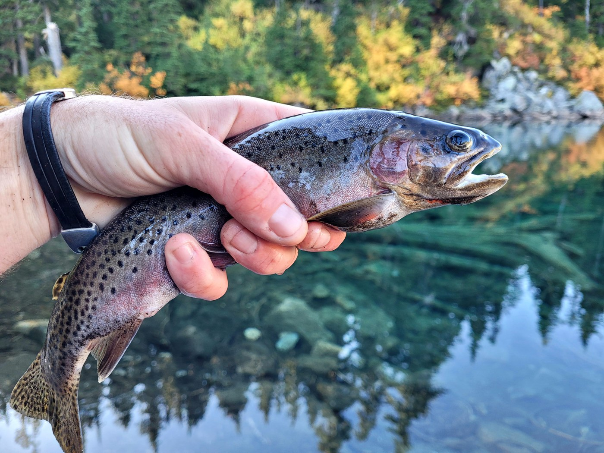 <em>Saturday, Oct. 7, 2023 -- Two trout held in hand (caption in Irish Gaelic: 'There are trout in Wildcat Lake') [manual review]</em> -- <a href="https://www.wta.org/go-hiking/trip-reports/trip_report.2023-10-09.6139412841">https://www.wta.org/go-hiking/trip-reports/trip_report.2023-10-09.6139412841</a>

**Text mentions:**

- **Saturday, Oct. 7, 2023** -- https://www.wta.org/go-hiking/trip-reports/trip_report.2023-10-09.6139412841
    - text ("fishing"): "...ell-defined trail takes you to the real prize: Upper Wildcat Lake. I made camp and went fishing until dusk. The weather was unseasonably warm and felt like an August night. A few mosq..."
    - text ("fishing"): "...night. A few mosquitoes buzzed around and midges would pester me when I was at the water fishing but that was it for bugs. Two other backpackers arrived in the evening and set up camps..."
    - text ("trout"): "...rought homemade cookies to share! What a great wilderness neighbor! I caught a few more trout Sunday morning then broke camp and headed home. All in all a great overnighter to the Wi..."
- **Saturday, Sep. 10, 2022** -- https://www.wta.org/go-hiking/trip-reports/trip_report.2022-09-12.9429999937
    - text ("Trout"): "...uiet, with toilet paper discarded under shrubs and the return of tents dotting the shore. Trout were casually mingling at the surface, nibbling on floating bugs and detritus. Running be..."
- **Tuesday, Jul. 12, 2022** -- https://www.wta.org/go-hiking/trip-reports/trip_report.2022-07-18.4621007475
    - text ("fishing"): "...red around 60 miles w/10,000ft or so of gain in three days (the fourth was a zero day for fishing). 90% of the entire loop was snow free, with the climb up Mt. Defiance from the NW being..."
    - text ("fishing"): ".... Day 2: Thompson Lake to... Nowhere! I took a zero day at Thompson and spent the day fishing and exploring the lake basin. I moved my camp to a more agreeable spot after another par..."
    - text ("fishing"): "...en scuttled! Very sad day. I also found a Shasta Root Beer can from the 50's when I was fishing. Remember folks, it hasta be Shasta! The trout were jumping all over the lake throughou..."
- **Wednesday, Oct. 13, 2021** -- https://www.wta.org/go-hiking/trip-reports/trip_report-2021-10-16-9953844728
    - text ("fishing"): "...to be in the lake before you could see it. I hiked to the lake outlet and busted out the fishing pole for a couple hours of relaxation hypothermia. I packed up and headed back around..."
- **Sunday, Jul. 18, 2021** -- https://www.wta.org/go-hiking/trip-reports/trip_report-2021-07-22-0271738886
    - text ("fishermen"): "...woke early and crossed the Pratt River Bar to Middle Fork Road, passing a couple dawn fly-fishermen who said they hadn’t caught anything in two days. This would turn out to be a recurring t..."
    - text ("fish"): "...own to the shore. Thompson is an absolutely gorgeous lake, complete with islands, jumping fish and sweet campsites. It also sits below 4000ft in the Alpine Lakes Wilderness, which can..."
    - text ("fishing"): "...pfires! When there’s no burn ban, of course… I cooked lunch at the lake and did a little fishing but didn’t have any luck. With the fishing, that is. Lunch was definitely a success. Se..."

### Oxbow Loop Trail

https://www.wta.org/go-hiking/hikes/oxbow-lake

_14 photo(s) downloaded for visual review, 1 contact sheet(s) generated._

**Text mentions:**

- **Tuesday, Sep. 23, 2025** -- https://www.wta.org/go-hiking/trip-reports/trip_report-2025-09-23.201043725799
    - text ("fishing"): "...mie! Now that school is in session it’s way less crowded. Mostly retired folks and people fishing during the week. Trail is in great condition, very well compacted dirt and not very long..."
- **Saturday, Sep. 13, 2025** -- https://www.wta.org/go-hiking/trip-reports/trip_report-2025-09-13.164648830361
    - text ("fishing"): "...hat were well maintained. The river isn't very high right now, but we did see many people fishing. The road is smooth and paved so anyone can drive out there...."
- **Sunday, Apr. 6, 2025** -- https://www.wta.org/go-hiking/trip-reports/trip_report-2025-04-06.202213862994
    - text ("fishing"): "...I went hiking and fishing to Oxbow lake for the first time this year. The road and trail are in good shape. Several..."
    - text ("fish"): "...and pushed aside. I saw several flowers blooming and some big frogs in the pond, but the fish are MIA. Decent weather but it started pouring as I headed back and then the exit for hig..."
- **Sunday, Jan. 7, 2024** -- https://www.wta.org/go-hiking/trip-reports/trip_report.2024-01-07.4803239935
    - text ("pack-raft"): "...hoe-shaped Oxbow Lake is very intriguing - I will return to explore at lake level with my pack-raft (not certain I can get through in some of the shallower spots)! Snow starts at road level..."

### Source Lake

https://www.wta.org/go-hiking/hikes/source-lake

_15 photo(s) downloaded for visual review, 1 contact sheet(s) generated._

**Text mentions:**

- **Wednesday, Jul. 14, 2021** -- https://www.wta.org/go-hiking/trip-reports/trip_report-2021-07-14-7192668403
    - text ("pack raft"): "...ich appears to have broken apart a bit over the winter!). This is a good spot to put in a pack raft, and raft over to the island at the far end of the lake, which is surrounded by shallow g..."
- **Tuesday, Sep. 20, 2016** -- https://www.wta.org/go-hiking/trip-reports/trip_report.2016-09-20.2414521949
    - text ("fish"): "...ly saw a few groups of people early in the morning. I brought my spinning pole with me to fish trout, but the lake was literally empty. This was my first time not catching anything in..."
    - text ("fish"): "...le disappointing. Even those high or alpine lakes, where people have a hard time catching fish , I always catch at least 3-5. I guess the population was either very low or they just di..."
    - text ("fishing"): "...5. I guess the population was either very low or they just didn't survive. Anyways, after fishing for a few hours, I decided to head back. However, since I heard there are fish in Source..."
- **Friday, Jun. 26, 2015** -- https://www.wta.org/go-hiking/trip-reports/trip_report.2015-06-27.3379721082
    - text ("fisherman"): "...y. There were wildflowers blooming all along the way. I let a party of 3 and a solo hiker/fisherman pass by as I make frequent stops to look, listen, and wander. The only other people I enc..."
- **Saturday, Oct. 3, 2009** -- https://www.wta.org/go-hiking/trip-reports/trip_report.2009-10-14.8714923541
    - text ("trout"): "...ula with a full lake view. After lunch on the trail just above the lake shore we watched trout swimming in the super clear, clean , turquoise water. Then we proceeded on to admire the..."
    - text ("trout"): "...baby waterfalls 4. Wildlife yes, bluebird, raven, pika, trout, other birds. 5. Views..."

### Trail Creek

https://www.wta.org/go-hiking/hikes/trail-creek-1

_12 photo(s) downloaded for visual review, 1 contact sheet(s) generated._

**Text mentions:**

- **Thursday, Aug. 10, 2023** -- https://www.wta.org/go-hiking/trip-reports/trip_report.2023-08-12.0389260015
    - text ("fishermen"): "...l Pass Trail, no one on the Trail Creek Trail, one day hiker at Moonshine Lake, and three fishermen returning from a day trip to Lake Terence (probably camped at Lake Michael). On Day 2 (Fr..."
- **Wednesday, Aug. 24, 2022** -- https://www.wta.org/go-hiking/trip-reports/trip_report.2022-08-29.3818618027
    - text ("fish"): "...junction and .75 mi before lake. Lake was warm and clear, saw lots of medium-larger sized fish swimming around. Some bugs but not bad. Appears that far edge saw some winter/spring dama..."
    - text ("fishing"): "...tion and at the base of the mountains. There were four or five groups already camping and fishing. Campsites up there are either in the trees or out by the lake. We followed the trail bac..."
- **Wednesday, Jul. 21, 2021** -- https://www.wta.org/go-hiking/trip-reports/trip_report-2021-07-24-7995004358
    - text ("Fish"): "...ase consider buying their book. Day 1: Arrived at the Tucquala Meadows TH at the end of Fish Lake Rd, aka FS Rd 4430, midmorning on a Wednesday and scored the last spot in the primar..."
- **Saturday, Jul. 9, 2016** -- https://www.wta.org/go-hiking/trip-reports/trip_report.2016-07-12.8927549053
    - text ("fish"): "...ots back on in between. It was pretty windy in the evening, which impacted my ability to fish so we had a trusty freeze-dried meal. In the morning there was no wind, which impacted my..."
    - text ("fish"): "...trusty freeze-dried meal. In the morning there was no wind, which impacted my ability to fish so we had a trusty freeze-dried meal. I may not be very good at fishing but I sure as hel..."
    - text ("fishing"): "...pacted my ability to fish so we had a trusty freeze-dried meal. I may not be very good at fishing but I sure as hell can boil water! If you want to impress your significant other and/o..."

### Loch Katrine

https://www.wta.org/go-hiking/hikes/loch-katrine

_2 photo(s) downloaded for visual review, 1 contact sheet(s) generated._

**Text mentions:**

- **Saturday, Jun. 13, 2026** -- https://www.wta.org/go-hiking/trip-reports/trip_report-2026-06-15.114212549025
    - text ("fish"): "...route. I believe that puts it ahead of the melting from last year. Someone was catching fish in Loch Katrine. You'll need a permit to go here...."
- **Saturday, Jul. 7, 2018** -- https://www.wta.org/go-hiking/trip-reports/trip_report.2018-07-08.4547977319
    - text ("fish"): "...checking permits! We fished at Loch Katrine for several hours with mixed luck. Only one fish was big enough to keep, and we probably caught about 10 total. Navigating the shoreline i..."
    - text ("fishing"): "...out 10 total. Navigating the shoreline is really difficult, so it's probably not the best fishing spot. All in all, a nice way to get away from the crowds, but nothing really stood out ab..."
- **Monday, May. 29, 2000** -- https://www.wta.org/go-hiking/trip-reports/tripreport-2000052815
    - text ("trout"): "...h. The 3.5 miles along Weyerhauser tree farm roads is not exactly the most inspiring, but trout enthusiasts know that there are certain compensations. After crossing over the North Fork..."
    - text ("trout"): "...he lake is very pretty. Be sure not to become so obsesed with the fat, aggressive rainbow trout that you fail to notice!..."

### Nordic Pass - Hyak

https://www.wta.org/go-hiking/hikes/nordic-pass-hyak

**Text mentions:**

- **Saturday, Jan. 7, 2006** -- https://www.wta.org/go-hiking/trip-reports/tripreport-2006010803
    - text ("fishing"): "...d that, blue diamonds here and there. We get to a meadow/marsh area, watch a water dipper fishing for a while, then decide to turn back, shy of the destination. As we go down, we see some..."

### PCT - Stampede Pass to Windy Pass

https://www.wta.org/go-hiking/hikes/windy-pass-to-stampede-pass

_4 photo(s) downloaded for visual review, 1 contact sheet(s) generated._

**Text mentions:**

- **Sunday, Sep. 27, 2020** -- https://www.wta.org/go-hiking/trip-reports/trip_report-2020-09-27-4325126978
    - text ("fish"): "...e of the infamous mylar balloons. Back at Lizard Lake we cast a line in where we saw some fish jump but all we got were a few nibbles and lost bait. I always abide by the 'My worst day..."
    - text ("fishing"): "...jump but all we got were a few nibbles and lost bait. I always abide by the 'My worst day fishing is better than my best day working' theory...."

### Alaska Lake Snowshoe

https://www.wta.org/go-hiking/hikes/alaska-lake-snowshoe

_4 photo(s) downloaded for visual review, 1 contact sheet(s) generated._

**Text mentions:**

- **Saturday, Jun. 4, 2016** -- https://www.wta.org/go-hiking/trip-reports/trip_report.2016-06-06.1045349305
    - text ("trout"): ".... Be carefull, many of these small logs are floating freely. I saw at least two foot long trout here during my picnic. The descent down was again swift. Lots of giant steps through scr..."

### Easton Ridge

https://www.wta.org/go-hiking/hikes/easton-ridge

No fishing-related trip reports found.

### Rock Creek - Red Pass Loop

https://www.wta.org/go-hiking/hikes/snow-lake-rock-creek-middle-fork-red-pass-commonwealth-basin-loop

No fishing-related trip reports found.

### Lower Tuscohatchie Lake via Denny Creek Trail

https://www.wta.org/go-hiking/hikes/lower-tuscohatchie-lake-via-denny-creek-trail

No fishing-related trip reports found.

### Sorcery Mountain

https://www.wta.org/go-hiking/hikes/sorcery-mountain

No fishing-related trip reports found.

### Quick Creek Camp

https://www.wta.org/go-hiking/hikes/quick-creek-camp

No fishing-related trip reports found.

### Rye Creek to Camp Lake Snowshoe

https://www.wta.org/go-hiking/hikes/rye-creek-camp-lake

No fishing-related trip reports found.

### Jack Creek Snowshoe

https://www.wta.org/go-hiking/hikes/jack-creek-snowshoe

No fishing-related trip reports found.
